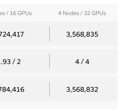
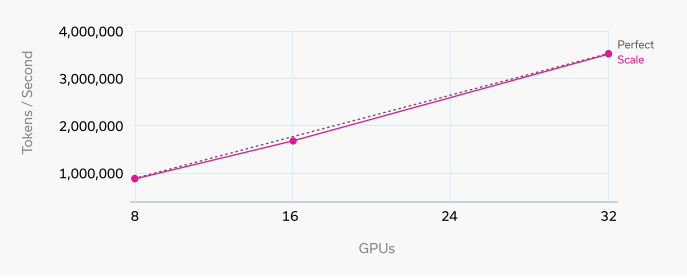
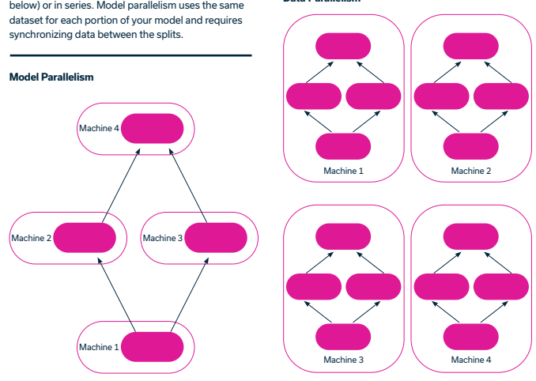
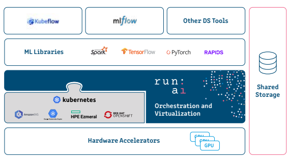

IT & DATA SCIENCE
Avoiding Fragmentation in your GPU Cluster using Run:ai

# Table Of Contents

| Introduction _                               |    |
|----------------------------------------------|----|
| Understanding Fragmentation                  |    |
| Bin Packing: Addressing GPU Fragmentation    |    |
| Consolidation: Addressing Node Fragmentation | す |
| Applicability to Batch Jobs                  | 5  |
| Time Limits for Interactive Workloads        | 5  |
| ldle Detection and Termination               | 5  |
| Considerations and Recommendations           | 5  |
| Conclusion                                   | ଚ  |

# Introduction

ln a dynamic computing environment, managing workloads efficiently is crucial to maximize resource utilization and ensure smooth operations.

One challenge that organizations often face is fragmentation, which can lead to inefficient resource allocation and reduced system performance.

In this blog post, we will explore two methods, bin packing and consolidation, to address fragmentation in workload management. We will also highlight the difference between interactive workloads and batch jobs, emphasizing the applicability of bin packing and consolidation to batch jobs only.

# Understanding Fragmentation

Fragmentation can occur in two forms: node fragmentation and GPU fragmentation. Node fragmentation refers to the situation where valuable resources in the cluster, such as GPUs, are not fully utilized due to the way tasks are allocated. GPU fragmentation arises when tasks allocate fractions of GPUs, leading to suboptimal utilization of available GPU resources.


# Bin Packing: Addressing Gpu Fragmentation

To combat GPU fragmentation, a technique called bin packing is employed. Bin packing aims to allocate tasks in a way that minimizes unused portions of GPUs. By assigning tasks with smaller GPU requirements to partially allocated GPUs, the available space can be utilized more effectively. This approach ensures that the maximum number of tasks can be accommodated within the available GPU resources.


# Consolidation: Addressing Node Fragmentation

While bin packing helps address GPU fragmentation, it may not always solve node fragmentation. Node fragmentation occurs when a task requires a larger number of GPUs than can be allocated on any single node. In such cases, consolidation comes into play. Consolidation involves identifying available resources on different nodes and preempting tasks from one node to allocate them on another node with sufficient resources. This strategy optimizes resource utilization by making space for new tasks on nodes that would otherwise remain underutilized.

1


2 3

## Applicability To Batch Jobs

lt's important to note that bin packing and consolidation techniques are primarily applicable to batch jobs rather than interactive workloads. Batch jobs are typically scheduled and executed in a preemptible manner, meaning they can be interrupted and reallocated if necessary. In contrast, interactive workloads often require continuous and uninterrupted access to resources, making them non-preemptible. As a result, bin packing and consolidation are not applicable to interactive workloads due to their unique requirements.

# Time Limits For Interactive Workloads

To ensure that interactive workloads don't contribute to fragmentation, it's recommended to set time limits for their execution. By imposing reasonable time limits, such as 8 to 12 hours, interactive sessions can be terminated automatically, freeing up resources for other tasks. These time limits need to be aligned with the workday hours and strike a balance between allowing sufficient time for interactive work and preventing excessive fragmentation and idleness.

# Idle Detection And Termination

Another best practice for managing interactive workloads is to implement idle detection and termination mechanisms. By monitoring GPU usage, the system can detect when a workload is not actively utilizing the GPU for a certain period. In such cases, the workload can be terminated to release resources for other tasks. lt's important to consider the specific use case and workload characteristics when setting the idle detection and termination thresholds, as certain tasks may have phases that require intermittent GPU usage.

## Considerations And Recommendations

While the suggested time limits and idle detection mechanisms serve as general guidelines, it's essential to tailor them to specific orqanizational requirements. Some workloads, such as distributed training, may benefit from different configurations and optimizations. For training workloads that involve CPU-intensive processes before transitioning to GPU utilization, longer idle detection periods may be necessary to avoid premature termination. Striking the right balance between termination and resource conservation is key to optimizing system performance.

## Conclusion

Fragmentation can significantly impact resource allocation in GPU clusters, leading to suboptimal utilization

 and performance. Through techniques like bin packing and consolidation, organizations can mitigate fragmentation and improve resource allocation efficiency. By implementing best practices such as setting time limits for interactive sessions and utilizing idleness detection and termination, clusters can be optimized for productivity and resource utilization. Ultimately, understanding fragmentation and adopting appropriate strategies will lead to enhanced performance and better utilization of GPU resources in clusters.

# About Run:Ai

Run:ai is an Al management platform for MLOps, Data Science, and DevOps teams. In addition to helping these teams access and utilize their GPU resources more effectively, it also has a powerful set of features that can abstract infrastructure complexities and simplify the process of training and deploying models. With or without a GPU shortage, Run:ai enables data scientists to focus on innovation without having to worry about resource limitations.

Read more about how Run:ai supports data scientists here www.run.aı/runa A THROUGHPUT PERFORMANCE
BENCHMARKING:
Pretraining NVIDIA
NeMo GPT-3 on Kubernetes with Run:ai and Bare-metal

## Abstract

This benchmarking study focuses on evaluating the distributed training throughput performance of GPT-3 models across different computing environments: "Bare-metal" and "Kubernetes with Run:ai."
We conduct this benchmarking with a three-fold motivation: firstly, to compare throughput performance between the two environments; secondly, to explore how performance varies in a distributed training setting by investigating scenarios with 1, 2, and 4 nodes of an NVIDIA DGX BasePOD™ system; and thirdly, to understand how different model sizes of NeMo™ Megatron GPT-3 models impact performance.

For the GPT-3 model with 5 billion parameters, we find minimal differences in throughput between Kubernetes with Run:ai and bare-metal setups, ranging from 1.24% to 2.05%. Both setups exhibit similar linear scaling behavior, showcasing the robustness of Kubernetes with Run:ai for LLM training.

In contrast, for the GPT-3 model with 126 million parameters, Kubernetes with Run:ai demonstrates superior efficiency, resulting in a 10.27% improvement in throughput compared to bare-metal.

Our findings highlight the suitability of Kubernetes with Run:ai for scaling and optimizing performance, especially when dealing with models of varying sizes.

Kubernetes scripts shared in this study are accessible in our repository for researchers and developers who seek to harness the power of Kubernetes for distributed computing to train and optimize language models efficiently.

Table of contents

| Abstract _               | ਹ   |
|--------------------------|-----|
| Introduction _           | 3   |
| Data preprocessing .     | 4   |
| Dataset: The Pile        | す  |
| Data Locality            |     |
| Cluster preparation      | す  |
| Run:ai and Kubernetes .. | ব   |
| Bare\-metal \-\-         | 4   |
| Benchmarking setup .     |     |
| Models \-                | 5   |
| Run                      |     |
| Throughput calculation _ | 5   |
| Results ..               |     |
| GPT\-3 \- 5B parameters  | 7   |
| GPT\-3 \- 126M Parameter |     |
| Conclusion \-            |     |

## Introduction

In the rapidly evolving landscape of artificial intelligence, the performance and efficiency of training large-scale language models are of paramount importance. As the demand for sophisticated language understanding models continues to grow, the need for robust and efficient training infrastructure becomes increasingly critical. In this benchmarking whitepaper, we delve into a comprehensive comparison of the training throughput of GPT-3 models, utilizing two prominent and widely used orchestration platforms: Kubernetes  with the integration of the Run:ai platform and bare-metal, where we utilize Slurm workload manager.

Our focus extends to evaluating two variants of NeMo™ Megatron's GPT-3 models: GPT-3 5B and GPT-3 126M. With their scale and complexity, training these models require cutting-edge hardware and optimized software frameworks to achieve optimal performance. Therefore, for our hardware infrastructure, we harnessed the power of an NVIDIA DGX BasePOD™ consisting of 4 NVIDIA DGX™ 
A100 nodes. This hardware configuration, known for its high-performance networking, was instrumental in achieving the training throughput we present in this study. NeMo™ Megatron, a creation of NVIDIA's Applied Deep Learning Research team, represents a GPU-accelerated framework tailored for training and deploving transformer-based Large Language Models (LLMs). We use it for its ability to handle models of up to a trillion parameters, offering a cost-effective and swift path to train generative Al. 

At the heart of our investigation lies Kubernetes and Slurm. Slurm, an open-source workload manager and job scheduler, has gained adoption in high-performance computing (HPC) clusters due to its adaptability and resource allocation capabilities. On the other hand, Kubernetes, an open-source container orchestration platform, has emerged as a de facto standard for cloud-native infrastructure management  and has become the platform of choice for Al companies like OpenAl and Spotify, and new Al Cloud providers like Coreweave. Its dynamic nature and cloud-native architecture make it a prime contender for orchestrating distributed machine learning workloads.

Our exploration would not be complete without the integration of the Run:ai platform, a pivotal component in our benchmarking endeavor on Kubernetes. Run:ai is an Al compute platform, enhances the Kubernetes ecosystem with advanced scheduling capabilities, cluster management, and GPU
virtualization techniques for Al containerized workloads, thereby streamlining the training and deployment processes of Al models and maximizing availability and utilization of Al compute.

Throughout this whitepaper, we outline the infrastructure setup for both Kubernetes and bare-metal environments. We delve into the benchmarking methodologies, the experimental setup, and the results obtained from both environments. Notably, we highlight the NeMo-Megatron-Launcher, as well as the custom scripts sourced from the Run:ai k8s-launcher repository, adaptable for Kubernetes deployments —including standalone Kubernetes clusters. We make these scripts readily accessible in our repository, fostering an environment of collaborative exploration.

## Data Preprocessing

#### Dataset: The Pile Data Locality

## Cluster Preparation

#### Run:Ai And Kubernetes Bare-Metal

"The Pile" is a massive dataset that represents one of the largest publicly available collections of diverse natural language data. Compiled and released by OpenAl, "The Pile" is a culmination of various sources like books, articles, websites, and other written material from the internet. With the intention of promoting advances in natural language processing (NLP) and machine learning, the dataset spans an extensive range of topics, languages, and writing styles. It contains over hundreds of gigabytes of text data, making it a valuable resource for training state-of-the-art language models and developing Al systems capable of comprehending and generating human-like language. Its size and diversity enable researchers and developers to address a wide array of NLP challenges, leading to the advancement of various languagerelated applications across multiple domains. The Pile is provided as 30 shards of 15 GB size each. For our benchmark purposes we will download, extract and preprocess only 2 shards.

The preprocessed data is going to be available to all the nodes in the cluster through NFS server with Read/Write spec of approximately 500 GB/s. We preprocess the data such that the length of every sequence is 2048 tokens.

Kubernetes, often abbreviated as K8s, is an open-source container orchestration platform designed to automate the deployment, scaling, and management of containerized applications. Originally developed by Google and now maintained by the Cloud Native Computing Foundation (CNCF), Kubernetes provides a powerful and flexible solution for running distributed applications in a cloud-native environment. With Kubernetes, developers can package their applications in containers, such as Docker, along with all their dependencies and configurations, ensuring consistent deployment across various environments. Run:ai is installed on top of Kubernetes.

For bare-metal experiments, we utilize Slurm. Slurm, short for "Simple Linux Utility for Resource Management," is a widely used open-source workload manager and job scheduler for high-performance computing (HPC) clusters. Developed and maintained by the Lawrence Livermore National Laboratory, Slurm manages and allocates computing resources, such as CPUs, GPUs, memory, and other hardware components, to different tasks and jobs submitted by users. It provides a robust and flexible platform for distributing and executing computational workloads in a multi-user environment.

In addition, we are going to use the Pyxis plugin to run enroots as described in the NeMo-Megatron-Launcher repository.

へ NFS Server 4 x NVIDIA DGX A100 Nodes, with a total of 32 x NVIDIA A100 Tensor Core GPUs with 80 GB of GPU
> 
memory each
> 
8 x 200 Gb HDR NVIDIA InfiniBand connectivity per node

# Benchmarking Setup

Models We will run the benchmarking on NVIDIA NeMo™ GPT-3 models in the following sizes:
126M parameters 5B parameters Run For running on Kubernetes we will use specifically written scripts and tools that can be found in Run:ai k8s-launcher repository.

#### Throughput Calculation

The throughput stands for the amount of tokens processed per second over the job's entire runtime. We measure the training throughput by the following equation based on step train time:
Tokens per second Global Batch Size  x  Sequence Length Seconds per Step

## Results

In our experiments, we aimed to assess the throughput performance of GPT-3 training across different computing environments, namely "Kubernetes with Run:ai" and "Bare-metal." Our investigation focused on three main objectives: comparing throughput performance of both environments, exploring the impact of distributed training settings with varying node configurations (1, 2, and 4 nodes), and evaluating the influence of different GPT-3 model sizes (5 billion parameters and 126 million parameters). In our results, we introduce the following metrics:

#### 01. Tokens Per Second

Also called as throughput, this metric quantifies the rate at which the systems process tokens. It serves as a crucial indicator of processing efficiency.

#### 02. Linear Factor

The Linear Factor is a relative measure of performance, indicating how each configuration compares to a baseline. A Linear Factor greater than 1 signifies improved performance, while a factor less than 1 suggests a decrease in performance compared to the baseline.

#### 03. Perfect Linear Scale

The "Perfect Linear Scale" demonstrates the theoretical performance if scaling were perfectly linear.

#### 04. The Difference (Diff.)

The "Diff." values represent the performance advantage or disadvantage of the "Bare-metal" setup compared to the "Kubernetes + Run:al" setup for each configuration, expressed as a percentage. To calculate the percentage difference, we use the following formula:
Difference 

| Tokens per second(Bare Metal) \- Tokens per second(Kubernetes with Run:ai)   |
|------------------------------------------------------------------------------|
| Tokens per second(Bare Metal)                                                |

GPT-3 - 5B parameters


|                                       | 1 Node/ 8 GPUs   | 2 Nodes / 16 GPUs   | 4 Nodes / 32 GPUs   |
|---------------------------------------|------------------|---------------------|---------------------|
| Tokens Per Second                     | 48,941           | 97,541              | 185,090             |
| Linear Factor / Perfect Linear Factor | 1 / 1            | 1.99 / 2            | 3.78 / 4            |
| Perfect Linear Scale                  | 48,941           | 97,882              | 195,764             |
| Tokens Per Second                     | 48,131           | 95,545              | 182,791             |
| Linear Factor / Perfect Linear Factor | 1 / 1            | 1.98 / 2            | 3.79 / 4            |
| Perfect Linear Scale                  | 48,131           | 96,262              | 19,2524             |
| Diff.                                 | 1.65%            | 2.05%               | 1.24%               |

Table 1: Throughput Comparison of GPT-3 with 5B parameters.

Starting with the GPT-3 model with 5 billion parameters, we measured the rate at which tokens were processed per second for each setup and then interpolated these measurements. Detailed values can be found in Table 1, and visualizations are provided in Figure 2. Our investigation revealed that there is a very slight difference in throughput between Kubernetes with Run:ai and bare-metal when using a large language model (LLM). Specifically, the difference amounted to just 1.65% and 2.05% for scenarios involving 1 and 2 nodes respectively, and 1.24% for 4 nodes. Additionally, both settings showed similar linear scaling behavior for each scenario. For instance, when the number of nodes doubled from 1 to 2, the baremetal environment achieved a throughput factor of 1.99, whereas Kubernetes with Run:ai had a factor of 1.98. With 4 nodes, bare-metal exhibited a scaling factor of 3.78, and Kubernetes with Run:ai had a factor of 3.79.


Figure 1: Tokens per seconds for 8 - 32 GPUs on bare-metal (GPT-3 5B parameters)


Figure 2: Tokens per seconds for 8 - 32 GPUs on Kubernetes with Run:ai (GPT-3 5B parameters)

|                     | Tokens Per Second                     | 1 Node/ 8 GPUs   | 2 Nodes / 16 GPUs   | 4 Nodes / 32 GPUs   |
|---------------------|---------------------------------------|------------------|---------------------|---------------------|
|                     |                                       | 919,803          | 1,747,626           | 3,236,345           |
| Bare\-metal         | Linear Factor / Perfect Linear Factor | 1 / 1            | 1.9 / 2             | 3.5 / 4             |
|                     | Perfect Linear Scale                  | 919,803          | 1,839,606           | 3,679,212           |
|                     | Tokens Per Second                     | 892,208          | 1,724,417           | 3,568,835           |
| Kubernetes + Run:ai | Linear Factor / Perfect Linear Factor | 1 / 1            | 1.93 / 2            | 3.65 / 4            |
|                     | Perfect Linear Scale                  | 894,208          | 1,784,416           | 3,268,832           |
|                     | Diff.                                 | 2.78%            | 1.33%               | \-1.00%             |

GPT-3 - 126M Parameters

Table 2: Throughput Comparison of GPT-3 with 126M parameters Turning to the GPT-3 model with 126 million parameters, our subsequent experiments demonstrated nearly linear scalability in throughput when using Kubernetes with Run:ai (see Table 2). The linear factor calculated for this scenario was 1.93 for 2 nodes and 4 for 4 nodes. With bare-metal, the corresponding factors were 1.9 and 3.5. Remarkably, when we analyzed the throughput difference between the two environments, we observed a 10.27% improvement with Kubernetes in comparison to bare-metal. From our observations, we can conclude that for GPT-3 with 5B parameters, the difference in throughput values between Kubernetes with Run:ai and bare-metal is not significant. However, for GPT-3 with 126M parameters, Kubernetes proves to be the more efficient choice for LLM training.


Figure 3: Tokens per seconds for 8 - 32 GPUs on bare-metal (GPT-3 126M parameters)


Figure 4: Tokens per seconds for 8 - 32 GPUs on Kubernetes with Run:ai (GPT-3 126M parameters)

## Conclusion

Our experimentation revealed that for the GPT-3 model with 5 billion parameters, the difference in throughput between Kubernetes with Run:ai and bare-metal is minimal. The differences, amounting to around 1.65% for smaller node counts and 1.24% for larger ones, underscore the comparable performance of both platforms. Notably, the linear scaling factors observed in these cases remained consistent across the platforms, indicating a balanced scaling behavior.

For the GPT-3 model with 126 million parameters, the performance dynamics shifted. With a remarkable 10.27% improvement in throughput compared to bare-metal, Kubernetes affirm as an efficient choice for training large language models.

Taken together, our findings highlight the nuanced interplay between platform choice, model size, and scalability when aiming to achieve optimal training throughput. Researchers and practitioners can leverage these insights to make informed decisions when selecting the most suitable platform and configuration for their specific training needs.

Additionally, we're committed to ensuring the reproducibility of our experiments. As such, we've made our k8s launcher scripts available in our repository. This toolkit expands possibilities by providing a comprehensive suite of tools and scripts tailored for NVIDIA NeMo models. Designed to facilitate tasks from pretraining to fine-tuning and evaluation of expansive language models, this toolkit enhances the training experience for researchers and developers. By harnessing Kubernetes for distributed computing, we aim to simplify training processes and empower machine learning practitioners, fostering advancements in the field collectively.

A THROUGHPUT PERFORMANCE
BENCHMARKING:
Pre-training NVIDIA
NeMo GPT-3 on Kubernetes with Run:ai

# Abstract

This benchmarking study provides an examination of distributed training throughput for GPT-3 models, offering insights into performance and efficiency gains via Kubernetes (K8s). Specifically, we investigate the throughput of two NVIDIA NeMo™ Megatron GPT-3 models, namely the 5B and 126M variants, across one, two and four nodes of an NVIDIA DGX BasePOD™ system. We leverage Kubernetes as our orchestration framework, enhanced by the integration of the Run:ai platform.

Our results demonstrate that Kubernetes exhibits nearly perfect linear scaling behavior for GPT-3 with 5B parameters, while it achieves perfect linear scaling for GPT-3 with 126M parameters. This performance affirms Kubernetes as a potent tool for training GPT-3-like large language models efficiently, especially in distributed settings, empowering researchers and practitioners in advancing language models and Al applications. Kubernetes scripts used in this study are accessible in our repository for researchers and developers who seek to harness the power of Kubernetes for distributed computing to train and optimize language models efficiently.

# Table Of Contents

| Introduction .            |    |
|---------------------------|----|
| Data preprocessing _      | イ |
| Dataset: The Pile         | 4  |
| Data Locality             | す |
| Cluster preparation       | 4  |
| Run:ai and Kubernetes     | す |
| Benchmarking setup        | 5  |
| Models ..                 |    |
| Run                       |    |
| Throughput calculation    |    |
| Results                   |    |
| GPT\-3 \- 5B parameters   | ଚ  |
| GPT\-3 \- 126M Parameters |    |
| Conclusion .              |    |

## Introduction

In the rapidly evolving landscape of artificial intelligence, the performance and efficiency of training large-scale language models are of paramount importance. As the demand for sophisticated language understanding models continues to grow, the need for robust and efficient training infrastructure becomes increasingly critical. In this benchmarking whitepaper, we delve into an evaluation of the distributed training throughput of GPT-3 models in Kubernetes, a prominent and widely utilized orchestration platform, boosted by the capabilities of the Run:ai platform.

Our focus extends to evaluating two variants of the NeMo Megatron GPT-3 5B and GPT-3 126M models. With their scale and complexity, training these models require cutting-edge hardware and optimized software frameworks to achieve optimal performance. Therefore, for our hardware infrastructure, we harnessed the power of an NVIDIA DGX BasePOD™ consisting of 4 NVIDIA DGX™ A100 nodes. This hardware configuration, known for its high-performance networking, was instrumental in achieving the training throughput we present in this study. NeMo™ Megatron, a creation of the NVIDIA Applied Deep Learning Research team, represents a GPU-accelerated framework tailored for training and deploying transformer-based Large Language Models (LLMs). We use it for its ability to handle models of up to a trillion parameters, offering a cost-effective and swift path to train generative Al.

At the heart of our investigation lies Kubernetes; an open-source container orchestration platform. It has emerged as a de facto standard for cloud-native infrastructure management and has become the platform of choice for Al companies like OpenAl and Spotify, and new Al Cloud providers like Coreweave.

lts dynamic nature and cloud-native architecture make it a prime contender for orchestrating distributed machine learning workloads.

ln our experiments, we evaluate the training throughput using Kubernetes across 1, 2, and 4 nodes, examining both models. Our aim is to provide a comparison of training throughput for these models, shedding light on their performance characteristics and the efficiency gains realized through Kubernetes.

Our exploration would not be complete without the integration of the Run:ai platform, a pivotal component in our benchmarking on Kubernetes. Run:ai is an Al compute platform, which enhances the Kubernetes ecosystem with advanced scheduling capabilities, cluster management, and GPU
virtualization techniques for Al containerized workloads, thereby streamlining the training and deployment processes of Al models and maximizing availability and utilization of Al compute. 

Throughout this whitepaper, we outline the infrastructure setup for the Kubernetes environment. We delve into the benchmarking methodologies, the experimental setup, and the results obtained. Notably, we highlight the custom scripts sourced from the Run:ai k8s-launcher repository, adaptable for Kubernetes deployments—including standalone Kubernetes clusters. We make these scripts readily accessible in our repository, fostering an environment of collaborative exploration.

## Data Preprocessing

#### Dataset: The Pile

"The Pile" is a massive dataset that represents one of the largest publicly available collections of diverse natural language data. Compiled and released by OpenAl, "The Pile" is a culmination of various sources like books, articles, websites, and other written material from the internet.

With the intention of promoting advances in natural language processing (NLP) and machine learning (ML), the dataset spans an extensive range of topics, languages, and writing styles. It contains over hundreds of gigabytes of text data, making it a valuable resource for training state-of-the-art language models and developing Al systems capable of comprehending and generating human-like language. Its size and diversity enable researchers and developers to address a wide array of NLP challenges, leading to the advancement of various language-related applications across multiple domains. The Pile is provided as 30 shards of 15 GB size each. For our benchmark purposes we will download, extract and preprocess only 2 shards.

#### Data Locality

The preprocessed data is available to all the nodes in the cluster through NFS server with Read/Write spec of approximately 500 GB/s.

We preprocess the data such that the length of every sequence is 2048 tokens.

## Cluster Preparation

#### Run:Ai And Kubernetes

Kubernetes (K8s) is an open-source container orchestration platform designed to automate the deployment, scaling, and manaqement of containerized applications. Originally developed by Google and now maintained by the Cloud Native Computing Foundation (CNCF), Kubernetes provides a powerful and flexible solution for running distributed applications in a cloud-native environment. With Kubernetes, developers can package their applications in containers, such as Docker, along with all their dependencies and configurations, ensuring consistent deployment across various environments. Run:ai is installed on top of Kubernetes.

The cluster consists of:
> NFS Server
>   4 x NVIDIA DGX A100 Nodes, with a total of 32 x NVIDIA A100 Tensor Core GPUs with 80 GB of GPU memory each
>   8 x 200 Gb HDR NVIDIA InfiniBand connectivity per node

# Benchmarking Setup

 Models We will run the benchmarking on NVIDIA NeMo GPT 3 models in the following sizes:
-  126M parameters
- 5B parameters Run For running on Kubernetes we will use specifically written scripts and tools that can be found in Run:ai k8s-launcher repository.

#### Throughput Calculation

The throughput stands for the amount of tokens processed per second over the job's entire runtime. We measure the training throughput by the following equation based on step train time:
Tokens per second Global Batch Size  x  Sequence Length Seconds per Step

## Results

ln our experiments, we conducted training usinq different node configurations: 1, 2, and 4 nodes, each equipped with 8, 16, and 32 GPUs, respectively. Our main expectation was to see how throughput scales as we increase the number of nodes and GPUs on Kubernetes with Run:ai. To create a baseline for comparison, we used perfect linear scaling as a reference point, which demonstrates the theoretical performance if scaling were perfectly linear and then compared it with the throughput achieved. The linear factor we used helps us understand how the throughput scales with the number of nodes.

GPT-3 - 5B parameters


|                                       | 1 Node/ 8 GPUs   | 2 Nodes / 16 GPUs   | 4 Nodes / 32 GPUs   |
|---------------------------------------|------------------|---------------------|---------------------|
| Tokens Per Second                     | 48,131           | 95545               | 182,791             |
| Linear Factor / Perfect Linear Factor | 1 / 1            | 1.98 / 2            | 3.78 / 4            |
| Perfect Linear Scale                  | 48,131           | 96262               | 192,524             |

Table 1: Throughput Comparison of GPT-3 with 5B parameters for 1 Node, 2 Nodes and 4 Nodes Starting with the GPT-3 5B, we measured the rate at which tokens were processed per second for each setup and then interpolated these measurements. Detailed values can be found in Table 1, and visualizations are provided in Figure 1. Our investigation revealed that Kubernetes showed almost linear scaling behavior for each scenario. For instance, when the number of nodes doubled from 1 to 2, it achieved a throughput factor of 1.98. With 4 nodes, it exhibited a scaling factor of 3.79.

KUBERNETES LINEAR SCALE


GPT-3 - 126M Parameters


|                                      | 1 Node/ 8 GPUs   | 2 Nodes / 16 GPUs   | 4 Nodes / 32 Gl   |
|--------------------------------------|------------------|---------------------|-------------------|
| okens Per Second                     | 892,208          | 1,724,417           | 3,568,835         |
| inear Factor / Perfect Linear Factor | 1 / 1            | 1.93 / 2            | 4 / 4             |
| Perfect Linear Scale                 | 892,208          | 1,784,416           | 3,568,832         |



Table 2: Throughput Comparison of GPT-3 with 126M parameters Turning to the GPT-3 126M, our subsequent experiments demonstrated nearly linear scalability in throughput when using Kubernetes with Run:ai again. The linear factor calculated for this scenario was 1.93 for 2 nodes and 4 for 4 nodes. For the case with 4 nodes, we noticed a slightly higher value in the throughput of Kubernetes in comparison to linear scale. These results lead to the conclusion that Kubernetes is particularly efficient for training GPT-3 with 126M parameters, while GPT-3 with 5B
parameters still achieve throughput very close to the ideal linear scale.



KUBERNETES LINEAR SCALE

Figure 2: Tokens per seconds for 8 - 32 GPUs on Kubernetes with Run:ai (GPT-3 126M parameters)

## Conclusion

In this benchmarking study, we focused on Kubernetes as the central platform, supported by Run:ai, to evaluate the distributed training throughput of GPT-3 models.

Our experiments involved various node configurations of an NVIDIA DGX BasePOD™ system to understand how throughput scales. For the GPT-3 model with 5 billion parameters, Kubernetes showed impressive scalability, closely following linear scaling. With 4 nodes, it achieved a significant scaling factor of 3.79.

When examining the GPT-3 model with 126 million parameters, Kubernetes once again displayed nearlinear scalability. In the 4-node scenario, it even exceeded linear scaling. These results affirm Kubernetes as an efficient choice for training large language models.

In summary, our research highlights Kubernetes as a powerful tool for training large language models such as GPT-3 efficiently. Researchers and practitioners can use these insights to make informed decisions about infrastructure and configurations, advancing language models and Al applications. Additionally, we're committed to ensuring the reproducibility of our experiments. As such, we've made our k8s launcher scripts available in our repositorv. This toolkit expands possibilities by providing a comprehensive suite of tools and scripts tailored for NVIDIA NeMo models. Designed to facilitate tasks from pretraining to fine-tuning and evaluation of expansive language models, this toolkit enhances the training experience for researchers and developers. By harnessing Kubernetes for distributed computing, we aim to simplify training processes and empower machine learning practitioners, fostering advancements in the field collectively.

IT & DATA SCIENCE
Best Practices for Building Containers for Machine Learning

# Table Of Contents

| Introduction .           | .. 2   |
|--------------------------|--------|
| Understanding Containers |        |
| Best Practices .         |        |
| Conclusion .             | 5      |

## Introduction

In the world of machine learning, containers have become a crucial tool for simplifying model training and deployment workflows, managing dependencies, and ensuring reproducibility. A memorable quote from one of our 'Beers with Engineers' online events captures this sentiment: "If you manage not to use Docker when building a machine learning system, hats off, I would not know how I could dodge that" exclaimed Simon Stiebellehner, ML platform Engineering Manager. This quote emphasizes Docker's pivotal role, countering the occasional hesitation among data scientists to embrace it.

However, building containers for machine learning requires careful consideration of various factors to optimize performance, efficiency, and maintainability.

In this blog post, we will explore the best practices for building containers, some of the practices are more general and relevant for any system using containers, while others are specific for machine learning workloads.

Best practices for building containers for machine learning

## Understanding Containers

>

#### Understanding Containers

A container image is a lightweight, standalone, and executable software package that includes everything needed to run a piece of software, including the code, runtime, libraries, and system tools.

Container images consist of multiple layers, where each layer represents a specific modification or addition to the previous layer. This layering system allows for easy sharing and distribution of images, as only the changes need to be transmitted, reducing download times and saving storage space.

#### Building Docker Images With Dockerfiles

Scaling a single job to tens or hundreds of high-end, interconnected GPUs to do things like distributed model training can be problematic. This is because high-end GPUs are not as abundant as lower-end ones, and availability can often be constrained.

This is especially true when close proximity between the machines is required for attaining maximum performance. Even large cloud providers may struggle to provide this level of resources, especially when many clients are demanding the same resources simultaneously, such as during a GPU shortage.

#### Understand Entrypoint And Cmd

lt's crucial to comprehend the difference between ENTRYPOINT and CMD as they dictate which command is executed, when the container is launched. The ENTRYPOINT specifies the command to be run, and CMD sets default arguments for the command. The combination of these two determines the actual command that will be executed when the container runs.

>

#### Working With Kubernetes And Docker

When working with containers in Kubernetes, being able to understand how ENTRYPOINT and CMD are utilized is vital. Kubernetes will prioritize the command and arguments (defined within the Pod specification) over the values specified in the container image. Ultimately, the command and arguments in the Kubernetes YAML file will override the values defined in the Docker image.

## Best Practices

#### Utilize Existing Images 2 Optimize Tagging Strategy 3  Choose A Building Approach 4 ) Cross-Platform Considerations 5 Optimize Layers For Faster Build Times 6 Prioritize Efficiency 7 Create Customized Containers 8 ) Use Environment Variables And Arguments

When building containers for machine learning, leveraging existing images as much as possible is key.

Instead of starting from scratch, find well-maintained base images that suit your needs. Popular repositories like Docker Hub and Nvidia NGC Catalog offer a plethora of pre-built images for various frameworks like TensorFlow, PyTorch, and Jupyter.

Plan and implement a well thought out tagging strategy, to keep track of container versions effectively. Consider using meaningful tags that convey essential information about the container version, such as software versions, updates, or relevant metadata. When choosing a container, avoid using the "latest" tag, as it may be continuously changing, which may lead to unexpected behavior during deployment.

Two common approaches for building containers are "Build Per Code Update" and "Base Image with Startup Scripts for Customization." The first involves building a new container for every code update, which can lead to image overload and larger images. Whereas the latter involves creating a base image and using startup scripts for customization, resulting in smaller, more efficient images that are easier to manage, and update.

lf your container needs to run on different architectures, ensure it is cross-platform compatible.

Use BuildX, a cross-platform build tool, to create containers that work seamlessly across different architectures, such as Intel and ARM.

Optimizing layers can significantly improve build times. If a layer changes frequently, place it at the end of the Dockerfile to minimize the number of layers that need rebuilding. This strategy reduces the time required to install dependencies and speeds up the build process.

When building containers for machine learning, it's important to strive for efficiency. Avoid installing unnecessary packages or dependencies. Use multi-stage builds to separate the build environment from the production environment, reducing the image size. Opt for lightweight base images to keep the container as compact as possible, ensuring efficiency.

When building containers for machine learning, customization is key. Instead of creating a one-size-fitsall container, tailor each container to specific ML use cases. For example, have separate containers for training and inference, each with their specific dependencies and configurations. This approach reduces the container's size and complexity, leading to better performance and efficiency.

Leverage environment variables and command-line arguments within the container to enable flexibility.

This allows you to modify the container's behavior without changing the underlying image. Environment variables can control which dependencies are installed, what code is executed, or even the entire entry point of the container.

1)

#### 9 Leverage Versioning

Versioning is essential in ML containers to ensure reproducibility and consistency. Specify the exact versions of software libraries, dependencies, and models used in the container to avoid any compatibility issues. Use version control systems like Git to manage your Dockerfile and easily roll back to previous working versions if needed.

#### 10) Automate Building Process

Automate the container building process to ensure consistency and efficiency. Use build scripts and continuous integration tools to automatically build and update containers when changes are made to the codebase or dependencies.

#### 11 Optimize Container Size

Containers can quickly become large and unwieldy, especially when dealing with machine learning models, datasets and dependencies. It's crucial to optimize container size by removing unnecessary packages, compressing files, and using lightweight base images. Avoid including datasets or large files in the container itself; instead, fetch them from external sources during runtime.

# Conclusion

Building containers for machine learning requires a thoughtful approach that prioritizes efficiency, maintainability, and performance. Leveraging existing images, optimizing tags, choosing the right build approach, considering cross-platform compatibility, and optimizing layers are all essential best practices to ensure successful containerization of machine learning applications.

By following these best practices, you can create containers that facilitate seamless deployment, enhance


reproducibility, and ultimately accelerate the development and deployment of your machine learning models. Containers provide a powerful foundation for machine learning workflows, and with the right approach, you can harness their potential to build robust and scalable machine learning applications.

Read more about how Run:ai supports data scientists here www.run.aı/runaı

# The Best Gpu For Deep Learning


# Critical Considerations For Large-Scale Ai

Traditionally, the training phase of the deep learning pipeline takes the longest to achieve. This is not only a timeconsuming process, but an expensive one. The most valuable part of a deep learning pipeline is the human element. Data scientists often wait for hours or days for training to complete, which hurts their productivity and the time to bring new models to market.

To significantly reduce training time, you can use deep learning GPUs, which enable you to perform Al computing operations in parallel. When assessing GPUs, you need to consider the ability to interconnect multiple GPUs, the supporting software available, licensing, data parallelism, GPU
memory use and performance.

All rights reserved to Run:ai.

No part of this content may be used without express permission of Run:ai.

# In This Guide, You Will Learn:

| O The importance of GPUs in deep learning            | ਤ   |
|------------------------------------------------------|-----|
| - How to choose the best GPU for deep learning       | B   |
| O Using consumer GPUs for deep learning              | 4   |
| C  Best deep learning GPUs for data centers          | 5   |
| O DGX for deep learning at scale                     | O   |
| O Automated Deep Learning GPU Management With Run:ai | 00  |


All rights reserved to Run:ai.


No part of this content may be used
without express permission of Run:ai.

2

# Why Are Gpus Important In Deep Learninq?

The longest and most resource intensive phase of most deep learning implementations is the training phase. This phase can be accomplished in a reasonable amount of time for models with smaller numbers of parameters but as your number increases, your training time does as well. This has a dual cost; your resources are occupied for longer and your team is left waiting, wasting valuable time.

Graphical processing units (GPUs) can reduce these costs, enabling you to run models with massive numbers of parameters quickly and efficiently. This is because GPUs enable you to parallelize your training tasks, distributing tasks over clusters of processors and performing compute operations simultaneously.

GPUs are also optimized to perform target tasks, finishing computations faster than non-specialized hardware. These processors enable you to process the same tasks faster and free your CPUs for other tasks. This eliminates bottlenecks created by compute limitations.

# How To Choose The Best Gpu For Deep Learning?

Selecting the GPUs for your implementation has significant budget and performance implications. You need to select GPUs that can support your project in the long run and have the ability to scale through integration and clustering. For large-scale projects, this means selecting production-grade or data center GPUs.


#### Gpu Factors To Consider

These factors affect the scalabilitv and ease of use of the GPUs you choose:

#### Ability To Interconnect Gpus

When choosing a GPU, you need to consider which units can be interconnected. Interconnecting GPUs is directly tied to the scalability of your implementation and the ability to use multi-GPU and distributed training strategies. Typically, consumer GPUs do not support interconnection (NVlink for GPU
interconnects within a server, and Infiniband/RoCE for linking GPUs across servers) and NVIDIA has removed interconnections on GPUs below RTX 2080.

#### Supporting Software

NVIDIA GPUs are the best supported in terms of machine learning libraries and integration with common frameworks, such as PyTorch or TensorFlow. The NVIDIA CUDA toolkit includes GPU-accelerated libraries, a C and C++ compiler and runtime, and optimization and debugging tools. It enables you to get started right away without worrying about building custom integrations.

Learn more in our quides about PyTorch GPUs, and NVIDIA deep learning GPUs.

#### Licensing

Another factor to consider is NVIDIA's quidance regarding the use of certain chips in data centers. As of a licensing update in 2018, there may be restrictions on use of CUDA software with consumer GPUs in a data center. This may require organizations to transition to production-grade GPUs.

#### Algorithm Factors Affective Gpu Use

In our experience helping organizations optimize largescale deep learning workloads, the following are the three key factors you should consider when scaling up your algorithm across multiple GPUs.

Il rights reserved to Run:ai.

No part of this content mav be used vithout express permission of Run:ai Data Parallelism - Consider how much data vour O
algorithms need to process. If datasets are going to be large, invest in GPUs capable of performing multi-GPU training efficiently. For very large scale datasets, make sure that servers can communicate quickly with each other and with storage components, using technology like Infiniband/RoCE, to enable efficient distributed training.

Memory Use - Are you going to deal with large data O
inputs to model? For example, models processing medical images or long videos have very large training sets, so you'd want to invest in GPUs with relatively large memory. By contrast, tabular data such as text inputs for NLP models are typically small, and you can make do with less GPU memory.

Performance of the GPU - Consider if you're going to O
use GPUs for debugging and development. In this case you won't need the most powerful GPUs. For tuning models in long runs, you need strong GPUs to accelerate training time, to avoid waiting hours or days for models to run.

# Using Consumer Gpus

## For Deep Learning

While consumer GPUs are not suitable for largescale deep learning projects, these processors can provide a good entry point for deep learning. Consumer GPUs can also be a cheaper supplement for less complex tasks, such as model planning or low-level testing. However, as vou scale up, vou'll want to consider data center grade GPUs and high-end deep learning systems like NVIDIA's DGX
series (learn more in the following sections).

In particular, the Titan V has been shown to provide performance similar to datacenter-grade GPUs when it comes to Word RNNs. Additionally, its performance for CNNs is only slightly below higher tier options. The Titan RTX and RTX 2080 Ti aren't far behind.

#### Nvidia Titan V

The Titan V is a PC GPU that was designed for use by scientists and researchers. It is based on NVIDIA's Volta technology and includes Tensor Cores. The Titan V comes in Standard and CEO Editions.

The Standard edition provides 12GB memory, 110 teraflops performance, a 4.5MB L2 cache, and 3,072bit memory bus. The CEO edition provides 32GB memory and 125 teraflops performance, 6MB cache, and 4,096-bit memory bus. The latter edition also uses the same 8-Hi HBM2 memory stacks that are used in the 32GB Tesla units.

#### Nvidia Titan Rtx

The Titan RTX is a PC GPU based on NVIDIA's Turing GPU architecture that is designed for creative and machine learning workloads. It includes Tensor Core and RT Core technologies to enable ray tracing and accelerated Al.

Each Titan RTX provides 130 teraflops, 24GB GDDR6 memory, 6MB cache, and 11 GigaRays per second.

This is due to 72 Turing RT Cores and 576 multi precision Turing Tensor Cores.

#### Nvidia Geforce Rtx 2080 Ti

The GeForce RTX 2080 Ti is a PC GPU designed for enthusiasts. It is based on the TU102 graphics processor. Each GeForce RTX 2080 Ti provides 11GB
of memory, a 352-bit memory bus, a 6MB cache, and roughly 120 teraflops of performance.

All rights reserved to Run:ai.


No part of this content mav be used without express permission of Run:ai

# Best Deep Learning Gpus For Large-Scale Projects

# And Data Centers

The following are GPUs recommended for use in large-scale Al projects.

#### Nvidia Tesla A100

The A100 is a GPU with Tensor Cores that incorporates multi-instance GPU (MIG) technology.

lt was designed for machine learning, data analytics, and HPC. The Tesla A100 is meant to be scaled to up to thousands of units and can be partitioned into seven GPU instances for any size workload.

Each Tesla A100 provides up to 624 teraflops performance, 40GB memory, 1,555 GB memory bandwidth, and 600GB/s interconnects.

#### Nvidia Tesla V100

The NVIDIA Tesla V100 is a Tensor Core enabled GPU that was designed for machine learning, deep learning, and high performance computing (HPC). It is powered by NVIDIA Volta technology, which supports tensor core technology, specialized for accelerating common tensor operations in deep learning. Each Tesla V100 provides 149 teraflops of performance, up to 32GB memory, and a 4,096-bit memory bus.

#### Nvidia Tesla P100

The Tesla P100 is a GPU based on an NVIDIA 
Pascal architecture that is designed for machine learning and HPC. Each P100 provides up to 21 teraflops of performance, 16GB of memory, and a 4,096-bit memory bus.

#### Nvidia Tesla K80

The Tesla K80 is a GPU based on the NVIDIA Kepler architecture that is designed to accelerate scientific computing and data analytics. It includes 4,992 NVIDIA CUDA cores and GPU Boost™ technology.

Each K80 provides up to 8.73 teraflops of performance, 24GB of GDDR5 memory, and 480GB of memory bandwidth.

#### Google Tpu

Slightly different are Google's tensor processing units (TPUs). TPUs are chip or cloud-based, application-specific integrated circuits (ASIC) for deep learning. These units are specifically designed for use with TensorFlow and are available only on Google Cloud Platform.

Each TPU can provide up to 420 teraflops of performance and 128 GB high bandwidth memory (HBM). There are also pod versions available that can provide over 100 petaflops of performance, 32TB HBM, and a 2D toroidal mesh network.

No part of this content mav be used


nout express permission of Run:ai


# Dgx For Deep Learning At Scale


The NVIDIA DGX systems are full stack solutions designed for enterprise-grade machine learning.

These systems are based on a software stack that is optimized for Al, multi-node scalability, and enterprise-grade support.

You can implement the DGX stack in containers or on bare metal. This technology is meant to be plug-and-play and is fully integrated with NVIDIA
deep learning libraries and software solutions. DGX is available for server-class workstations, servers, or pods. Below, the server options are introduced.

#### Dgx-1

The DGX-1 is a GPU server based on the Ubuntu Linux Host OS. It integrates with Red Hat solutions and includes the DIGITS deep learning training application, the NVIDIA Deep Learning SDK, the CUDA toolkit, and


the Docker Engine Utility for NVIDIA GPU.

#### Each Dgx-1 Provides:

Two Intel Xeon CPUs for deep learning framework O
coordination, boot, and storage management Up to 8 Tesla V100 Tensor Cores GPUs with 32GB of O
memory 300Gb/s NVLink interconnects 800GB/s communication with low-latency Single 480GB boot OS SSD and four 1.92 TB SAS SSDs
(7.6 TB total) configured as a RAID 0 striped volume All rights reserved to Run:ai.

No part of this content may be used without express permission of Run:ai.

#### Dgx-2

The DGX-2 is the next level up from the DGX-1.

lt is based on the NVSwitch networking fabric for greater parallelism and scalability.

#### Each Dgx-2 Provides:

Two petaflops of performance O
2X 960GB NVME SSDs for OS storage and 30TB of SSD
storage O
16 Tesla V100 Tensor Core GPUs with 32GB of memory 1.6TB/s low-latency, bi-directional bandwidth 1.5TB system memory O
Two Xeon Platinum CPUs for deep learning framework coordination, boot, and storage Two high I/O ethernet cards

#### Dgx A100

The DGX A100 is designed to be a universal system for machine learning workloads, including analytics, training, and inference. It is fully optimized for CUDA-X. The DGX A100 can be stacked with other A100 units to create massive Al clusters, including the NVIDIA DGX SuperPOD.

#### Each Dgx A100 Provides:

Five petaflops of performance Eight A100 Tensor Core GPUs with 40GB memory O
Six NVSwitches for 4.8TB bi-directional bandwidth Two 64-core AMD CPUs for deep learning framework coordination, boot, and storage 1TB system memory, 2x 1.92TB M.2 NVME drives for O
OS storage and 15TB SSD storage All rights reserved to Run:ai.


No part of this content may be used without express permission of Run:ai.

# Automated Deep Learning

# Gpu Manaqement With

# Run:Ai

Run:ai automates resource management and workload orchestration for machine learning infrastructure. With Run:ai, you can automatically run as many compute intensive experiments as needed.

Here are some of the capabilities you gain when using Run:ai:
Advanced visibility: create an efficient pipeline of O
resource sharing by pooling GPU compute resources No more bottlenecks: vou can set up quaranteed O
quotas of GPU resources, to avoid bottlenecks and optimize billing A higher level of control: Run:ai enables you to O
dynamically change resource allocation, ensuring each job gets the resources it needs at any given time.

Run:Al accelerates deep learning on GPU by helping data scientists optimize expensive compute resources and improve the quality of their models.

# See Our Additional Guides On Key Artificial Intelliqence Infrastructure Topics

We have authored in-depth guides on several other artificial intelligence infrastructure topics that can also be useful as you explore the world of deep learning GPUs.

#### Mlops

In today's highly competitive economy, enterprises are looking to artificial intelligence in general and machine and deep learning in particular to transform big data into actionable insights that can help them better address their target audiences, improve their decisionmaking processes, and streamline their supply chains and production processes, to mention just a few of the many use cases out there. In order to stay ahead of the curve and capture the full value of ML, however, companies must strategically embrace MLOps.

#### See Top Articles In Our Mlops Guide:

Machine Learning Ops: What Is It and Why We Need It Machine Learning Automation: Speeding Up the Data Science Pipeline Machine Learning Workflow: Streamlining Your ML
Pipeline

#### Kubernetes And Al

This guide explains the Kubernetes architecture for Al workloads and how K8s came to be used inside many companies. There are specific considerations for implementing Kubernetes to orchestrate Al workloads.

Finally, the guide addresses the shortcomings of Kubernetes when it comes to scheduling and orchestration of deep learning workloads and how you can address those shortfalls.

See top articles in our Kubernetes for Al guide:
Kubernetes Architecture - w Understanding Kubernetes Architecture for Data Science Workloads The Challenges of Scheduling Al Workloads on Kubernetes All rights reserved to Run:ai.


No part of this content mav be used without express permission of Run:ai.

# The Complete Guide To Machine Learning Operations (Mlops)

This guide covers four important areas of Machine Learning Operations


| What is it?   | ML Infrastructure  ML Automation   |
|---------------|------------------------------------|

Considerations for ML Workflows All rights reserved to Run:ai.

No part of this content may be used without express permission of Run:ai.

www.run.ai 1

# This Guide Covers:

We begin with an explanation of how machine learning operations came to be a discipline inside many companies and then cover some of the details around how to best implement MLOps in your organization.

# Machine Learning Ops:

3 How has machine learning influenced the need for machine learning operations Teams?

O
 Why Is MLOps Important?

## Ml Infrastructure:

5 O
 What is machine learning infrastructure?

C
Components of machine learning infrastructure development O
 Considerations for machine learning infrastructure

## Ml Automation:

8 O
 What is machine learning automation?

O
Challenges of machine learning pipelines O
Why is automated machine learning important?

O
 What ML tasks should you automate?

## Ml Workflows:

 ਹ Core phases of machine learning workflows Machine learning workflow best practices How to automate machine learning workflows


All rights reserved to Run:ai.

No part of this content may be used without express permission of Run:ai.

# Machine Learning Operations:

## What Is It? Why Do We Need It?

Machine learning (ML) is a subset of artificial intelligence in which computer systems autonomously learn a task over time. Based on pattern analyses and inference models, ML algorithms allow a computer system to adapt in real time as it is exposed to data and real-world interactions. For many people, ML was, until recently, considered science fiction. But advances in computational power, frictionless access to scalable cloud resources, and the exponential growth of data have fueled an increase in ML-based applications.

Today, ML has a profound impact on a wide range of verticals such as financial services, telecommunications, healthcare, retail, education, and manufacturing. Within all of these sectors, ML is driving faster and better decisions in businesscritical use cases, from marketing and sales to business intelligence, R&D, production, executive management, IT, and finance.

# Mlops: Getting From Science

## To Production

Machine learning is rooted in the realm of data science. For the ML inference model used during runtime to identify a pattern or predict an outcome, data scientists must make sure it is "asking the right questions," i.e., looking for the features that are most relevant to the task at hand. Once data scientists have defined an initial set of features, their next task is to identify, aggregate, clean, and annotate a known data set that can be used to train

 the model to recognize those features.

Here, the larger the training data set, the better. The data scientists then continue to optimize the model under development through a highly iterative process of training, testing, and tuning.

In addition to data science expertise, developing an ML model also involves considerable IT
and infrastructure skills. Huge data sets have to be aggregated, stored, moved, protected, and managed. Training and testing the models requires very high levels of compute capacity and performance.

Thus, one of the first challenges in accelerating the ML development lifecycle is to abstract the infrastructure layer from the data science. In much the same way that DevOps freed developers from infrastructure issues, allowing them to concentrate on application development, a simple and easy-touse research environment is necessary to allow data scientists to focus on model development rather than infrastructure provisioning and monitoring.

Other challenges are related to an inherent disconnect between data scientists and the engineers who must  operationalize the models in production-ready applications. Each group works in its own silo, with its own unique mindset, concepts, processes, and tool stacks. In many cases, the engineering team may have difficulty simply understanding the model handed off to them by the data scientists. And once the model is in production, it is tough for the operations team to understand which metrics and parameters need to be tracked in order to effectively monitor accuracy and performance. It's also not easy to establish the critical feedback loop for the data science team to be able to continue improving the inference model while ensuring that the updated models don't have a negative impact on application performance.

All rights reserved to Run:ai.

No part of this content mav be used vithout express permission of Run:ai.

## Why Is Mlops Important? Closing The Loop With Machine Learning Operations

MLOps (Machine Learning Operations) is a relatively new discipline that seeks to systematize the entire ML lifecycle, from science to production. lt started as a set of best practices to improve the communications between data scientists and DevOps teams–promoting workflows and processes that could accelerate the time to market for ML applications. Soon, open source MLOps frameworks began to emerge, such as MLflow and Kubeflow.

Today, MLOps capabilities are considered a key requirement for Data Science and Machine Learning (DSML) platforms. Gartner's "2020 Magic Quadrant for Data Science and Machine Learning Platforms" cites MLOps as a key inclusion criterion, noting that "…[a]s DSML moves out of the lab and into the mainstream, it must be operationalized with seamless integration and carefully designed architecture and processes.

Machine learning operations capabilities should also include explainability, versioning of models and business impact analysis, among others."
As shown in Figure 1 below, the next-generation data science lifecycle breaks down the silos among all the different stakeholders that need to be involved for ML projects to capture business value.

This starts with the modeling and data acquisition activities of the data science team being informed by a clear understanding of the business objectives for the ML application-as well as of the governance and compliance issues that should be taken into account. The MLOps model then ensures that the data science, production, and operations teams work seamlessly together across ML workflows that are as automated as possible, ensuring smooth deployments and effective ongoing monitoring.

Performance issues, as well as new production data, are reflected back to the data science team so that they can tune and improve the model, which is then thoroughly tested by the operations team before being put into production. (Source: A report reprint, available to Gartner subscribers only.)


Data Science Lifecycle

Figure 1: MLOps Drives Data Science Success and Value. (Source: Azure)
All rights reserved to Run:ai.


No part of this content mav be used without express permission of Run:ai.

In short, machine learning operations is the critical missing link that allows IT to support the highly specialized infrastructure requirements of ML infrastructure. The cyclical, highly automated MLOps approach:
Reduces the time and complexity of moving models O
into production.

O
Enhances communications and collaboration across teams that are often siloed: data science, development, operations.

O
Streamlines the interface between R&D processes and infrastructure, in general, and operationalizes the use of specialized hardware accelerators (such as GPUs), in particular.

Operationalizes model issues critical to long-term O
application health, such as versioning, tracking, and monitoring.

Makes it easier to monitor and understand ML infrastructure and compute costs at all stages, from development to production.

O
Standardizes the ML process and makes it more auditable for requlation and governance purposes.

# Machine Learning Infrastructure

## Components Of Effective Pipelines

Machine learning (ML) infrastructure is the foundation on which machine learning models are developed and deployed. Because models differ between projects, machine learning infrastructure implementations also vary. However, there are core components any machine learning infrastructure needs to be fully functional.

This article explains these components, and reviews important aspects you should consider when creating your machine learning infrastructure.

# What Is Machine Learning

## Infrastructure?

Machine learning infrastructure includes the resources, processes, and tooling needed to develop, train, and operate machine learning models.

It is sometimes referred to as Al infrastructure or a component of MLOps.

ML infrastructure supports every stage of machine learning workflows. It enables data scientists, engineers, and DevOps teams to manage and operate the various resources and processes required to train and deploy neural network models.


All rights reserved to Run:ai.


No part of this content mav be used without express permission of Run:ai

## Machine Learninq Infrastructure Development: The Building Blocks

To understand machine learning infrastructure it helps to first understand its components.

#### Model Selection

Machine learning model selection is the process of selecting a well-fitting model. It determines what data is ingested, what tools are used, which components are required, and how components are interlinked.

#### Data Ingestion

Data ingestion capabilities are at the core of any machine learning infrastructure. These capabilities are needed to collect data for model training, application, and refinement.

Data ingestion tools enable data from a wide range of sources to be aggregated and stored without requiring significant upfront processing. This allows teams to leverage real-time data and to effectively collaborate on the creation of datasets.

#### Ml Pipelines Automation

There are numerous tools available that can automate machine learning workflows according to scripts and event triggers. Pipelines are used to process data, train models, perform monitoring tasks, and deploy results. These tools enable teams to focus on higher-level tasks while helping to increase efficiency and ensure the standardization of processes.

When developing your infrastructure, you can create toolchains from scratch by individually integrating and orchestrating tools. You can also adopt pre-built or self-contained pipelines, such as MLflow Pipelines or Apache Airflow. Learn more in our guide about machine learning automation.

#### Visualization And Monitoring

Machine learning visualization and monitoring are used to gain perspective on how smoothly workflows are moving, how accurate model training is, and to derive insights from model results.


Visualizations can be integrated at any point in machine learning workflows to enable teams to auickly interpret system metrics. Monitoring should be integrated throughout.

When incorporating visualization and monitoring into your machine learning infrastructure, you need to ensure that tools ingest data consistently. If solutions do not integrate with all relevant data sources you will not get meaningful insights. Additionally, you need to keep in mind the resources that these tools require. Make sure that you are choosing solutions that work efficiently and do not create resource conflicts with your training or deployment tools.

#### Model Testing

Testing machine learning models requires integrating tooling between training and deployment phases. This tooling is used to run models against manually labeled datasets to ensure that the results are as expected. Thorough testing requires:
Collection and analysis of both qualitative and quantitative data Multiple training runs in identical environments The ability to identify where errors occurred To set up machine learning testing, you need to add monitoring, data analysis, and visualization tools to your infrastructure. You also need to set up automated creation and management of environments. During set up you should perform integration tests to ensure that components are not causing errors in other components or negatively affecting your test results.

#### Deployment

Deployment is the final step that you need to account for in your architecture. This step packages your model and makes it available to development teams for integration into services or applications. 

If you are offering machine learning as a Service
(MLaaS), it mav also mean deploving the model to a production environment. This deployment enables you to take data from and return results to users. Typically, MLaaS involves containerizing models. When models are hosted in containers, you 


can deliver them as scalable, distributed services regardless of end environment.

All rights reserved to Run:ai.

No part of this content mav be used without express permission of Run:ai

#### Inference

In the deployment stage, it is important to evaluate deep learning frameworks and select those that best fit your needs for ongoing inference of new data. You will need to select and optimize the framework that meets vour performance requirements in production without exhausting your hardware resources. For example, a computer vision model running in a self driving car must perform inference at millisecond speeds, while taking into account the hardware available on board the car.

The process of moving models between frameworks, according to production needs, has been made easier in recent years with the development of universal model file formats. These formats enable you to more easily port models between libraries, such as the Open Neural Network eXchange (ONNX).

## Key Considerations For Infrastructure That Supports Ml

When creating your machine learning infrastructure there are several considerations that you should keep in mind.

#### Location

Pay attention to where your machine learning workflows are being conducted. The requirements for on-premises operations vs cloud operations can differ significantly. Additionally, your location of choice should support the purpose of your model.

In the training stage, you should primarily focus on cost considerations and operational convenience. Security and regulations relating to data are also important considerations when deciding where to store training data. Will it be cheaper and/or easier to perform training on premises or in the cloud? The answer may vary depending on the number of models, the size and nature of data being ingested, and your ability to automate the infrastructure.

In the inference stage, the focus should be on balancing between performance and latency requirements vs available hardware in the target


location.

Models that need a fast response or very low latency should prioritize local or edge infrastructures, and be optimized to run on lowpowered local hardware. Models that can tolerate some latency can leverage cloud infrastructure, which can scale up if needed to run "heavier" inference workflows.

#### Compute Requirements

The hardware used for machine learning can have a huge impact on performance and cost. Typically, GPUs are used to run deep learning models, and CPUs are used to run classical machine learning models. In some cases, the traditional ML uses large volumes of data, it can also be accelerated by GPUs using frameworks like Nvidia's RAPIDS.

In both cases, the efficiency of the GPU or CPU for the algorithms being used will affect operating and cloud costs, hours spent waiting for processes to complete, and by extension, time to market..

When building your machine learning infrastructure you should find the balance between underpowering and overpowering your resources. Underpowering may save you upfront costs but requires extra time and reduces efficiency. Overpowering ensures that you aren't restricted by hardware but means you're paying for unused resources.

#### Network Infrastructure

The right network infrastructure is vital to ensuring efficient machine learning operations. You need all of your various tools to communicate smoothly and reliably.

You also need to ingest and deliver data to and from outside sources without bottlenecks.  To ensure that networking resources meet your needs, you should consider the overall environment you are working in.

You should also carefully gauge how well networking capabilities match your processing and storage capabilities. Lightning fast network speeds aren't helpful if your processing or data retrieval speeds lag.

#### Storage Infrastructure

An automated ML pipeline should have access to an appropriate volume of storage, according to the data requirements of the models. Data-hungry models may require Petabytes of storage. You need to consider in advance where to locate this storage - on-premises or on the cloud.

All rights reserved to Run:ai.

No part of this content mav be used without express permission of Run:ai.

lt is always preferred to colocate storage with training. For example, you can run training using TPUs on Google Cloud, and have data stored in Google Cloud Storage, which is infinitely scalable. Or vou could run training on local NVIDIA GPUs and use a large-volume, high performance, fast distributed file system to store data locally. If you create a hybrid infrastructure, plan data ingestion carefully to prevent delays and complexity in training

#### Data Center Extension

If you are incorporating machine learning into existing business operations you should work to extend your current infrastructure. While it may seem easier to start from scratch, this often isn't cost-efficient and can negatively affect productivity.

A better option is to evaluate the existing infrastructure resources and tooling you have. Any assets that are suited to vour machine learning needs should be integrated. The exception is if you are planning to retire those assets soon. Then, you are better off adopting new resources and tools.

#### Security

Training and applying models requires extensive amounts of data. which is often valuable or sensitive.

For example, financial data or medical images. Big data is a big lure for threat actors interested in using data for malicious purposes, like ransoming or stealing data in black markets.

Additionally, depending on the purpose of the model, illegitimate manipulation of data could lead to serious damages. For example, if models used for object detection in autonomous vehicles are manipulated to cause intentional crashes. When creating your machine learning infrastructure you should take care to build in monitoring, encryption, and access controls to properly secure your data. You should also verify which compliance standards apply to your data. Depending on the results, you may need to limit the physical location of data storage or process data to remove sensitive information before use.

# Machine Learning Automation

## Speeding Up The Data Science Pipeline

Machine learning automation enables data scientists to automate the creation of machine learning processes. Without machine learning automation, the ML process can take months, from data preparation, through training, until actual deployment. Machine learning automation tools were created to help speed up the machine learning pipeline. In some cases, this means automating only specific tasks, like model selection. In other cases, it means automating your entire machine learning operations process.

In this article we discuss the potential and

 possibilities of automating machine learning pipelines.

Furthermore, these big investments in data and Al projects are successful only 15% of the time. As a result, for many readers, delivering an effective Al app in one day sounds like an impossible pipe dream. Apart from math, data analysis is the essential skill for machine learning. The ability to crunch data to derive useful insights and patterns form the foundation of ML. Like math, not every developer has the knack to play with data. Loading a large dataset, cleansing it to fill missing data, slicing and dicing the dataset to find patterns and correlation are the critical steps in data analysis.

Learn more in our article about the machine learning workflow.

All rights reserved to Run:ai.

No part of this content mav be used without express permission of Run:ai

## What Is Automl?

Automated machine learning (AutoML) is a process that automatically performs many of the time-consuming and repetitive tasks involved in model development. It was developed to increase the productivity of data scientists, analysts, and developers and to make machine learning more accessible to those with less data expertise.

## Challenqes Of Machine Learning Pipelines: The Need For Automl

In ML, data scientists first start with a problem statement and a dataset. The data is analysed and cleaned, a metric of performance is decided on and then a few models which might work on the dataset, according to the human intuition, are experimented with. There is a lot of feature engineering and fine tuning involved before we finally reach an acceptable model. A recent Gartner survey reported that it takes on average four years to get an Al project live. For 58%
of businesses it takes two years to get to the piloting stage.

Apart from math, data analysis is the essential skill for machine learning. The ability to crunch data to derive useful insights and patterns form the foundation of ML. Like math, not every developer has the knack to play with data. Loading a large dataset, cleansing it to fill missing data, slicing and dicing the dataset to find patterns and correlation are the critical steps in data analysis.

## Why Is Automated Machine Learning Important?

Machine learning automation is important because it enables organizations to significantly reduce the knowledge-based resources required to train and implement machine learning models. It can be used effectively by organizations with less domain knowledge, fewer computer science skills, and less mathematical expertise. This reduces the pressure on individual data scientists as well as on organizations to find and retain those scientists.


AutoML can also help organizations improve model accuracy and insights by reducing opportunities for bias or error. This is because machine learning automation is developed with best practices determined by expert data scientists. AutoML
models do not rely on organizations or developers to individually implement best practices.

Machine learning automation lowers the requirements for entry to model development, allowing industries that were previously unable to leverage machine learning to do so. This creates opportunities for innovation and strengthens the competitiveness of markets, driving advancement. Learn more in our article about machine learninq infrastructure.

## What Tasks Should You Automate?

While not everything in machine learning can be automated, many processes and steps are iterative, especially in model training. These iterative steps are ideal for automation.

#### Hyperparameter Optimization

Hyperparameters are values that are defined before a model is trained. These values govern model training and impact the end accuracy of the model. 

Example hyperparameters include learning rate, activations functions, number of hidden units and layers, and the number of epochs. To improve models, you need to optimize your hyperparameters. This is typically done through the application of search algorithms, such as random search, grid search, or Bayesian optimization. This application is what can be automated. There are multiple individual tools available for this, including SigOpt, Katib, Eclipse Arbiter, Tensorflow Vizier, and Spearmint.

#### Model Selection

In machine learning, model selection is the process of selecting the right candidate model for your machine learning implementations. It is based on model performance, complexity and maintainability, as well as what resources you have available. The model selection process is what determines the structure of your model development pipeline.


All rights reserved to Run:ai.

No part of this content mav be used without express permission of Run:ai Automating model selection is done in much the same way as hyperparameter optimization. This is because both are essentially seeking the same end goal. The difference is that model selection may also include more extensive filtering through methods like Akaike Information Criterion (AIC) or Bayesian Information Criterion (BIC).

## Feature Selection

Machine learning feature selection is a process that refines how many predictor variables are used in a machine learning model. The number of features that your model includes directly affects how difficult it is to train, understand, and run.

When automating feature selection testing is scripted to use one or more of a variety of algorithmic methods, such as wrapper, filter, or embedded. After performing your feature selection tests, the one with the lowest error rate or proxy measure is selected.

#### Data Preprocessing

Data preprocessing involves cleaning, encoding, and verifying data before use. Automated tasks can perform basic data preprocessing before performing hyperparameter and model optimization steps. This type of machine learning automation typically includes the detection of column types, transformation into numerical data, and handling missing values.

Advanced preprocessing can also be performed. This includes automation of feature selection, target encoding, data compression, text content processing, feature generation or creation, and data cleaning. 

#### Transfer Learning And Pre-Trained Models

In machine learning, transfer learning involves taking models that have already been trained on a similar data set and using it for your machine learning initiative. Generally, this model is used as a base and then further trained to match your exact needs.

In terms of machine learning automation, this initial model can be trained in the same way as your end model while you are collecting or preparing datasets for the final model. This can save significant time, especially if you do not need a highly accurate model.

#### Search For Network Architecture

You can also move beyond preparation and model selection processes, extending to the dynamic development of machine learning algorithms. New developments have allowed some automation of network architectures searches.

In particular, the neural architecture search (NAS) method is being explored and applied to problems based on gradient descent, reinforcement learning, and evolutionary algorithms. This method has already been integrated into several tools including AutoKeras, an open-source library, and the results integrated into several projects, including autonomous vehicles.


No part of this content mav be used


vithout express permission of Run:ai.
# Machine Learning Workflow

# Streamlining Your Ml Pipeline

Machine learning workflows define which phases are implemented during a machine learning project.

The typical phases include data collection, data pre-processing, building datasets, model training and refinement, evaluation, and deployment to production. You can automate some aspects of the machine learning operations workflow, such as model and feature selection phases, but not all.

While these steps are generally accepted as a standard, there is also room for change. When creating a machine learning workflow, you first need to define the project, and then find an approach that works. Don't try to fit the model into a rigid workflow.

Rather, build a flexible workflow that allows you to start small and scale up to a production-grade solution.

#### Data Pre-Processing

Once your data is collected, you need to pre-process it. Pre-processing involves cleaning, verifying, and formatting data into a usable dataset. If you are collecting data from a single source, this may be a relatively straightforward process. However, if you are aggregating several sources you need to make sure that data formats match, that data is equally reliable, and remove any potential duplicates.

#### Building Datasets

This phase involves breaking processed data into three datasets—training, validating, and testing:
Training set—used to initially train the algorithm and 0 teach it how to process information. This set defines model classifications through parameters.

## Understanding The Machine Learning Workflow

Machine learning workflows define the steps initiated during a particular machine learning implementation.

Machine learning workflows vary by project, but four basic phases are typically included.

O
Validation set—used to estimate the accuracy of the model. This dataset is used to finetune model parameters.

Test set-used to assess the accuracy and performance of the models. This set is meant to expose any issues or mistrainings in the model.

#### Gathering Machine Learning Data

Gathering data is one of the most important stages of machine learning workflows. During data collection, you are defining the potential usefulness and accuracy of your project with the quality of the data you collect.

To collect data, you need to identify your sources and aggregate data from those sources into a single dataset. This could mean streaming data from Internet of Things sensors, downloading open source data sets, or constructing a data lake from assorted files, logs, or media.


#### Training And Refinement

Once you have datasets, you are ready to train your model. This involves feeding vour training set to vour algorithm so that it can learn appropriate parameters and features used in classification.

Once training is complete, you can then refine the model using your validation dataset. This may involve modifying or discarding variables and includes a process of tweaking model-specific settings (hyperparameters) until an acceptable accuracy level is reached.

All rights reserved to Run:ai.

No part of this content mav be used without express permission of Run:ai

#### Machine Learning Evaluation

Finally, after an acceptable set of hyperparameters is found and your model accuracy is optimized you can test your model. Testing uses your test dataset and is meant to verify that your models are using accurate features. Based on the feedback you receive you may return to training the model to improve accuracy, adjust output settings, or deploy the model as needed.

## Machine Learning Best Practices For Efficient Workflows

When defining the workflow for your machine learning project, there are several best practices you can apply. Below are a few to start with.

#### Define The Project

Carefully define your project goals before starting to ensure your models add value to a process rather than redundancy. When defining your project, consider the following aspects:
O
What is vour current process? Tvpically models are designed to replace an existing process. Understanding how the existing process works, what its goals are, who performs it, and what counts as success are all important. Understanding these aspects lets you know what roles your model needs to fill, what restrictions might exist in implementation, and what criteria the model needs to meet or exceed.

O
What do you want to predict? Carefully defining what you want to predict is key to understanding what data you need to collect and how models should be trained. You want to be as detailed as possible with this step and make sure to quantify results. If vour goals aren't measurable you'll have a hard time ensuring that each is met.

O
What are your data sources? Evaluate what data your current process relies on, how it's collected and in what volume. From those sources, you should determine what specific data types and points you need to form


predictions.

#### Find An Approach That Works

The goal of implementing machine learning workflows is to improve the efficiency and/
or accuracy of your current process. To find an approach that achieves this goal you need to:
O
Research—before implementing an approach, you should spend time researching how other teams have implemented similar projects. You may be able to borrow methods they used or learn from their mistakes, saving yourself time and money.

O
Experiment—whether you have found an existing approach to start from or created your own, you need to experiment with it. This is essentially the training and testing phases of your model training.

#### Build A Full-Scale Solution

When developing your approach, your end result is typically a proof-of-concept. However, you need to be able to translate this proof into a functional product to meet your end goal. To transition from proof to deployable solution, you need the following:
O
A/B testing-enables you to compare your current model with the existing process. This can confirm or deny whether your model is effective and able to add value to your teams and users.

O
Machine learning API-creating an API for your model implementation is what enables it to communicate with data sources and services. This accessibility is especially important if you plan to offer your model as a machine learning service.

O
User-friendly documentation—includes documentation of code, methods, and how to use the model. If you want to create a marketable product it needs to be clear to users how they can leverage the model, how to access its results, and what kind of results they can expect.

All rights reserved to Run:ai.

No part of this content mav be used without express permission of Run:ai

# Automating Machine Learning Workflows

Automating machine learning workflows enables teams to more efficiently perform some of the repetitive tasks involved in model development.

There are many modules and an increasing number of platforms for this, sometimes referred to as autoML.

## What Is Automated Machine Learning?

AutoML essentially applies existing machine learning algorithms to the development of new models.

lts purpose is not to automate the entire process of model development. Instead, it is to reduce the number of interventions that humans must make to ensure successful development.  AutoML
helps developers get started with and complete projects significantly faster. It also has potential to improve deep learning and unsupervised machine learning training processes, potentially enabling self correction in developed models.

## What Can You Automate?

While it would be great to be able to automate all aspects of machine learning operations, this currently isn't possible. What can be reliably automated includes:

```
     Hyperparameter optimization—uses algorithms like grid
O
     search, random search, and Bavesian methods to test
     combinations of pre-defined parameters and find the

```

optimal combination.

O
Model selection—the same dataset is run through multiple models with default hyperparameters to determine which is best suited to learn from your data.

O


Feature selection—tools select the most relevant features from pre-determined sets of features.

## Mlops With Run:Ai

While the tools and tips mentioned above help with automating some parts of the ML lifecycle, such as data preparation, they are not built to automate resource allocation and job scheduling. If resource allocation is not properly configured and optimized, you can quickly hit compute or memory bottlenecks.

You can avoid these issues by replacing static allocation and provisioning with automated and dynamic resource management. This capability is enabled by virtualization and orchestration software from Run:ai, which automates resource management for machine learning and deep learning. With Run:ai, you can automatically run as many compute intensive experiments as needed.

Here are some of the capabilities vou gain when using Run:ai:
Advanced queueing and fair scheduling to allow users to easily and automatically share clusters of GPUs Distributed training on multiple GPU nodes to accelerate model training times Fractional GPUs to seamlessly run multiple workloads on a single GPU of any type Visibility into workloads and resource utilization to improve user productivity Run:ai simplifies machine learning workflows.

helping data scientists accelerate their productivity and the quality of their models. Learn more about the Run:ai platform.

All rights reserved to Run:ai.

No part of this content mav be used without express permission of Run:ai

# Deep Learning With Multiple Gpus


# How To Use Multiple Gpus For Deep Learning

Deep learning is a subset of machine learning that does not rely on structured data to develop accurate predictive models. This method uses networks of algorithms modeled after neural networks in the brain to distill and correlate large amounts of data. The more data you feed your network, the more accurate the model becomes. You can functionally train deep learning models using sequential processing methods. However, the amount of data needed and the length of data processing make it impractical if not impossible to train models without parallel processing.


Parallel processing enables multiple data objects to be processed at the same time, drastically reducing training time. This parallel processing is typically accomplished through the use of graphical processing units (GPUs). GPUs are specialized processors created to work in parallel. These units can provide significant advantages over traditional CPUs, including up to 10x more speed. Typically, multiple GPUs are built into a system in addition to CPUs. While the CPUs can handle more complex or general tasks, the GPUs can handle specific, highly repetitive processing tasks.

All rights reserved to Run:ai. No part of this content may be used without express permission of Run:ai

# In This Guide, You Will Learn:

O
O
O
O
O
O
O
GPU Cluster 5 Also refer to our other detailed guides about:
O
Machine Learning Operations (MLops)
O
Deep Learning GPU

| Multi GPU Distributed Deep Learning Strategies              | 3   |
|-------------------------------------------------------------|-----|
| How Does Multi GPU Work in Common Deep Learning Frameworks? | 4   |
| TensorFlow Multiple GPU                                     | र   |
| PyTorch Multi GPU                                           | 4   |
| Multi GPU Deployment Models                                 | 5   |
| GPU Server                                                  | 5   |

All rights reserved to Run:ai.


No part of this content may be used without express permission of Run:ai.

2

# Multi Gpu Deep Learning Strateqies

Once multiple GPUs are added to your systems, you need to build parallelism into your deep learning processes. There are two main methods to add parallelism—models and data.

#### Model Parallelism

Model parallelism is a method you can use when your parameters are too large for your memory constraints.

Using this method, you split your model training processes across multiple GPUs and perform each process in parallel (as illustrated in the image 

#### Data Parallelism

Data parallelism is a method that uses duplicates of your model across GPUs. This method is useful when the batch size used by your model is too large to fit on a single machine, or when you want to speed up the training process. With data parallelism, each copy of your model is trained on a subset of your dataset simultaneously. Once done, the results of the models are combined and training continues as normal.

Data Parallelism

All rights reserved to Run:ai.

 No part of this content may be used without express permission of Run:ai.

# How Does Usina Multiple Gpus Work In Common Deep Learning Frameworks?

When working with deep learning models, there are several frameworks you may use, including Keras, PyTorch and TensorFlow. Depending on the framework you choose, there are different ways to implement multi GPU systems.

#### Tensorflow

TensorFlow is an open source framework, created by Google, that you can use to perform machine learning operations. The library includes a variety of machine learning and deep learning algorithms and models that you can use as a base for your training. It also includes built-in methods for distributed training using GPUs.

Through the API, you can use the tf.distribute. Strategy method to distribute your operations across GPUs, TPUs or machines. This method enables you to create and support multiple user segments and to switch between distributed strategies easily.

Two additional strategies that extend the distribute method are MirroredStrategy and TPUStrategy.

Both of these enable you to distribute your workloads, the former across multiple GPUs and the latter across multiple Tensor Processing Units (TPUs). TPUs are units available through Google Cloud Platform that are specifically optimized for training with TensorFlow.

Both of these methods use roughly the same data-parallel process, summarized as follows:
O


evenly as possible.

●
Replicas of your model are created and assigned to a GPU. Then, a subset of the dataset is assigned to that replica
●
The subset for each GPU is processed and gradients are produced O
The gradients from all model replicas are averaged and the result is used to update the original model The process repeats until your model is fully trained

#### Pytorch

PyTorch is an open source scientific computing framework based on Python. You can use it to train machine learning models using tensor computations and GPUs. This framework supports distributed training through the torch.distributed backend.

With PyTorch, there are three parallelism (or distribution) classes that you can perform with GPUs. These include:
Data Parallel: enables you to distribute model replicas across multiple GPUs in a single machine.

You can then use these models to process different subsets of your data set.

O
Distributed Data Parallel: extends the DataParallel class to enable you to distribute model replicas across machines in addition to GPUs. You can also use this class in combination with model_parallel to perform both model and data parallelism.

O
Model Parallel: enables you to split large models across multiple GPUs with partial training happening on each. This requires syncing training data between the GPUs since operations are performed sequentially.

All rights reserved to Run:ai No part of this content mav be used without express permission of Run:ai

Your dataset is segmented so data is distributed as
# Multi Gpu Deployment Models

There are three main deployment models you can use when implementing machine learning operations that use multiple GPUs. The model you use depends on where your resources are hosted and the size of your operations.

#### Gpu Server

GPU servers are servers that incorporate GPUs in combination with one or more CPUs. When workloads are assigned to these servers, the CPUs act as a central management hub for the GPUs, distributing tasks and collecting outputs as available.

#### Gpu Cluster

GPU clusters are computing clusters with nodes that contain one or more GPUs. These clusters can be formed from duplicates of the same GPU (homogeneous) or from different GPUs (heterogeneous). Each node in a cluster is connected via an interconnect to enable the transmission of data.

#### Gpu Cluster

Kubernetes is an open source platform you can use to orchestrate and automate container deployments. This platform offers support for the use of GPUs in clusters to enable workload acceleration, including for deep learning.

When using GPUs with Kubernetes, you can deploy heterogeneous clusters and specify your resources, such as memory requirements. You can also monitor these clusters to ensure reliable performance and optimize GPU utilization.

O
Replicas of vour model are created and assigned to a GPU. Then, a subset of the dataset is assigned to that replica The subset for each GPU is processed and gradients are produced O
The gradients from all model replicas are averaged and the result is used to update the original model The process repeats until your model is fully trained

#### Using Multiple Gpus With Run:Ai

Run:ai automates resource management and workload orchestration for machine learning infrastructure. With Run:ai, you can automatically run as many deep learning experiments as needed on multi-GPU infrastructure.

Here are some of the capabilities you gain when using Run:ai:
Advanced Visibility: create an efficient pipeline of resource sharing by pooling GPU compute resources O
No More Bottlenecks: you can set up guaranteed quotas of GPU resources, to avoid bottlenecks and optimize billing.

O
A Higher Level of Control: Run:ai enables you to dynamically change resource allocation, ensuring each job gets the resources it needs at any given time Run:ai simplifies machine learning infrastructure pipelines, helping data scientists accelerate their productivity and the quality of their models.

Learn more about the Run:ai GPU virtualization platform.

All rights reserved to Run:ai.


No part of this content may be used without express permission of Run:ai.

IT & DATA SCIENCE
Dynamic GPU
Memory: Solving the Problem of Inefficient Resource Allocation in Inference Servers

# Table Of Contents

| Introduction _                                 |
|------------------------------------------------|
| Fractional GPU with static memory allocation _ |
| Fractional GPU with dynamic memory allocation  |
| Resolving memory collisions                    |
| lmplementation in Kubernetes                   |
| Benefits of Dynamic GPU Memory                 |
| Conclusion . 5                                 |

## Introduction

ln recent years, the demand for deploying inference servers and utilizing GPUs for various machine learning tasks has increased significantly. However, a common challenge arises when it comes to optimizing GPU memory usage for inference tasks. GPUs are becoming more powerful, equipped with larger memory capacities, but not all inference models require such extensive memory resources. This discrepancy leads to inefficient resource allocation, increased costs, and underutilization of GPU capabilities. In this blog, we will explore the motivation behind dynamic GPU memory, discuss the challenges it poses, and introduce how we at Run:ai address this problem.

Traditionally, when deploying models for inference, each model or inference server would occupy an entire GPU, regardless of the actual memory requirements. This approach is suboptimal because many models do not utilize the full memory capacity, resulting in wasted resources and increased costs. With modern GPUs having abundant memory, it becomes essential to find a way to leverage this excess capacity and improve GPU utilization.

## Fractional Gpu With Static Memory Allocation

In Run:ai, fractional GPU refers to the practice of dividing a GPU into multiple logical partitions, each with GPU memory allocation. In the case of static allocation, the user needs to pre-configure the amount of GPU
memory provisioned to each model or inference server. This approach allows multiple inference servers to run on a single GPU, each with its own GPU memory allocation. However, the GPU memory consumption of a single inference server varies according to the input size and if the input size changes dynamically so is the GPU memory consumption.

For example, with dynamic batching, the GPU memory consumption is proportional to the instant batch size. For language models the GPU memory consumption depends on the length of the input sequence, for longer sequences the GPU memory consumption is larger. Fractional GPU with static memory allocation assumes a worst-case scenario, allocating the maximum possible memory requirements. This results in wasted GPU memory and higher costs.


Figure 1. Models with dynamic GPU memory consumption

## Fractional Gpu With Dynamic Memory Allocation

Run:ai introduces dynamic GPU memory allocation as a solution for inference servers with dynamic GPU memory consumption. Unlike traditional static memory allocation, dynamic allocation allows multiple models to share a single GPU while adapting to their varying memory requirements in real-time. This approach enables better utilization of GPU resources, reducing costs, and increasing GPU utilization. 

Dynamic GPU memory allocation works by pre-configuring the amount of GPU memory provisioned to each model or inference server as well as the amount of GPU memory to which the model can grow. This flexibility allows for on-demand adjustment of memory allocation, ensuring that models only use the memory they actually need for inference tasks.


Figure 2. Deployment with dynamic GPU memory allocation

## Resolving Memory Collisions

In case multiple inference servers simultaneously try to use burstable resources, causing a potential memory collision, the Run:ai system detects and resolves it in runtime. This ensures that memory collisions do not introduce OOM events which can lead to downtime and degraded SLA.

The system provides multiple memory collision resolvers which users can control:
1. A wait-and-retry resolver ensures that only one of the inference servers receives access to the GPU
memory resources while the other servers wait until the resources get freed.

2. Priority resolver ensures that pods with higher priority will get burstable resources when needed, by terminating processes from other pods which are either idle for a configurable amount of time, or of a lower priority.

3. Swap Resolver allows the multiple servers to time-share the GPU memory by swapping memory between the CPU and GPU and ensuring consistency and fairness.

These memory collision resolvers provided by Run:ai allow users to handle memory collisions without requiring code changes or manual handling within their applications. Users have the flexibility to choose the appropriate resolver based on their specific requirements and preferences.

## Benefits Of Dynamic Gpu Memory

Run:ai's fractional GPU with dynamic GPU memory allocations enables the following benefits:
1. Efficient Resource Allocation: Run:ai's dynamic GPU memory allocation ensures that models only utilize the necessary memory, preventing wastage of valuable resources.

2. Cost Savings: By running multiple models on a single GPU and dynamically adjusting memory allocation, organizations can significantly reduce costs by optimizing GPU utilization and avoiding unnecessary memory provisioning.

3. Increased Flexibility: With dynamic memory allocation, organizations can adapt to changing workload requirements without the need for manual reconfiguration, allowing for greater flexibility and scalability.

 Dynamic GPU Memory with Run:ai

## Implementation In Kubernetes

In Kubernetes, resource request and resource limit values are used to define the CPU and memory requirements of a containerized application.

The resource request value represents the amount of CPU and memory resources that a container expects to use on a node. It is used by the Kubernetes scheduler to make decisions about where to place the container. The request value is typically set based on the average resource usage of the application. The resource limit value, on the other hand, sets an upper bound on the amount of CPU and memory that a container can use. It is used for resource allocation and to enforce resource isolation between containers running on the same node. If a container tries to exceed its limit, Kubernetes may take actions such as throttling or terminating the container.

Example of a K8s pod with request/limit for CPU and memory:
apiVersion: v1 kind: Pod spec:


containers:
- name: app image: images.my-company.example/app:v4 resources:
requests:
memory: "64Mi" cpu: "250m" limits:
memory: "128Mi" cpu: "500m" Run:ai's dynamic GPU memory capability allows users to specify different request and limit values for GPU
memory, similar to how Kubernetes allows different request and limit values for CPU and memory.

This means that users can set a lower request value based on the average case and allocate more GPU memory up to the limit value when there is a larger input or the workload requires burstable resources.

## Conclusion

Dynamic GPU memory allocation is a crucial solution to the problem of inefficient resource allocation in inference servers. With Run:ai's fractional GPUs and intelligent memory management, organizations can optimize GPU utilization, reduce costs, and improve performance of inference servers while maintaining the required SLA. By dynamically adjusting GPU memory allocation based on real-time usage and specific model requirements, Run:ai enables organizations to make the most of their GPU resources and streamline their machine learning operations. Embracing dynamic GPU memory allocation with Run:ai paves the way for more efficient and cost-effective deployment of inference models in production environments.

# About Run:Ai

Run:ai is an Al management platform for MLOps, Data Science, and DevOps teams. In addition to helping these teams access and utilize their GPU resources more effectively, it also has a powerful set of features that can abstract infrastructure complexities and simplify the process of training and deploying models. With or without a GPU shortage, Run:ai enables data scientists to focus on innovation without having to worry about resource limitations.

Read more about how Run:ai supports data scientists here www.run.aı/runai-

# Run:

 A 1 The Essential Guide: Machine Scheduling For Ai Workloads On Gpus

## Abstract

Newly emerging Al technologies pervade every industry, game-changing products and services like voicecontrolled devices, autonomous vehicles, and even cures for illness, are here or on the horizon. Organizations that are Al-driven are making their products more intelligent and optimizing processes like operations and decisionmaking. These capabilities are transforming industries and revolutionizing business.

Deep Learning (DL) is at the epicenter of this revolution. It is based on complex neural network models that mimic the human brain. The development of such DL models is extremely compute-intensive and has been enabled, in great measure, by new hardware accelerators that satisfy the need for massive processing power.  Organizations are investing heavily in bringing AI accelerators into their data centers or using them on the public cloud, but continue to struggle with the cost-effective and efficient management of these critical resources.

This white paper addresses the challenges of expensive and limited compute resources and identifies solutions for optimization of resources, applying concepts from the world of virtualization, High-Performance Computing
(HPC), and distributed computing to deep learning.

1 ·

# Contents

1

| Abstract                                      |    |
|-----------------------------------------------|----|
| Deep Learning Meets the Enterprise            |    |
| DATA SCIENCE BREAKTHROUGHS \- THE STARS ALIGN |    |
| DEEP LEARNING # SOFTWARE ENGINEERING          |    |
| IT AND DATA SCIENCE ARE NOT YET ALIGNED       | 5  |
| WHAT ABOUT KUBERNETES?                        |    |

3 3 4 б The Run:AI Solution -
б 7 8 8 10 11 Run:AI in Action - Case Study 12 INCREASING UTILIZATION AND SPEEDING UP EXPERIMENTS WITH RUN:AI
13 Conclusion

| Simplifying GPU Management and Machine Scheduling      |
|--------------------------------------------------------|
| DATA SCIENCE WORKFLOWS: TWO PROFILES                   |
| THE RUN:AI SCHEDULER                                   |
| FIXED AND GUARANTEED QUOTAS                            |
| SUSAN NEEDS MORE COMPUTE                               |
| WHAT HAPPENS WHEN OTHER RESEARCHERS ENTER THE PICTURE? |

14 2 ·

## Deep Learning Meets The Enterprise

Which industries are actually implementing Al? Burgeoning Al in the enterprise is impacting almost every industry, from medicine to retail, automotive to financial. A recent 451 Voice of the Enterprise report ("Al and Machine Learning Use Cases 2020″) found that 29% of enterprises have deployed machine learning in some capacity. "We expect to see organizations using machine learning to solve increasingly complex use cases as they move from applying Al to problems to which they have previously applied deterministic software approaches (that is, rulesbased ones) to new use cases that were not previously solvable using software alone."

DATA SCIENCE BREAKTHROUGHS - THE STARS ALIGN


Fiqure 1: Exponential growth in data and computing needs to support Deep Learning There are two primary factors fueling the acceleration of development in Deep Learning (DL):
1.

A vast increase in the quantity of enterprise data. Proliferation of data such as text, images, and video, feeds computational DL models that enable advances in areas like Natural Language Processing and Computer Vision.

2.

Exponential increases in the availability of raw computing power. Hardware accelerators, such as Nvidia's GPUs (Graphics Processing Units) and Google's DL-dedicated TPUs (Tensor Processing Units), are readily available, making AI accessible to every enterprise.

Because of the factors mentioned above, Deep Learning is becoming more commonplace in the enterprise.

As more enterprises see the success of the applications of DL technology, they venture ahead to develop new technologies that apply to their specific markets and consumers. But, as interest in and adoption of DL in the enterprise emerges, there are challenges in the process of implementing data science initiatives that stop some enterprises from realizing success.

#### Deep Learning # Software Engineering

Enterprise IT has grown comfortable with the traditional cycles of software development, and in recent years DevOps has emerged to streamline development and create efficiencies and scale around deploying code. While DevOps automates the process of building and deploying code, data scientists build and deploy models.

The process of building an ML model is different than developing software. It includes prototyping, exploring different approaches for the problem they are solving for, preparing data, model training, and finally, deploying models into production. Many of these tasks will eventually be automated, but today a lot of manual work is involved. One of the primary differences between software engineering and deep learning relates to their different needs around computing infrastructure.

Deep Learning is different than traditional software development in that it is based on experimentation. Tuning to achieve optimal parameters is what these experiments are doing - essentially choosing the right model architecture with the optimal hyperparameters and combination of values and weights for the problem at hand.

Sometimes this process takes weeks and many of these experiments run in parallel. Therefore, data centers are experiencing a new strain - many workloads which are all running simultaneously, all of them highly compute intensive.


U.S. DEEP LEARNING MARKET, BY SOLUTION, 2014-2025 (USD MILLION)
Fiqure 2: Increasing hardware needs to support burgeoning Deep Learning activity Source: www.grandviewresearch.com/industry-analysis/deep-learning-market and https://www.grandviewresearch.com/industry-analysis/machine-learning-market These compute-intensive workloads are run on specialized hardware that is growing in popularity. As the graph above shows, enterprises are investing in deep learning software, services and particularly in specialized Al hardware at unprecedented levels. According to GrandView Research, "The global machine learning market size was valued at USD 6.9 billion in 2018 and is anticipated to register a CAGR of 43.8% from 2019 to 2025."
Nvidia's GPU currently dominates the market for specialized Al hardware accelerators. New accelerators like Google's TPU are now available, and others are in development. Intel has invested billions of dollars in this area in the last years and many startups have entered the field as well. Some of them may eventually perform better than GPU, as they are built from the ground up for DL workloads. As more dedicated Al chips come to market, compute power should become less expensive and better able to meet demand.

Unfortunately, the cost of compute power is not the only challenge facing data science in the enterprise.

#### It And Data Science Are Not Yet Aligned

As machine learning initiatives grow, and businesses become increasingly interested in solving challenges with data science and experimentation, additional challenges are created for IT.

As companies buy additional Al accelerators like GPU, managing, maintaining and scaling the new hardware becomes difficult. GPUs are typically deployed in data centers as bare metal and are allocated statically to data scientists. Static allocations frustrate data scientists by slowing down the process of experimentation, which should be able to use more compute for heavy computations and less for lighter ones. Instead, bottlenecks are created when researchers try to run their models.

A recent 451 study highlighted this challenge, "Nearly half of enterprises indicate that their current Al infrastructure will not be able to meet demand."
How capable is your organization's current IT environment of meeting expectations for Al/ML
workloads?


STATUS OF ENTERPRISE INFRASTRUCTURE FOR AI
% of respondents (n=492)
Figure 3: Findings in answer to the question: "How capable is your organization's current IT environment of meeting expectations for Al/ML

 workloads?"
In addition to needing a seemingly endless supply of compute, managing bare metal creates infrastructure hassles for IT teams. Visibility of infrastructure across teams and locations, maintenance of hardware, provisioning of new resources, and other critical tasks are cumbersome.

Organizations that are investing heavily in GPUs find it difficult to manage allocations and achieve efficient use of hardware. This leads to having clusters of Al accelerators with very low utilization, and frustrated users whose productivity is limited by inefficient infrastructure, manual processes, and long and expensive development cycles.

Run:Al's understanding of the causes of inefficient use of GPUs in data science experimentation is at the center of the Run:Al technological solution.

More about that below, in Data Scientists: Two Profiles.

#### What About Kubernetes?

Can't Kubernetes solve infrastructure bottlenecks and help to orchestrate workflows?

Containers play an important role in the world of data science. Containers make experimentation easier by creating an environment that incorporates all of the dependencies that a data scientist needs in order to perform a task.

Kubernetes, an orchestration layer for those containerized workloads, was built to help automate deployment, scale, and management of containers. Kubernetes has become the de-facto standard for container orchestration and is already implemented in many enterprise IT environments. Could a Kubernetes scheduler be used for Al workloads? Not really. Kubernetes does not address some of the complexities of running Al workloads and managing those workflows. Unfortunately, Kubernetes lacks the batch scheduling capabilities that are crucial to Al scaling, like fair scheduling with management of multiple scheduling queues and automatic queueing or dequeuing of workloads according to priorities and policies, efficient management of multi-node distributed workloads with gang scheduling, and more.

In addition, Kubernetes is unable to perform topoloqy-aware scheduling that has a critical effect on the performance of DL workloads. Topology-aware scheduling refers to the ability of the scheduler to optimize job placement by taking into account the exact hardware setup of components like CPU sockets, Network Interface Cards (NICs), GPU interconnects, and more.

Kubernetes schedulers were not built for Al workloads and therefore are a long way from being the sole orchestration tool bridging Al computing infrastructure and Al workloads.

At Run:Al we built a solution to solve both of the challenges listed above - management and optimization of GPU,
using Kubernetes to simplify the implementation. Let us explain in more detail in the next chapter.

#### The Run:Ai Solution - Simplifying Gpu Management And Machine Scheduling

Run:Al aims at abstracting hardware accelerators away from data scientists and DL engineers to fast track the development and deployment of DL projects. At the heart of the Run:Al vision is a Kubernetes-based platform that decouples data science workloads from hardware accelerators so that scientists can focus on building models, sending those models for processing over the hardware accelerators. Scientists can focus on how to set up and manage their infrastructure.

Run:Al seeks to provide the ideal data science computing infrastructure, including:
•
Elastic compute resources that afford every data scientist as many resources as are needed,
•
The ability to train and run large-scale distributed computing in one click,
•
A tool that provides scalability and maximizes the utilization of expensive GPU resources,
•
A powerful platform based on a simple Kubernetes plug-in, removing complexity for both data science and IT teams.

Run:Al's virtualization software comprises an automated, distributed computing technology, allowing IT
administrators to manage resource allocations more efficiently, and ultimately reduce GPU idle time and increase cluster utilization. From the data scientist's point of view, virtualizing AI infrastructure allows them to consume more GPU compute power, to either run more experiments, which improves their productivity and the quality of their science, or to run distributed training using multiple GPUs, which shortens training times. These improvements translate into a 2x increase in hardware utilization and 2x faster model training.

#### Data Science Workflows: Two Profiles

The Run:Al solution is based on a separation of two distinct data science workflows.

The two workflows are train and build. In many organizations, this is seen as a single workflow but from a computational standpoint, they are completely different:
•
Training is generally associated with very long, compute-intensive workloads that go on for days and even weeks, while tuning parameters takes place. Thus, with this type of workload, optimizing utilization of a company's GPU resources is critical, as these are high memory and compute-intensive workloads.

.

Before the training process begins, however, data scientists typically build a training model. They code, they tweak, and they debug in an effort to connect the data to the code and launch a training session. Looking at the computational needs of this build phase, it can be characterized as an interactive process with short input cycles from both data scientists and GPU. Performance is far less important and GPU utilization is typically very low.

In summary:

| ill  Quillillul Build            | Train                                 |
|----------------------------------|---------------------------------------|
| Development and debugging        | Training, hyperparameter optimization |
| Interactive execution            | Unattended execution                  |
| Short cycles                     | Long runtime                          |
| Throughput is not that important | Throughput is highly important        |
| Low GPU utilization              | High GPU utilization                  |

Now that the differences between the two workflows are clear, let's look at them in the context of the life cycle of developing an Al model with the Run:Al platform.

Run:Al's software works by pooling heterogeneous resources so they can be used within two logical environments, to natively support build and train compute characteristics and increase utilization. The virtual pool exists inside a Kubernetes cluster.


#### The Run:Ai Scheduler

Run:Al's dedicated batch scheduler, running on Kubernetes, enables crucial features for the management of DL 
workloads. This includes an advanced multi-queue mechanism, fixed and guaranteed quotas, a manager for priorities and policies, automatic pause/resume, multi-node training, and more. It provides an elegant solution to simplify complex scheduling processes.

By pooling the resources and managing them using the Run:Al scheduler, administrators gain control - easily aligning resources with business goals, onboarding new users, maintaining and adding new hardware to the pool
- and visibility, including a holistic view of GPU usage and utilization. In addition, data scientists can automatically provision resources without depending on IT.


Figure 4: Run:Al Scheduler The pool of two logical environments, for build and for training workloads, interacts with the Run:Al scheduler.

#### Fixed And Guaranteed Quotas

The status quo in most deep learning initiatives today is to use fixed quotas of resources. Researchers are assigned specific GPU for their projects. As opposed to projects with a fixed quota, projects with a guaranteed guota of GPUs can use more GPUs than their quota allows and minimize idle resource time. To do so, the system allocates available resources to a job, even if the job is assigned to a project which is over quota.

Guaranteed quotas essentially break the boundaries of fixed allocations and make data scientists more productive, freeing them from limitations of the number of concurrent experiments they can run, or the number of GPUs they can use for multi-GPU training sessions. This greatly increases utilization of the overall GPU cluster.

| Fixed quotas              | Guaranteed quotas           |
|---------------------------|-----------------------------|
| Fit most build workloads  | Fit train workloads         |
| GPUs are always available | Users can go over quota     |
|                           | More concurrent experiments |
|                           | More multi\-GPU training    |

Ideally, GPUs for build workflows should always be available for users. It's the data scientists' dev and debug environment, and they need ready access to it. Training workflows on the other hand are used for experimentation.

It's more opportunistic. In an ideal scenario, they would have as many resources as their models need in the experimentation phase.  When GPUs are idle, the system can allow data scientists that currently need to run more experiments to use those idle GPUs.

Projects translate into the Run:Al Scheduler as queues and depending on the organization's preference. They can be modeled as individuals, as teams of people, or as actual business activities, where each queue has its own priority and quota.


Figure 5: Assignment of GPUs to different researchers for both build and training environments So how do the Run:Al Scheduler and Guaranteed Quotas help with optimal resource utilization? In the diagram above, this is explained. Two environments are shown, one is the build environment and the other is the training environment.

For the build environment, fixed quotas of GPUs are assigned to users.

For the larger, training environment, the greater proportion of the pool's resources is assigned, so that all the resources can be easily shared among all the users. Within the larger training environment, Run:Al uses quaranteed quotas to ensure that jobs with higher priority get the resources they need.

Projects with a quaranteed quota of GPUs, as opposed to projects with a fixed quota, can use more GPUs than their quota allows. So ultimately the system allocates available resources to a job submitted to a queue, even if the queue is over quota. In cases where a job is submitted to an under-quota queue and there are not enough available resources to launch it, the scheduler starts to become smarter and pause a job from a queue that is over quota, while taking priorities and fairness into account.

#### Susan Needs More Compute

Let's put it in plain speak.

Each day Susan, the data scientist, gets a static amount of resources, for example, two GPUs that she can use.

Those GPUs are always available, but only available for her. There is usually no problem to interact with the GPUs for short cycles and her workflow is smooth - at least for the build part - when her focus is to iteratively develop and debug a model before she trains it for the long run. But what happens when the train phase kicks in? Suddenly, her workloads demand additional GPU compute that is often unavailable, and resources are limited to fixed quotas that she cannot exceed, even in cases where her peers are not using their resources.

Typically, Susan will need more compute resources to do three things:
1.

2.

3.

Run more experiments Run multi-GPU training to speed up her training, and to enable her to experiment with larger batch sizes and achieve higher model accuracy Build a new model while a training model runs on its own With Run:Al, Susan is capable of all of these.

How? With quaranteed quotas. All the resources of Susan's orqanization are pooled together and she can have a much larger assignment of GPUs, providing her and every other user with flexible computational power, based on our quaranteed GPU quota.

As mentioned above, every data scientist on Susan's team has a fixed quota when they are building models. The system will provide a fixed quota for the build, so the scientists are always able to interact with GPUs. However, once they want to go over quota, to run more experiments, use multi GPU training, run larger jobs or multiple experiments in parallel, they just send jobs to be orchestrated in the larger pool that is shared in the training environment.

If Susan is not using the GPUs that are assigned to her, other people can use them. But if she needs them, they will always be made available to her. That's her 'quaranteed quota'. The preempted job will be automatically restarted once resources become available again.


#### What Happens When Other Researchers Enter The Picture?

In the figure below Susan, Joe and Jemma are sharing an eight GPU cluster. In a world of static allocations or fixed quotas, each user gets two GPUs and no more. In a world of guaranteed quotas, in contrast, there is a virtual assignment of GPUs to each of the users; Susan can always access two GPUs but if she needs four GPUs and her workmates are idle, she can access four. If Joe or Jemma would need to use those GPUs again, the system would reclaim them and bring them back. Schematically, it looks like this.


Figure 6: Sharing a pool of GPU for training.

In summary, with guaranteed quotas, if users are idle and there is free capacity, jobs will be allocated, even if they are associated to an over-quota project. When new jobs enter the system, the Run:Al Scheduler manages those queues according to business goals and provides a mechanism that stops and resumes workloads according to priorities and policy. This increases the utilization of the overall cluster and enhances the productivity of the data science teams.

# Run:Ai In Action - Case Study

Run:Al recently enqaged with an organization that employs 30 Deep Learning engineers. When we first met, these engineers were working in a heterogenous hardware environment that included a mix of different types of GPUs -- from low-end GPU workstations to high-end DGXs and servers with Nvidia Tesla V100s. Before Run:Al's involvement, the organization had been assigning the hardware statically. It had started out with a small group of data scientists and engineers, each of whom was assigned dedicated resources in a manual, static way whereby different users received different quantities and different types of resources. When the group started to grow and DL initiatives scaled, IT bought more and more hardware units to keep pace.

Instead of seeing the organization's productivity scale as they expected, they were met with growing frustration. New users that joined the organization received dedicated resources, but the productivity of the team remained relatively low. Concerned data scientists were frustrated with infrastructure bottlenecks despite mushrooming hardware resources. Overheads were skyrocketing, yet ROI remained elusive.

Run:Al's initial analysis of the utilization of the GPUs in the cluster quickly revealed the classical symptoms:
Very low all-round GPU utilization of the cluster- in this case, only 28% (Figure 7)
Relatively high, but fluctuating utilization for multi-GPU (train) jobs (Figure 8)
Very low utilization on several interactive (build) jobs - the GPU is idle for long periods and even when jobs run, utilization is lower than 50%. (Figure 9)
LOW GPU UTILIZATION Some peaks, but mostly inefficient and underutilized resources DIFFERENT USAGE PROFILES
The top graph shows Training workloads were often taxing GPU
capacity The bottom shows mostly idle resources for Build workloads


Figure 7,8,9: Metrics before integration with Run:Al This was obviously a sub-optimal scenario - some users were working with their GPUs intermittently (producing the peaks of utilization in graph 8 above), while most of the time, the GPU was idle. They were seeing an overall utilization of only 28%.

#### Increasing Utilization And Speeding Up Experiments With Run:Ai

Once the company chose Run:Al, their first task was to integrate the Run:Al system into the Kubernetes cluster and pool together all of the resources.

Then the GPUs were divided virtually into two groups:
1.

Build with fixed quotas: in this group, each researcher got a workstation with a fixed quota of two low-end GPUs so that they could still interact with GPUs while building interactive models. There was no resource sharing in this group.

2.

Train with guaranteed quotas: in this group, GPUs were assigned to researchers who were training models. The newer, high-end DGXs were used but all of the GPUs were pooled together to maximize computing power for workloads that crunch for days. This enabled them to see results faster. In this group, Run:Al assigned policies and implemented guaranteed quotas.

On top of all of this, the Run:Al management tool was installed to give the customer a holistic view of all the GPUs, how they were utilized and how admins could intervene to further optimize utilization.


#### Now...

There are more experiments being run and results are achieved faster - productivity measured as experiments-per-GPU has doubled
•
Average all-round utilization of their GPU cluster stands at more than 70% When looking at this in terms of cluster utilization, that translates as higher ROI on hardware expenditure
. .

Considering that data scientists are no longer concerned with infrastructure and tools but rather on increasing the number and quality of experiments, that represents simplified workflows and superior data science
.

IT departments gain better visibility and control, easy onboarding of new users, a simplified way to integrate new hardware, automatic resource provisioning, and analytics to help with the planning of future resource spend


Figure 10: The Run:Al GUI shows 75% utilization of the company's infrastructure.

## Conclusion

The steep increase in the application of Deep Learning to practically every vertical is bringing to bear a dramatic need for increased computing power. For enterprises with increasing data science initiatives, the mere purchase and deployment of additional hardware units is, alone, not enough to provide the solution. Without a strategy for a cost-effective and efficient utilization of these resources, lack of productivity and elusive ROI will continue to be the order of the day.

The Run:Al software solution decouples data science workloads from hardware by defining two task types according to two distinct workloads - a smaller build type and a larger train type, assigning limited GPU resources to the smaller type and guaranteeing unlimited resources to the larger.

By pooling resources and applying an advanced scheduling mechanism to data science workflows, with guaranteed quotas for priority jobs, Run:Al customers can increase the number of experiments they run, speed time to results, and ultimately meet the business goals of their Al initiatives.

For more information on virtualizing your AI infrastructure with Run:Al, contact us at info@run.ai.


· The Executive's Guide to LLMs:
Open-Source vs Proprietary

## The Executive'S Guide To Llms: Open-Source Vs Proprietary

As artificial intelligence (AI) continues to transform industries, choosing between open-source and proprietary Al models is a critical decision for businesses looking to leverage Al's full potential. Both options come with distinct advantages—ranging from control and flexibility to scalability and support—and each plays a unique role in shaping the future of Al-driven innovation.

In today's rapidly evolving Al landscape, the question "Which model should my team choose?" is common, but often misses the mark.

The real challenge lies in understanding the broader context and implications of Al model selection. This guide aims to equip decision-makers with essential questions to ask when considering Al models, key factors to be aware of in the selection process and strategies for aligning Al capabilities with organizational goals.

In this guide, you will learn:
How to align Al model selection with your business strategy Why understanding AI model licensing is crucial for cost management How to assess Al models for scalability and future-proofing How to navigate the hidden costs of Al model deployment 1

## The Evolution Of Al Models: A Brief Overview

Al models are now at the core of cutting-edge technologies—from natural language processing (NLP) and computer vision to generative Al tools that can create text, images, and even code. The models in this ecosystem can be broadly divided into two categories: open-source and proprietary models.

Open-source models are freely available for download, modification, and deployment, offering businesses complete control over customization and usage within the bounds of licenses.

Proprietary models are developed and controlled by companies, typically offered through APls or licensed platforms, often with additional enterprise-level support and pre-built integrations.

For today's business leaders, the challenge is understanding the trade-offs between the customizability and control of open-source models and the ease-of-deployment and enterprise support provided by proprietary solutions. Let's explore the key players in each space.

## Key Open-Source Al Model Providers

### Meta (Llama Series)

Meta's LLaMA models are powerful large language models (LLMs) designed for efficiency and scalability. The latest addition, the Llama 3.2 series, introduces advanced capabilities with a focus on edge and mobile device use cases. In general, Llama model series come in various sizes, from 1B to 405B parameters, making them suitable for businesses that need to deploy Al across a range of environments, including low-resource settings. LLaMA's flexibility makes it popular among researchers and enterprises that want to fine-tune models for specialized tasks.

#### Mistral

Mistral is a rising European Al company focused on delivering high-performance generative models. Although relatively new, their focus on efficiency and optimization makes their models appealing for organizations looking for scalable, open-source alternatives to proprietary LLMs.

Side note: While most of the Mistral models are licensed under Apache 2.0, some (e.g. Codestral) are under a different license. These models can be used for non-commercial purposes with no strings attached. A commercial license must be purchased for commercial use cases requiring self-deployment. For more information about Mistral Research License and Mistral Commercial License, please refer to their pricing page.

## Cohere For Al

Cohere for AI is the open research arm of Cohere, focusing on multilingual language models and natural language understanding. While Cohere's commercial models are proprietary, their open-source contributions are geared toward language model training and embedding generation.

## Stability Al (Stable Diffusion)

Stability Al has democratized text-to-image generation through its Stable Diffusion models, which are widely used in industries such as media, design, and entertainment. Stability Al's commitment to open-source innovation has made it a go-to for businesses looking to create high-quality generative models.

Note, there is a growing number of additional open-source providers, including but not limited to Google, Microsoft, Nvidia, BigScience, LAION, EleutherAl, Qwen and BAAl.

# Key Proprietary Al Model Providers

## Openal (Gpt Models)

OpenAl's GPT models (including GPT-4 and o1) are among the most advanced and widely used for tasks like chatbots, code generation, and image synthesis. However, these models are closed-source, available primarily through APIs via OpenAl's platform or Microsoft Azure. This makes them a convenient option for rapid deployment, but customization and data privacy may be limited.

## Google (Gemini Models)

Google's Gemini models, the successor to PaLM, power Al-driven NLP and conversational tools integrated within Google's enterprise ecosystem. Available exclusively through Google Cloud, these models provide high scalability and are designed to meet the needs of enterprises looking for plug-and-play Al solutions.

### Other Proprietary Providers:

-  AWS Bedrock: AWS Bedrock offers access to several proprietary models such as Titan (AWS), Claude
(Anthropic), and Jurassic-2 (Al21 Labs). While these models are generally API-driven, SageMaker Edge Manager provides options for on-premises or edge deployments, catering to enterprises requiring hybrid infrastructure setups.

-  Cohere Commercial Models: Available via API with enterprise plans for private deployment. -  Palantir Foundry: Custom Al models that can run in hybrid cloud and private data center environments.

Open-Source vs. Proprietary Models: Key Considerations for Enterprises Proprietary Models: Quick Start, Long-Term Trade-offs Proprietary models, accessible through APls, offer enterprise-level support and a quicker time to market. They are ideal for businesses looking for a rapid Al deployment strategy without needing extensive in-house expertise.

However, as companies scale, the limitations of proprietary models become apparent:
Data Privacy: Customization often requires sending sensitive data to third-party vendors, which poses potential security risks.

Costs: While pay-per-usage pricing can be appealing initially, the costs can quickly balloon as Al adoption grows.

Vendor Dependency: Businesses become dependent on the reliability and uptime of external infrastructure, which can pose operational risks if a vendor experiences outages.

## Open-Source Models: Control, Flexibility, And Cost Efficiency

On the other hand, open-source models allow businesses to fully control their Al infrastructure. These models can be fine-tuned using proprietary data, giving companies the ability to tailor their Al performance to specific needs without sharing sensitive data externally.

Customization: Fine-tuning open-source models allows for deep customization, making them a better fit for industry-specific applications.

Speed: Since the models are customizable, one can also optimize the model depending on the latency and hardware requirements.

Cost Efficiency: By deploying models on-premises, companies can avoid the escalating inference costs associated with usage-based proprietary models.

Flexibility: Open-source models can be deployed across any infrastructure-whether onpremises, cloud, or hybrid environments—allowing for full scalability at the pace of the business.

Ultimately, the power of open-source models isn't just in their accessibility or cost-effectiveness—it's in their adaptability. By investing in fine-tuning with proprietary data that aligns with strategic goals, organizations can innovate faster and cheaper in the long term.

As noted, open-source models offer many benefits. However they also come with some challenges:


To overcome these challenges and simplify use of open-source models, many tools and solutions have been developed, both open source and proprietary.

Now that we have a better understanding of advantages and disadvantages of both worlds, let's go through the key questions and considerations that actually matter the most when choosing between them.

## Reframing The Question, "Which Model Should I Choose?"

The right model isn't something you can pick off a shelf. Instead of searching for the perfect fit, focus on experimenting with different models on your own data. Benchmark the results to find the best match for your use case.

How should you benchmark the models? Public leaderboards, like Hugging Face's, are a great starting point for evaluating models across tasks. However, it's important to create internal benchmarks based on your unique data to determine which model performs best for your specific needs.

# As You Evaluate The Right Fit For Your Enterprise, Keep In Mind:

The "Bigger is Better" Myth: The Role of Fine-Tuning


A common misconception is that larger Al models always deliver better performance. However, models like LLaMA-3 405B are foundational models—designed to handle a wide range of tasks, but without specialization.

In many cases, smaller models, such as LLaMA-3 8B, outperform larger ones when fine-tuned for specific use cases, such as legal document processing or financial report interpretation. The key lies not in size, but in how well the model is tailored to your unique business needs.

Customization: The Key to Al Success


Following up on the previous point; Fine-tuning allows businesses to get insights from their data in a meaningful way by training the foundational models on domain-specific data, transforming them from generalists into specialists that deliver superior performance in targeted areas.

For example, a foundational Al model can understand natural language, but it won't be fluent in legal terminology or financial analysis unless you tailor it with your own proprietary data. This customization is where Al delivers a real competitive advantage—allowing you to automate tasks, improve decision-making, and drive innovation in ways that matter most to your organization.

Side note: While some models are pre-trained on specialized data (e.g., healthcare or finance), fine tuning with proprietary data may still be required.

Watch Out for Licensing


As mentioned previously with the Mistral Al case, remember that not all of the models on HuggingFace or any other platform are truly free. Some models have custom licenses that may require a commercial agreement.

Make sure to review these terms carefully before integrating them into your workflows to avoid unexpected costs down the line.

## Looking Ahead

For organizations looking for greater control, flexibility, and cost efficiency, open-source models offer a clear path forward. Unlike proprietary models, which often come with high costs when scaled, limited customization, and dependency on third-party infrastructure, open-source solutions put the power back in your hands. With the ability to fine-tune and deploy models on your own terms—whether on-premises, in the cloud, or a hybrid setup—you gain the freedom to innovate at your own pace.

While there may not be a clear-cut answer to the question, "Which model should I choose?", we hope that this guide will help you to get a better understanding in which direction you should look when making these decisions.

Ready to maximize the potential of GenAl while maintaining control, security, and scalability.


Take the next step in your Al journey with Run:ai.

WWW.ruin.


# Cool Vendors In Enterprise Al Operationalization And Engineering

Published 27 April 2021 - ID G00746832 - 15 min read By Analysts Chirag Dekate, Farhan Choudhary, Soyeb Barot, Erick Brethenoux, Arun Chandrasekaran, Robert Thanaraj, Georgia   O'Callaghan Initiatives: Artificial Intelligence More than half of successful artificial intelligence pilots never make it to the deployment stage; thus, data and analytics leaders struggle to capture value from Al investments. Data and analytics leaders must evaluate emerqinq vendors to build enterprise-grade Al platforms or solutions.

## Overview Key Findings

-  Building a data foundation that enables data and analytics leaders to unify existing data foundations and integrate new ones is at the core of any successful artificial intelligence (AI) strategy.

- Al model-monitoring environments that track metrics, data tiers, drifts, outliers and distribution are critical foundations for advanced capabilities including diagnostics, alerting and automated root cause analysis.

- Platforms architected to enable multiple users, teams and Al applications to share infrastructure (onpremises or cloud) are important enablers of training and deployment of models.

- Data stores, feature stores and model stores are core technologies to engineer Al platforms that promote reusability, reproducibility, reliability, retraining and rollback.

## Recommendations

Data and analytics leaders exploring promising techniques and methods that are emerging in the market should:
-  Evaluate the Ascend.io platform for its ability to integrate with existing data infrastructure including databases, Hadoop stacks and more, and automate curation of DataOps pipelines.

-  Appraise Mona for its differentiated contextual monitoring of models in real time that enables diagnostics, alerting and automation of root cause analysis.


-  Analyze Run:Al platform capabilities around unifying compute intensive GPU resources, integrating them with machine learning operationalization (MLOps) and data science platforms, and provisioning them across teams and Al workloads.

-  Assess Tecton feature store capabilities around self-service and the ability to automate feature discovery and reuse across their enterprise context.

# Strategic Planning Assumptions

By 2025, 50% of enterprises will have devised artificial intelligence orchestration platforms to operationalize Al, up from fewer than 10% in 2020.

By 2025, Al will be the top category driving infrastructure decisions, due to the maturation of the Al market, resulting in a tenfold growth in compute requirements.

By 2025, 50% of enterprises implementing Al orchestration platforms will use open-source technologies alongside proprietary vendor offerings to deliver state-of-the-art Al capabilities.

## Analysis

This research does not constitute an exhaustive list of vendors in any given technology area, but rather is designed to highlight interesting, new and innovative vendors, products and services. Gartner disclaims all warranties, express or implied, with respect to this research, including any warranties of merchantability or fitness for a particular purpose.

## What You Need To Know

Gartner's Cool Vendors in Enterprise Al Operationalization and Engineering are focused on the urgency and the need for enterprises to develop platforms that accelerate productizing AI (see Figure 1).

Figure 1: Production Al Requires Enterprises to Integrate Data, Machine Learning and Deploy ment Contexts Production Al Requires Enterprises to Integrate Data, Machine Learning and Deployment Contexts


Source: Gartner 746832 C
Gartner.


Gartner has selected four vendors that specialize in various parts of the data-to-deploy Al life cycle (see Figure 2). These vendors offer differentiated capabilities that are core for enterprises seeking to devise enterprise Al platforms.

# Al Orchestration Platforms

4 Data Flow   4 Data and ML Artifacts

| ML Pipeline       |
|-------------------|
| Model Development |

Data Pipeline Source Data and Persistent Store and Governance


| App Pipeline   | Model Deployment   |
|----------------|--------------------|

Source: Gartner 737833_C
Gartner.

To accelerate production Al, IT leaders will need to devise enterprise Al platforms to provide standardization, manageability and governance of data, machine learning (ML) and deployment pipelines.

Curating enterprise Al platforms involves nurturing multiple best practices across data, ML, Al and application development to create an efficient delivery model for Al-based systems. Enterprise Al platforms enable IT leaders to:
-  Leverage existing data foundations and adapt agile practices to building and operating data pipelines that enable fusion of newer data sources to expose a unified data interface to data scientists.

-  Monitor environments that enable trackability of key metrics across the Al life cycles and, most importantly, also provide advanced automated contextual capabilities.


- Enable shareable platforms for high-value resources including GPU accelerated compute environments.

-  Provide autonomy to business units by enabling discoverable and reusable Al artifacts, including data transformation patterns, features and machine learning models across the enterprise.

- Scale value capture from Al investments by delivering environments that enable monitoring, governance and auditing of any Al model in production.

### Ascend.Io

Palo Alto, California, U.S. ( www.ascend.io)
Analysis by Robert Thanaraj, Chirag Dekate and Soyeb Barot Why Cool:
Ascend.io is cool because it revolutionizes the speed at which data engineers can build and operationalize data pipelines across a distributed data and analytics ecosystem. Its Unified Data Engineering Platform allows data teams to launch Spark-based pipelines in hours, allowing them sufficient time to analyze and improve business logic instead of spending a huge amount of time managing the platform infrastructure.

It uses a declarative programming style to deliver its promise of speed, where the logic of computation is expressed (the what) without having to describe the underlying control flow (the how). In addition to faster development cycles, its customers also benefit from a platform that offers low-code and lowmaintenance of data pipelines, while also offering higher-code options for advanced use cases.

At the core of its platform, Ascend.io runs a patented component called "DataAware" that tracks every action performed against data within the platform. It ensures data pipelines run at optimal efficiency and adhere to governance requirements.

The Ascend platform is available as a managed service or a self-managed service on the public cloud or virtual private cloud (VPC).

Challenges:
Ascend claims to self-optimize the data pipeline alongside the underlying compute infrastructure. Its customers are able to realize these operational improvements. However, with any usage-based cloud pricing model, throwing more computational resources (i.e., risk of increased operational cost) is not always ideal over building optimized data pipelines. Price/performance should be a transparent metric to avoid spiking operational costs in the long run.


Organizations starting with a new "greenfield" data engineering platform can benefit from a partnership with Ascend. However, those organizations that have an existing platform will need to factor in the challenges (both from technical and costs perspectives) when migrating their existing codebase into Ascend.

Who Should Care:
Data and analytics leaders seeking to improve data engineering productivity for their data teams should consider Ascend. The Ascend platform can provide an end-to-end visibility of data pipelines in an enterprise, and it can empower data analysts and scientists to quickly build data pipelines feeding their analytical models.

Mona Atlanta, Georgia, U.S. ( www.monalabs.io/)
Analysis by Soyeb Barot and Farhan Choudhary Why Cool:
What makes Mona cool is its focus on the contextual monitoring and observability of Al models in production. The platform goes beyond just the model metrics and takes into account the data used for training and inference data captured within the retraining pipeline within the context of business key performance indicators (KPls). One of the biggest challenges that businesses and data scientists face is bridging the gap between model metrics such as gain and lift charts, under the curve (AUC), receiver operating characteristic (ROC), and F-measure with business KPIs like percent of customer churn and business value captured. In addition, enterprises want to gain transparency into the behavior and performance of these models over time. The concerns are around data integrity, concept drift and other performance blind spots. This is where Mona supports exporting of inference data directly from within the model code at the time of inference and assists with the end-to-end monitoring of the model performance.

Data scientists and ML engineers can leverage Mona's extraction, transformation and loading (ETL) capabilities to create context classes (data table description), schemas, fields and tables to track new metrics derived from the raw data. Mona uses arrays of metric building functions, such as mathematical and logical operators, to leverage the data used within transformations without losing their context within source systems. The model outputs, such as classification results, sentiment scores, and confidence intervals, can be tracked as leading indicators of model performance, and not just precision and recall, thereby proactively detecting anomalous behavior before business KPIs are negatively impacted.

A unique feature with the platform is its anomaly detection engine, called Insights Generator, using the verse object that contains instructions to detect a single anomaly type within the monitoring context. 


These instructions specify data segmentation configurations, the metrics to measure and compa other specifications regarding assessing whether the behavior is anomalous.

In summary, Mona's value-add lies in its ability to:
- Track and aggregate metrics at the model and data tiers, bringing together business indicators and technical features.

-  Detect drifts, outliers and distribution tracking for behavior modeling while the models are in production.

- Diagnose and alert while performing automated root cause analysis via "Insights Generator" using the algorithms and analytics database.

Challenges:
-  Mona does not provide a model development environment, and comes out as a niche model monitoring and observability solution for Al models in production.

- The configuration of the data points requires technical expertise, with business domain experts having limited ability to tweak/change parameters to effect changes of the model behavior.

-  Mona will need to dedicate substantial effort and resources to educate and build on maintaining the niche of monitoring and observability, since other DSML and MLOps solutions focus and build these capabilities within their individual platforms.

#### Who Should Care:

-  Organizations within specific verticals that require contextual monitoring of models in real time to maintain their competitive edge in the marketplace can leverage Mona's platform to get insights into model behavior.

- The Insights Generator capability allows both technical and business users to drill down to the data element and feature variable levels to identify anomalies and make course corrections.

- Enterprises closely tracking global and region-specific regulatory requirements usually require a robust post-production monitoring system to meet compliance requirements and reduce risks with Al implementations.

Run:Al Tel Aviv, Israel ( www.run.ai)
Analysis by Chirag Dekate


Why Cool:
Run:Al is cool because of its differentiated Al orchestration runtime platform. Current approaches require enterprises to use GPU infrastructures for deep learning in an ad hoc manner often organized by project silos. Further, current solutions either do not enable pooling of GPUs across cloud or on-premises environments or they do not enable fractional access to GPUs. This results in overprovisioning of expensive infrastructures and underutilization of the core resources. Run:Al addresses all these issues and enables enterprise IT leaders to develop a platform strategy for orchestrating their Al workloads across their compute-intensive assets, whether on-premises or in the cloud.

The Run:Al platform should not be confused with an MLOps platform. The Run:Al platform sits between the MLOps middleware (for example Kubeflow, MLflow or other data science tools) and the underlying GPU-accelerated compute infrastructure stacks.

Run:Al enables enterprises to decouple their data science models from the underlying hardware. Rather than manually managing Al workloads on compute resources including GPU-accelerated clusters, the Run:Al platform enables enterprises to share compute resources across Al workloads and teams. Run:Al pools together all the GPUs in an organization and exposes them to multiple users, teams and applications as a unified computing environment. Further, the Run:Al platform also integrates with common MLOps environments including Kubeflow, MLflow and data science tools.

With Run:Al, multiple users, teams and workloads can share a unified compute platform to elastically allocate GPUs according to a customizable policy engine designed to maximize utilization of GPUs across the full environment and alignment to business priorities.

What differentiates the Run:Al platform is:
-  Its ability to expose fractional access to GPUs (where users can select just a fraction of a GPU or multiple GPUs) to maximize utilization of compute-intensive environments. A key innovation here is how Run:Al enables multiple containers to run on a single GPU or scale to as many as needed.

- A Kubernetes core makes it easy for the Run:Al platform to be deployed on-premises or via any of the cloud environments.

-  Integrated hyperparameter optimization enables customers to run a large array of experiments in parallel while leveraging a shared environment.

Challenges:
- Run:Al focuses on addressing the orchestration problem. Enterprises seeking a fully featured end-toend stack from data ingestion, development, orchestration and deployment might need to complement Run:Al with relevant platform tooling.


- Prospective clients need to have a relatively high degree of maturity and workloads that require GPUs for training and/or inference.

Who Should Care:
-  IT leaders seeking to devise a platform strategy that enables multiple users, teams and workloads to share a common platform for Al orchestration and deployment should consider Run:Al.

-  IT leaders looking to maximize utilization and value for Al training and inference from their GPU
investments across on-premises or any major cloud provider may benefit from Run:Al.

-  IT leaders and data scientists struggling with manual scheduling and management of resources for Al workloads across on-premises and any major cloud provider should actively evaluate Run:l0's automation features and capabilities.

Tecton San Francisco, California, U.S. ( www.tecton.ai)
Analysis by Arun Chandrasekaran, Georgia O'Callaghan and Farhan Choudhary Why Cool:
Tecton provides an enterprise data feature store that enables data scientists to build, reuse and monitor features for batch, streaming and real-time analytics through a centralized repository to accelerate machine learning model development and deliver reliable data to models in production. Rather than just offering a "store," Tecton provides end-to-end management and orchestration of the feature life cycle, from feature creation and evaluation to deployment, sharing, security, governance and monitoring.

If the data is not agile enough and can't be quaranteed with high fidelity and quick availability, its value significantly diminishes for Al pipelines. A feature store enables several critical capabilities to ease these challenges:
-  It allows clients to execute data pipelines that transform raw data into feature values.

-  It stores and enables reuse of the features.

- It enables tracking feature versions, data lineage and securing that data easier.

-  It serves the feature data consistently and with low latency for training and inference purposes.

The Tecton product enables clients to:


- Connect the feature store to a variety of on-premises and cloud data sources such as S3, Re Snowflake and Kafka for batch and real-time analytics.

-  Define, create and register new features through policy as code in an automated fashion.

- Generate feature value and serve those features to Al models in a consistent manner during both the training and inferencing phases.

- Architect feature deployments through self-managed stores or fully managed feature stores (currently in AWS with upcoming support for Microsoft Azure and Google Cloud).

-  Leverage preintegration of Tecton with MLOps products such as Amazon SageMaker, Databricks and Kubeflow to accelerate the machine learning pipeline.

Challenges:
- While Tecton is one of the early startups in this space, several data science platform vendors such as AWS, Databricks and IBM have built feature stores today as part of a platform play.

- There are open-source alternatives such as Feast that may satisfy the needs of do-it-yourself (DIY)
customers (although Tecton is a core contributor to Feast as well), obviating the need for Tecton.

- Prospective clients need to have a high degree of Al maturity to consider the usage of feature stores, which can raise the barrier to entry for a small startup such as Tecton.

Who Should Care:
-  Data scientists looking to accelerate the MLOps pipeline through feature discovery and reuse should consider the Tecton feature store.

-  Data and analytics leaders who want to enable self-service, orqanizationwide sharing and reuse of feature data should shortlist Tecton as a potential vendor in their feature store evaluation.

Where Are They Now?

ModelOp (Formerly, One Data Group)
Chicago, Illinois, U.S. ( www.modelop.com)
Analysis by Farhan Choudhary, Soyeb Barot and Erick Brethenoux Profiled in Cool Vendors in Data Science, 2014 Why Cool Then: Open Data Group's forte was dealing with very large datasets and providing outsourced analytics services, analytic resources and management consulting. It enabled organizations to analyze


data and build predictive analytics models (such as risk and response modeling) across a variety of platforms working with customer data, supplier data and third-party data, as well as data from internal business processes. As its name suggests, Open Data Group has deep expertise in open-source analytics among other analytics infrastructure and strategy services. Open Data Group was also a key contributor to the Predictive Model Markup Language (PMML) standard and released an open-source predictive analytics solution called "Augustus" for data mining and statistical modeling.

Where They Are Now: Open Data Group  officially became ModelOp in October 2019. ModelOp is cool because it addresses one of the major roadblocks that clients face when it comes to value realization of Al projects - putting Al models into production. The ModelOp Center by ModelOp helps to monitor, govern and audit any type of Al model in production (e.g., analytical, machine learning, linguistic, heuristic) while being cloud, runtime and dev-environment agnostic. It enables ModelOps at scale while leveraging existing enterprise IT investments and reducing technical debt and complexity of Al solution integration, keeping the organizations at bay to truly realize the value of their Al projects.

ModelOp helps clients build resilient production-ready systems by offering thorough model governance with standard and custom compliance rule enforcement, providing a central model life cycle operations control panel, audit capabilities and model risk management integrations. The ModelOp Center sits between the Model Factories and the Enterprise IT Stack. This allows AI architects and other technical audiences to have a holistic view of the production pipelines. Further, the ModelOps Center enables users to get notified on the basis of concept, data or mathematical drifts, noncompliance, and nonadherence to business rules by integrations with ticketing platforms such as ServiceNow and Jira. This gives Al teams the ability to be aqile and respond to changes as they happen.

Apart from newer capabilities that help manage the risks of Al models in production, ModelOp also assists in ModelOps, model-agnostic deployment, execution, monitoring and governance, which includes model packaging, model execution, model monitoring, model retraining and champion/challenger automation. The ModelOp Center also ensures that the business KPIs are duly mapped to Al projects, which empowers business users to make strategic decisions on the basis of outcomes from the models.

Who Should Care:
-  Organizations struggling with putting their Al models into production while addressing concerns around governance and compliance should consider ModelOp.

-  Organizations that want to have a robust Al model management, monitoring and governance capability but don't know where to start or are overwhelmed by the complexity of the subject may benefit from ModelOp.

-  ModelOp may be a good fit for organizations that want to structure their Al initiatives better and want to have a more holistic view of models in production while adding least technical debt and maximizing ROI.

04/28/2021


Recommended by the Authors Demystifying XOps: DataOps, MLOps, ModelOps, AlOps and Platform Ops for Al Innovation Insight for ModelOps 2021 Planning Guide for Data Analytics and Artificial Intelligence A Guidance Framework for Operationalizing Machine Learning Solution Path for Building an Effective Technical Al Strategy Operational Al Requires Data Engineering, DataOps and Data-Al Role Alignment Predicts 2021: Operational Al Infrastructure and Enabling Al Orchestration Platforms
© 2021 Gartner, Inc. and/or its affiliates. All rights reserved. Gartner is a registered trademark of Gartner, Inc. and its affiliates. This publication may not be reproduced or distributed in any form without Gartner's prior written permission.

lt consists of the opinions of Gartner's research organization, which should not be construed as statements of fact. While the information contained in this publication has been obtained from sources believed to be reliable, Gartner disclaims all warranties as to the accuracy, completeness or adequacy of such information. Although Gartner research may address legal and financial issues, Gartner does not provide legal or investment advice and its research should not be construed or used as such. Your access and use of this publication are governed by Gartner's Usage Policy. Gartner prides itself on its reputation for independence and objectivity. Its research is produced independently by its research organization without input or influence from any third party. For further information, see "Guiding Principles on Independence and Objectivity."

# Run:

 A 1 E-Book: Improve Gpu Utilization Automate Gpu Scheduling To Maximize Resources

## Abstract

Newly emerging Al technologies pervade every industry: game-changing products and services like voicecontrolled devices, autonomous vehicles, and even cures for illness, are here or on the horizon. Orqanizations that are Al-driven are making their products more intelligent and optimizing processes like operations and decisionmaking. These capabilities are transforming industries and revolutionizing business.

Deep Learning (DL) is at the epicenter of this revolution. It is based on complex neural network models that mimic the human brain. The development of such DL models is extremely compute-intensive and has been enabled, in great measure, by new hardware accelerators that satisfy the need for massive processing power.  Organizations are investing heavily in bringing AI accelerators into their data centers or using them on the public cloud, but continue to struggle with the cost-effective and efficient management of these critical resources.

This e-book addresses the challenges of expensive and limited compute resources and identifies solutions for optimization of resources, applying concepts from the world of virtualization. High-Performance Computing (HPC),
and distributed computing to deep learning.

# Contents

1

| Abstract                                      |    |
|-----------------------------------------------|----|
| Deep Learning Meets the Enterprise            |    |
| DATA SCIENCE BREAKTHROUGHS \- THE STARS ALIGN |    |
| DEEP LEARNING # SOFTWARE ENGINEERING          |    |
| IT AND DATA SCIENCE ARE NOT YET ALIGNED       | 5  |
| WHAT ABOUT KUBERNETES?                        |    |

3 3 4 б The Run:AI Solution -
б 7 8 8 10 11 Run:AI in Action - Case Study 12 INCREASING UTILIZATION AND SPEEDING UP EXPERIMENTS WITH RUN:AI
13 Conclusion

| Simplifying GPU Management and Machine Scheduling      |
|--------------------------------------------------------|
| DATA SCIENCE WORKFLOWS: TWO PROFILES                   |
| THE RUN:AI SCHEDULER                                   |
| FIXED AND GUARANTEED QUOTAS                            |
| SUSAN NEEDS MORE COMPUTE                               |
| WHAT HAPPENS WHEN OTHER RESEARCHERS ENTER THE PICTURE? |

14 2 ·

## Deep Learning Meets The Enterprise

Which industries are actually implementing Al? Burgeoning Al in the enterprise is impacting almost every industry, from medicine to retail, automotive to financial. A recent 451 Voice of the Enterprise report ("Al and Machine Learning Use Cases 2020″) found that 29% of enterprises have deployed machine learning in some capacity. "We expect to see organizations using machine learning to solve increasingly complex use cases as they move from applying Al to problems to which they have previously applied deterministic software approaches (that is, rulesbased ones) to new use cases that were not previously solvable using software alone."

DATA SCIENCE BREAKTHROUGHS - THE STARS ALIGN


Fiqure 1: Exponential growth in data and computing needs to support Deep Learning There are two primary factors fueling the acceleration of development in Deep Learning (DL):
1.

A vast increase in the quantity of enterprise data. Proliferation of data such as text, images, and video, feeds computational DL models that enable advances in areas like Natural Language Processing and Computer Vision.

2.

Exponential increases in the availability of raw computing power. Hardware accelerators, such as Nvidia's GPUs (Graphics Processing Units) and Google's DL-dedicated TPUs (Tensor Processing Units), are readily available, making AI accessible to every enterprise.

Because of the factors mentioned above, Deep Learning is becoming more commonplace in the enterprise.

As more enterprises see the success of the applications of DL technology, they venture ahead to develop new technologies that apply to their specific markets and consumers. But, as interest in and adoption of DL in the enterprise emerges, there are challenges in the process of implementing data science initiatives that stop some enterprises from realizing success.

#### Deep Learning # Software Engineering

Enterprise IT has grown comfortable with the traditional cycles of software development, and in recent years DevOps has emerged to streamline development and create efficiencies and scale around deploying code. While DevOps automates the process of building and deploying code, data scientists build and deploy models.

The process of building an ML model is different than developing software. It includes prototyping, exploring different approaches for the problem they are solving for, preparing data, model training, and finally, deploying models into production. Many of these tasks will eventually be automated, but today a lot of manual work is involved. One of the primary differences between software engineering and deep learning relates to their different needs around computing infrastructure.

Deep Learning is different than traditional software development in that it is based on experimentation. Tuning to achieve optimal parameters is what these experiments are doing - essentially choosing the right model architecture with the optimal hyperparameters and combination of values and weights for the problem at hand.

Sometimes this process takes weeks and many of these experiments run in parallel. Therefore, data centers are experiencing a new strain - many workloads which are all running simultaneously, all of them highly compute intensive.


U.S. DEEP LEARNING MARKET, BY SOLUTION, 2014-2025 (USD MILLION)
Fiqure 2: Increasing hardware needs to support burgeoning Deep Learning activity Source: www.grandviewresearch.com/industry-analysis/deep-learning-market and https://www.grandviewresearch.com/industry-analysis/machine-learning-market These compute-intensive workloads are run on specialized hardware that is growing in popularity. As the graph above shows, enterprises are investing in deep learning software, services and particularly in specialized Al hardware at unprecedented levels. According to GrandView Research, "The global machine learning market size was valued at USD 6.9 billion in 2018 and is anticipated to register a CAGR of 43.8% from 2019 to 2025."
Nvidia's GPU currently dominates the market for specialized Al hardware accelerators. New accelerators like Google's TPU are now available, and others are in development. Intel has invested billions of dollars in this area in the last years and many startups have entered the field as well. Some of them may eventually perform better than GPU, as they are built from the ground up for DL workloads. As more dedicated Al chips come to market, compute power should become less expensive and better able to meet demand.

Unfortunately, the cost of compute power is not the only challenge facing data science in the enterprise.

#### It And Data Science Are Not Yet Aligned

As machine learning initiatives grow, and businesses become increasingly interested in solving challenges with data science and experimentation, additional challenges are created for IT.

As companies buy additional Al accelerators like GPU, managing, maintaining and scaling the new hardware becomes difficult. GPUs are typically deployed in data centers as bare metal and are allocated statically to data scientists. Static allocations frustrate data scientists by slowing down the process of experimentation, which should be able to use more compute for heavy computations and less for lighter ones. Instead, bottlenecks are created when researchers try to run their models.

A recent 451 study highlighted this challenge, "Nearly half of enterprises indicate that their current Al infrastructure will not be able to meet demand."
How capable is your organization's current IT environment of meeting expectations for Al/ML
workloads?


STATUS OF ENTERPRISE INFRASTRUCTURE FOR AI
% of respondents (n=492)
Figure 3: Findings in answer to the question: "How capable is your organization's current IT environment of meeting expectations for Al/ML

 workloads?"
In addition to needing a seemingly endless supply of compute, managing bare metal creates infrastructure hassles for IT teams. Visibility of infrastructure across teams and locations, maintenance of hardware, provisioning of new resources, and other critical tasks are cumbersome.

Organizations that are investing heavily in GPUs find it difficult to manage allocations and achieve efficient use of hardware. This leads to having clusters of Al accelerators with very low utilization, and frustrated users whose productivity is limited by inefficient infrastructure, manual processes, and long and expensive development cycles.

Run:Al's understanding of the causes of inefficient use of GPUs in data science experimentation is at the center of the Run:Al technological solution.

More about that below, in Data Scientists: Two Profiles.

#### What About Kubernetes?

Can't Kubernetes solve infrastructure bottlenecks and help to orchestrate workflows?

Containers play an important role in the world of data science. Containers make experimentation easier by creating an environment that incorporates all of the dependencies that a data scientist needs in order to perform a task.

Kubernetes, an orchestration layer for those containerized workloads, was built to help automate deployment, scale, and management of containers. Kubernetes has become the de-facto standard for container orchestration and is already implemented in many enterprise IT environments. Could a Kubernetes scheduler be used for Al workloads? Not really. Kubernetes does not address some of the complexities of running Al workloads and managing those workflows. Unfortunately, Kubernetes lacks the batch scheduling capabilities that are crucial to Al scaling, like fair scheduling with management of multiple scheduling queues and automatic queueing or dequeuing of workloads according to priorities and policies, efficient management of multi-node distributed workloads with gang scheduling, and more.

In addition, Kubernetes is unable to perform topoloqy-aware scheduling that has a critical effect on the performance of DL workloads. Topology-aware scheduling refers to the ability of the scheduler to optimize job placement by taking into account the exact hardware setup of components like CPU sockets, Network Interface Cards (NICs), GPU interconnects, and more.

Kubernetes schedulers were not built for Al workloads and therefore are a long way from being the sole orchestration tool bridging Al computing infrastructure and Al workloads.

At Run:Al we built a solution to solve both of the challenges listed above - management and optimization of GPU,
using Kubernetes to simplify the implementation. Let us explain in more detail in the next chapter.

#### The Run:Ai Solution - Simplifying Gpu Management And Machine Scheduling

Run:Al aims at abstracting hardware accelerators away from data scientists and DL engineers to fast track the development and deployment of DL projects. At the heart of the Run:Al vision is a Kubernetes-based platform that decouples data science workloads from hardware accelerators so that scientists can focus on building models, sending those models for processing over the hardware accelerators. Scientists can focus on how to set up and manage their infrastructure.

Run:Al seeks to provide the ideal data science computing infrastructure, including:
•
Elastic compute resources that afford every data scientist as many resources as are needed,
•
The ability to train and run large-scale distributed computing in one click,
•
A tool that provides scalability and maximizes the utilization of expensive GPU resources,
•
A powerful platform based on a simple Kubernetes plug-in, removing complexity for both data science and IT teams.

Run:Al's virtualization software comprises an automated, distributed computing technology, allowing IT
administrators to manage resource allocations more efficiently, and ultimately reduce GPU idle time and increase cluster utilization. From the data scientist's point of view, virtualizing AI infrastructure allows them to consume more GPU compute power, to either run more experiments, which improves their productivity and the quality of their science, or to run distributed training using multiple GPUs, which shortens training times. These improvements translate into a 2x increase in hardware utilization and 2x faster model training.

#### Data Science Workflows: Two Profiles

The Run:Al solution is based on a separation of two distinct data science workflows.

The two workflows are train and build. In many organizations, this is seen as a single workflow but from a computational standpoint, they are completely different:
•
Training is generally associated with very long, compute-intensive workloads that go on for days and even weeks, while tuning parameters takes place. Thus, with this type of workload, optimizing utilization of a company's GPU resources is critical, as these are high memory and compute-intensive workloads.

.

Before the training process begins, however, data scientists typically build a training model. They code, they tweak, and they debug in an effort to connect the data to the code and launch a training session. Looking at the computational needs of this build phase, it can be characterized as an interactive process with short input cycles from both data scientists and GPU. Performance is far less important and GPU utilization is typically very low.

In summary:

| ill  Quillillul Build            | Train                                 |
|----------------------------------|---------------------------------------|
| Development and debugging        | Training, hyperparameter optimization |
| Interactive execution            | Unattended execution                  |
| Short cycles                     | Long runtime                          |
| Throughput is not that important | Throughput is highly important        |
| Low GPU utilization              | High GPU utilization                  |

Now that the differences between the two workflows are clear, let's look at them in the context of the life cycle of developing an Al model with the Run:Al platform.

Run:Al's software works by pooling heterogeneous resources so they can be used within two logical environments, to natively support build and train compute characteristics and increase utilization. The virtual pool exists inside a Kubernetes cluster.


#### The Run:Ai Scheduler

Run:Al's dedicated batch scheduler, running on Kubernetes, enables crucial features for the management of DL 
workloads. This includes an advanced multi-queue mechanism, fixed and guaranteed quotas, a manager for priorities and policies, automatic pause/resume, multi-node training, and more. It provides an elegant solution to simplify complex scheduling processes.

By pooling the resources and managing them using the Run:Al scheduler, administrators gain control - easily aligning resources with business goals, onboarding new users, maintaining and adding new hardware to the pool
- and visibility, including a holistic view of GPU usage and utilization. In addition, data scientists can automatically provision resources without depending on IT.


Figure 4: Run:Al Scheduler The pool of two logical environments, for build and for training workloads, interacts with the Run:Al scheduler.

#### Fixed And Guaranteed Quotas

The status quo in most deep learning initiatives today is to use fixed quotas of resources. Researchers are assigned specific GPU for their projects. As opposed to projects with a fixed quota, projects with a guaranteed guota of GPUs can use more GPUs than their quota allows and minimize idle resource time. To do so, the system allocates available resources to a job, even if the job is assigned to a project which is over quota.

Guaranteed quotas essentially break the boundaries of fixed allocations and make data scientists more productive, freeing them from limitations of the number of concurrent experiments they can run, or the number of GPUs they can use for multi-GPU training sessions. This greatly increases utilization of the overall GPU cluster.

| Fixed quotas              | Guaranteed quotas           |
|---------------------------|-----------------------------|
| Fit most build workloads  | Fit train workloads         |
| GPUs are always available | Users can go over quota     |
|                           | More concurrent experiments |
|                           | More multi\-GPU training    |

Ideally, GPUs for build workflows should always be available for users. It's the data scientists' dev and debug environment, and they need ready access to it. Training workflows on the other hand are used for experimentation.

It's more opportunistic. In an ideal scenario, they would have as many resources as their models need in the experimentation phase.  When GPUs are idle, the system can allow data scientists that currently need to run more experiments to use those idle GPUs.

Projects translate into the Run:Al Scheduler as queues and depending on the organization's preference. They can be modeled as individuals, as teams of people, or as actual business activities, where each queue has its own priority and quota.


Figure 5: Assignment of GPUs to different researchers for both build and training environments So how do the Run:Al Scheduler and Guaranteed Quotas help with optimal resource utilization? In the diagram above, this is explained. Two environments are shown, one is the build environment and the other is the training environment.

For the build environment, fixed quotas of GPUs are assigned to users.

For the larger, training environment, the greater proportion of the pool's resources is assigned, so that all the resources can be easily shared among all the users. Within the larger training environment, Run:Al uses quaranteed quotas to ensure that jobs with higher priority get the resources they need.

Projects with a quaranteed quota of GPUs, as opposed to projects with a fixed quota, can use more GPUs than their quota allows. So ultimately the system allocates available resources to a job submitted to a queue, even if the queue is over quota. In cases where a job is submitted to an under-quota queue and there are not enough available resources to launch it, the scheduler starts to become smarter and pause a job from a queue that is over quota, while taking priorities and fairness into account.

#### Susan Needs More Compute

Let's put it in plain speak.

Each day Susan, the data scientist, gets a static amount of resources, for example, two GPUs that she can use.

Those GPUs are always available, but only available for her. There is usually no problem to interact with the GPUs for short cycles and her workflow is smooth - at least for the build part - when her focus is to iteratively develop and debug a model before she trains it for the long run. But what happens when the train phase kicks in? Suddenly, her workloads demand additional GPU compute that is often unavailable, and resources are limited to fixed quotas that she cannot exceed, even in cases where her peers are not using their resources.

Typically, Susan will need more compute resources to do three things:
1.

2.

3.

Run more experiments Run multi-GPU training to speed up her training, and to enable her to experiment with larger batch sizes and achieve higher model accuracy Build a new model while a training model runs on its own With Run:Al, Susan is capable of all of these.

How? With quaranteed quotas. All the resources of Susan's orqanization are pooled together and she can have a much larger assignment of GPUs, providing her and every other user with flexible computational power, based on our quaranteed GPU quota.

As mentioned above, every data scientist on Susan's team has a fixed quota when they are building models. The system will provide a fixed quota for the build, so the scientists are always able to interact with GPUs. However, once they want to go over quota, to run more experiments, use multi GPU training, run larger jobs or multiple experiments in parallel, they just send jobs to be orchestrated in the larger pool that is shared in the training environment.

If Susan is not using the GPUs that are assigned to her, other people can use them. But if she needs them, they will always be made available to her. That's her 'quaranteed quota'. The preempted job will be automatically restarted once resources become available again.


#### What Happens When Other Researchers Enter The Picture?

In the figure below Susan, Joe and Jemma are sharing an eight GPU cluster. In a world of static allocations or fixed quotas, each user gets two GPUs and no more. In a world of guaranteed quotas, in contrast, there is a virtual assignment of GPUs to each of the users; Susan can always access two GPUs but if she needs four GPUs and her workmates are idle, she can access four. If Joe or Jemma would need to use those GPUs again, the system would reclaim them and bring them back. Schematically, it looks like this.


Figure 6: Sharing a pool of GPU for training.

In summary, with guaranteed quotas, if users are idle and there is free capacity, jobs will be allocated, even if they are associated to an over-quota project. When new jobs enter the system, the Run:Al Scheduler manages those queues according to business goals and provides a mechanism that stops and resumes workloads according to priorities and policy. This increases the utilization of the overall cluster and enhances the productivity of the data science teams.

# Run:Ai In Action - Case Study

Run:Al recently enqaged with an organization that employs 30 Deep Learning engineers. When we first met, these engineers were working in a heterogenous hardware environment that included a mix of different types of GPUs -- from low-end GPU workstations to high-end DGXs and servers with Nvidia Tesla V100s. Before Run:Al's involvement, the organization had been assigning the hardware statically. It had started out with a small group of data scientists and engineers, each of whom was assigned dedicated resources in a manual, static way whereby different users received different quantities and different types of resources. When the group started to grow and DL initiatives scaled, IT bought more and more hardware units to keep pace.

Instead of seeing the organization's productivity scale as they expected, they were met with growing frustration. New users that joined the organization received dedicated resources, but the productivity of the team remained relatively low. Concerned data scientists were frustrated with infrastructure bottlenecks despite mushrooming hardware resources. Overheads were skyrocketing, yet ROI remained elusive.

Run:Al's initial analysis of the utilization of the GPUs in the cluster quickly revealed the classical symptoms:
Very low all-round GPU utilization of the cluster- in this case, only 28% (Figure 7)
Relatively high, but fluctuating utilization for multi-GPU (train) jobs (Figure 8)
Very low utilization on several interactive (build) jobs - the GPU is idle for long periods and even when jobs run, utilization is lower than 50%. (Figure 9)
LOW GPU UTILIZATION Some peaks, but mostly inefficient and underutilized resources DIFFERENT USAGE PROFILES
The top graph shows Training workloads were often taxing GPU
capacity The bottom shows mostly idle resources for Build workloads


Figure 7,8,9: Metrics before integration with Run:Al This was obviously a sub-optimal scenario - some users were working with their GPUs intermittently (producing the peaks of utilization in graph 8 above), while most of the time, the GPU was idle. They were seeing an overall utilization of only 28%.

#### Increasing Utilization And Speeding Up Experiments With Run:Ai

Once the company chose Run:Al, their first task was to integrate the Run:Al system into the Kubernetes cluster and pool together all of the resources.

Then the GPUs were divided virtually into two groups:
1.

Build with fixed quotas: in this group, each researcher got a workstation with a fixed quota of two low-end GPUs so that they could still interact with GPUs while building interactive models. There was no resource sharing in this group.

2.

Train with guaranteed quotas: in this group, GPUs were assigned to researchers who were training models. The newer, high-end DGXs were used but all of the GPUs were pooled together to maximize computing power for workloads that crunch for days. This enabled them to see results faster. In this group, Run:Al assigned policies and implemented guaranteed quotas.

On top of all of this, the Run:Al management tool was installed to give the customer a holistic view of all the GPUs, how they were utilized and how admins could intervene to further optimize utilization.


#### Now...

There are more experiments being run and results are achieved faster - productivity measured as experiments-per-GPU has doubled
•
Average all-round utilization of their GPU cluster stands at more than 70% When looking at this in terms of cluster utilization, that translates as higher ROI on hardware expenditure
. .

Considering that data scientists are no longer concerned with infrastructure and tools but rather on increasing the number and quality of experiments, that represents simplified workflows and superior data science
.

IT departments gain better visibility and control, easy onboarding of new users, a simplified way to integrate new hardware, automatic resource provisioning, and analytics to help with the planning of future resource spend


Figure 10: The Run:Al GUI shows 75% utilization of the company's infrastructure.

## Conclusion

The steep increase in the application of Deep Learning to practically every vertical is bringing to bear a dramatic need for increased computing power. For enterprises with increasing data science initiatives, the mere purchase and deployment of additional hardware units is, alone, not enough to provide the solution. Without a strategy for a cost-effective and efficient utilization of these resources, lack of productivity and elusive ROI will continue to be the order of the day.

The Run:Al software solution decouples data science workloads from hardware by defining two task types according to two distinct workloads - a smaller build type and a larger train type, assigning limited GPU resources to the smaller type and guaranteeing unlimited resources to the larger.

By pooling resources and applying an advanced scheduling mechanism to data science workflows, with guaranteed quotas for priority jobs, Run:Al customers can increase the number of experiments they run, speed time to results, and ultimately meet the business goals of their Al initiatives.

For more information on virtualizing your AI infrastructure with Run:Al, contact us at info@run.ai.


IT & DATA SCIENCE
Introducing Run:ai's CPU Scheduling:
Improved Productivity and Utilization for CPU-only Clusters

# Table Of Contents

| Introduction _                                                                         | 2   |
|----------------------------------------------------------------------------------------|-----|
| The Challenge with Kubernetes CPU Scheduling                                           | ო   |
| Static Quotas and Efficiency                                                           | 3   |
| Limitations in Advanced Scheduling Strategies                                          |     |
| Gaps in Handling Batch Distributed Computing Workloads                                 | 3   |
| Introducing Run:ai's CPU Scheduling Solution _                                         | ব   |
| Dynamic Quotas for Enhanced Productivity _                                             |     |
| Multilayered Fairness and Hierarchical Resource Sharing                                | ব   |
| Elastic Scheduling for Adaptive Workloads                                              | ব   |
| Unlocking the Benefits: Improved Resource Utilization and User Productivity            |     |
| Conclusion _________________________________________________________________________ 6 |     |

## Introduction

Distributed computing frameworks such as Apache Spark, Dask, and Ray, have become cornerstones of modern data analytics, machine learning, and data processing workflows. These frameworks are leveraged for tasks ranging from machine learning model training and data analytics to running complex data pipelines. As their utilization surges, scheduling strategies become more important for user productivity, utilization, and resource allocation.

Run:ai has extended its advanced scheduling capabilities to address the challenges organizations face when orchestrating CPU workloads within their Kubernetes environments. The growing adoption of Kubernetes for orchestrating container workloads brings both convenience and challenges, particularly in the context of distributed computing workloads running on shared clusters of compute.

Run:ai's CPU Scheduling Demo

## The Challenge With Kubernetes Cpu Scheduling

Traditionally, organizations have sought to centralize their compute resources, enabling various teams and users to access and run their workflows efficiently. Kubernetes, while a powerful container orchestration tool, still presents several challenges when it comes to scheduling workloads on shared clusters of compute resources.

 >

#### Static Quotas And Efficiency

Traditional Kubernetes resource management relies on fixed quotas for CPU and memory allocation to different teams or users. However, these static quotas often lead to inefficiencies as users and teams risk being trapped by static limits, regardless of available resources in the cluster.

In busy times quotas can be too high, potentially letting users starve other users and introduce long idle times. During quieter times quotas can be too low, preventing users from exploiting idle resources and running more workloads. The lack of dynamic quotas not only lowers cluster utilization but also hampers user productivity.

>

#### Limitations In Advanced Scheduling Strategies

Kubernetes scheduler has limited support in advanced scheduling strategies like bin packing and consolidation for batch workloads which optimize resource usage by placing and moving workloads to run on as few nodes as possible. Instead, the Kubernetes scheduler by default spreads workloads across nodes, resulting in suboptimal resource utilization and reducing the number of available resources for running big distributed workloads.

 >

#### Gaps In Handling Batch Distributed Computing Workloads

The default Kubernetes scheduler lacks important scheduling capabilities needed for running batch distributed computing workloads. Distributed workloads consist of multiple pods that need to be scheduled and orchestrated together. However, the default scheduler lacks Gang Scheduling capabilities and schedules pods individually, leading to uneven distribution and potentially resource wastage. Non-elastic scheduling further compounds these problems as workloads that have the potential to scale based on resource availability, like with Apache Spark and Ray, cannot dynamically adjust to accommodate changing demands. This leads to inefficient resource utilization, as workloads either remain constrained within their original boundaries or risk overloading the cluster.

# Introducing Run:Ai'S Cpu Scheduling Solution

Recognizing the shortcomings of existing approaches, Run:ai has engineered a robust solution to tackle the intricate challenge of CPU scheduling. By integrating its advanced scheduler into Kubernetes environments, Run:ai empowers organizations to optimize resource allocation, boost productivity, and achieve higher utilization rates.

# Dynamic Quotas For Enhanced Productivity

Run:ai's scheduler introduces the concept of dynamic quotas. Instead of rigidly defined quotas, users and teams are allocated guaranteed resources that they can access at all times. Moreover, if additional resources become available in the cluster, users can opportunistically access them, further enhancing their productivity and workloads' efficiency. This approach ensures users receive resources when needed, even if their guaranteed quotas are exceeded temporarily.

# Multilayered Fairness And Hierarchical Resource Sharing

The scheduler supports multiple hierarchical teams and departments, allowing resources to be shared and prioritized across different levels. A fairness algorithm, dominant resource fairness (DRF), ensures that shared CPU compute and memory resources are allocated fairly based on policies, priorities, and usage. Users can then access resources not only within their team but also borrow resources from other teams or departments if they are underutilized. This adaptable resource sharing fosters a fair and efficient distribution of cluster resources while ensuring priority access for high-priority tasks.

## Multilayered Fairness And Hierarchical Resource Sharing

In scenarios where workloads can dynamically adjust their resource needs, the scheduler optimally manages resource allocation. When resources are scarce, the scheduler can automatically shrink resourceintensive workloads, making space for other workloads. These workloads can then automatically expand when resources become available again, enhancing cluster efficiency. This capability prevents unnecessary workload preemptions and ensures efficient utilization of resources even as workloads dynamically expand and contract.

## Unlocking The Benefits: Improved Resource Utilization And User Productivity

By adopting Run:ai's CPU Scheduling, enterprises can unlock a range of benefits, including:
1 ) Enhanced Cluster Utilization Run:ai's dynamic quotas and elastic scheduling prevent underutilization of cluster resources, ensuring every available CPU and memory unit is leveraged effectively.

2 )

#### Higher Productivity

Users and teams experience increased productivity by accessing more resources when needed and running their workloads more efficiently without being limited by rigid quotas.

3 )

#### Reduced Dependency On It

Allowing users to go above their quota in a self-service manner reduces users' reliance on IT
administrators to manually adjust quotas and resources, freeing up IT to focus on more strategic tasks.

#### 4 Single Software Stack

Enterprises can streamline their infrastructure by consolidating resources into a single shared environment and focusing on a single cloud-native software stack to maximize the value of their existing investments and simplify operations and management overhead.

#### Fair And Equitable Resource Allocation

Multilayered fairness ensures priority access to critical tasks while optimizing resource distribution among teams, projects, and departments.

#### 6 ) Efficient Distributed Computing

Run:ai's scheduler understands the unique demands of distributed computing workloads, ensuring optimal packing strategies and efficient execution.

7

#### Visibility Into Infrastructure Resources

With Run:ai administrators can get centralized visibility into how resources are being utilized and allocated at the user, team, department, project and job level, across clouds and on premises from a single location.

## Conclusion

ln a world where computational demands continue to grow, scheduling emerges as a key ingredient of


efficiency and innovation, enabling organizations to harness the full potential of their CPU resources while ensuring equitable access and maximum user productivity. By addressing the limitations of static quotas, introducing dynamic quotas, ensuring fairness in resource allocation, and enabling elastic scheduling, Run:ai's Scheduler brings to distributed computing in the enterprise more efficiency and user productivity.

# About Run:Ai

Run:ai is an Al management platform for MLOps, Data Science, and DevOps teams. In addition to helping these teams access and utilize their GPU resources more effectively, it also has a powerful set of features that can abstract infrastructure complexities and simplify the process of training and deploying models. With or without a GPU shortage, Run:ai enables data scientists to focus on innovation without having to worry about resource limitations.

Read more about how Run:ai supports data scientists here www.run.aı/runai PROBLEM AWARE, MLOPS
Kubernetes Scheduling for Al Challenges of Using K8s for Al

# Table Of Contents

| The Challenges of Scheduling Al Workloads on Kubernetes                        | 2   |
|--------------------------------------------------------------------------------|-----|
| Kubernetes Scheduling Basics                                                   | 3   |
| What's Missing? ..                                                             |     |
| Scale\-out vs. Scale\-up Architecture                                          |     |
| What is a Hyperscale System? .                                                 |     |
| Scheduling for Hyperscale Systems                                              |     |
| What is a High\-Performance System? ..                                         | イ  |
| Scheduling for High\-Performance Systems .                                     | イ  |
| Batch Scheduling Explained                                                     | イ  |
| What is Topology Awareness?                                                    | 5   |
| Gang Scheduling                                                                | ଚ   |
| Kubernetes Scheduling with Run:Al                                              | ଚ   |
| See Our Additional Guides on Key Artificial Intelligence Infrastructure Topics | ଚ   |
| GPUs for Deep Learning                                                         |     |
| MLOps  ..                                                                      |     |

# The Challenges Of Scheduling Al Workloads On Kubernetes

This article explains the basics of Kubernetes scheduling. The guide explains how Kubernetes, the de-facto choice for container orchestration, is not suited for scheduling and orchestration of Deep Learning workloads.

We will address the specific areas where Kubernetes falls short for Al and how you can address those shortfalls.

-  Kubernetes Scheduling Basics
-  Scale-out vs. Scale-up Systems
-  Batch Scheduling
-  Topology Awareness
-  Gang Scheduling This is part of an extensive series of guides about Kubernetes Architecture

## Kubernetes Scheduling Basics

In Kubernetes, scheduling means making sure that pods are attached to worker nodes. The default Kubernetes scheduler is kube-scheduler, which runs in the cluster's master node and "watches" for newly created pods that have no node assigned. The scheduler first filters the existing cluster nodes according to the container/pod's resource configurations and identifies "feasible" nodes that meet the scheduling requirements. It then scores the feasible nodes and picks the node with the highest score to run the pod. The scheduler notifies the master node's API server about the decision in a binding process.

If no suitable node is found, the pod is unscheduled until the scheduler succeeds in finding a match.

#### What'S Missing?

Kubernetes was built for running microservices with scale-out architecture in mind. The default Kubernetes scheduler is therefore not ideal for Al workloads, lacking critical high-performance scheduling components like batch scheduling, preemption, and multiple queues for efficiently orchestrating long running jobs. In addition, K8s is missing gang scheduling for scaling up parallel processing Al workloads to multiple distributed nodes, and topology awareness for optimizing performance.

# Scale-Out Vs. Scale-Up Architecture

Kubernetes was built as a Hyperscale System with Scale-out architecture for running services. For more information on Kubernetes architecture read the article here. Al/ML workloads require a different approach. They should run on high-performance systems that can efficiently scale-up workloads.

#### What Is A Hyperscale System?

Hyperscale systems were designed and built to run microservices that can serve millions of requests.

Such services are always up, waiting for triggers to take action and serve incoming calls, needing to support peak demands that can grow notably with respect to average demand.

Hyperscale systems are typically based on cost-efficient hardware that allows each application to support millions of service requests at a sufficiently low price.

#### Scheduling For Hyperscale Systems

Hyperscale systems require a scheduling approach that spreads a large number of service instances on multiple servers to be resilient to server failures, and even to multiple zones and regions to be resilient to data center outages. They are based on auto-scaling mechanisms that quickly scale out infrastructure, spinning machines up and down to dynamically support demand in a cost-efficient way. Kubernetes was built to satisfy such requirements.

#### What Is A High-Performance System?

A high-performance system with scale-up architecture is one in which workloads are running across multiple machines, requiring high-speed, low-latency networking and software programs that can run distributed processes for parallel computing.

High-performance systems support workloads for data science, big data analytics, Al, and HPC. In these scenarios the infrastructure should support tens to thousands of lonq-running workloads concurrently, not millions of short, concurrent service requests as is the case with microservices. Al workloads run to completion, starting and ending by themselves without user intervention (called 'batch jobs', which we will address in more detail later), typically for long durations ranging from hours, days and in some cases even for weeks.

Infrastructure for data science and HPC needs to have the capability to host compute-intensive workloads and process them fast enough. It is therefore based on high end, expensive hardware, including in some cases specialized accelerators like GPUs which typically results in high cost per workload/user.

#### Scheduling For High-Performance Systems

For high-performance systems to work efficiently, they need to enable large workloads that require considerable resources to coexist efficiently with small workloads requiring fewer resources. These processes are very different than the spread scheduling and scale-out mechanism required for microservices. They require scheduling methods like bin packing and consolidation to put as many workloads as possible on a single machine to gain efficiency of hardware utilization and reduce machine fragmentation. Reserved instances and backfill scheduling are needed to prevent cases where large workloads requiring multiple resources need to wait in queue for a long time and batch scheduling and preemption mechanisms are needed to orchestrate long running jobs dynamically according to priorities and fairness policies. In addition, elasticity is required to scale up a single workload to use more resources according to availability.

# Batch Scheduling Explained

Batch workloads are jobs that run to completion unattended (i.e., without user intervention). Batch processing and scheduling is commonly used in High Performance Computing (HPC) but the concept can easily be applied to data science and Al. With batch processing, training models can start, end, and then shut down, all without any manual intervention. Plus, when the container terminates, the resources are released and can be allocated to other workloads.

The scheduler that is native to Kubernetes does not use batch scheduling methods like multi-queue scheduling, fairness, advanced preemption mechanisms, and more, all of which are needed to efficiently manage the lifecycle of batch workloads. With such capabilities jobs can be paused and resumed automatically according to predefined priorities and policies, taking into account the fluctuating demands and the load of the cluster. Batch scheduling also prevents jobs from being starved by heavy users and ensures fairness between multiple users sharing a cluster.

# What Is Topology Awareness?

Another challenge of running Al workloads on Kubernetes relates to a concept called 'topology awareness'.

This refers to:minter-node communication and 1. how resources within a node inter-connect These two topological factors that have major impact on the runtime performance of workloads. In clusters managed by a centralized orchestration system, the responsibility of provisioning resources and optimizing allocations according to these topological factors is at the hands of the cluster manager. Kubernetes has not yet addressed topology awareness efficiently, resulting in lower performance when sub-optimal resources are provisioned. Performance inconsistency is another issue -workloads may run at maximum speed, but often poor hardware setup leads to lower performance.

Scheduler awareness to the topology of interconnect links between nodes is important for distributed workloads with parallel workers communicating across machines. In these cases, it is critical that the scheduler binds pods to nodes with fast interconnect communication links. For example, nodes located in the same rack would typically communicate faster and with lower latency than nodes located in different racks. The default K8s scheduler today does not account for inter-node communication.

Another important aspect of topology awareness relates to how different resources within a node are communicating. Typically, multiple CPU sockets, memory units, network interface cards (NICs), and multiple peripheral devices like GPUs, are all set up in a node in a topology that is not always symmetric. For example, different memory units can be connected to different CPU sockets and a workload running on a specific CPU socket would gain the fastest read/write data access when using the memory unit closest to the CPU socket. Another example would be a workload running on multiple GPUs in a node with nonuniform topology of inter-GPU connectors. Provisioning the optimal mix of CPUs, memory units, NICs, GPUs, etc., is often called NUMA (non-uniform memory access) alignment.

Topology awareness relating to NUMA alignment has been addressed by Kubernetes but the current implementation is limited and highly inefficient - the Kubernetes scheduler allocates a node for a workload without knowing if CPU/memory/GPU/NIC alignm      ent can be applied. If such alignment is not feasible on the chosen node, best-effort configuration would run the workload using a sub-optimal alignment while restricted configuration would fail the workload. Importantly, sub-optimal alignment and a failure to run a workload can occur even in cases where other nodes that can satisfy NUMA alignment are available in the cluster.

The limitations of topology-awareness relate to a basic flaw in Kubernetes architecture. The scheduling mechanism of Kubernetes is based on splitting responsibilities between the scheduler which operates at the cluster level and Kubelet which operates at the node level. The scheduler allocates nodes for containers based on information about the number of resources available in each node, without being aware of the topology of the nodes, the topology of the resources within a node, and which exact resources are actually available at a given moment. Kubelet, together with components of Linux OS and device plugins, is responsible for scheduling the containers and for allocating their resources within the node. This architecture is perfect for orchestrating microservices running within a node, but fails to provide high, consistent performance when orchestrating compute-intensive jobs and distributed workloads. 

Compare Kubernetes vs Slurm schedulers in another guide from this series.

## Gang Scheduling

The third Al-focused component missing from Kubernetes is gang scheduling. Gang scheduling is used when containers need to be launched together, start together, and end together. For example, this capability is required for distributed workloads to ensure that different containers are launched on different nodes only when enough resources are available, preventing inefficiencies and dead-lock situations where one group of containers are launched while others are waiting for resources to become available. Gang scheduling can also help with recovery when some of the containers fail, without requiring a restart of the entire workload.

Compare Kubernetes vs Slurm schedulers in another guide from this series.

## Kubernetes Scheduling With Run:Al

Run:Al's Scheduler plugs into Kubernetes clusters to enable optimized orchestration of high-performance Al workloads.

-  High-performance system - for scale-up infrastructures that pool resources and enable large workloads that require considerable resources to coexist efficiently with small workloads requiring fewer resources.

-  Batch Scheduling - training models can start, pause, restart, end, and then shut down, all without any manual intervention. Plus, when the container terminates, the resources are released and can be allocated to other workloads for greater system efficiency.

-  Topology awareness— inter-resource and inter-node communication enable consistent high performance of Al workloads.

-  Gang Scheduling - containers can be launched together, start together, and end together for distributed workloads that need considerable resources.

Run:Al simplifies Kubernetes scheduling for Al workloads, helping data scientists accelerate their productivity and the quality of their models. Learn more about the Run:Al platform.

## See Our Additional Guides On Key Artificial Intelligence Infrastructure Topics

We have authored in-depth guides on several other artificial intelligence infrastructure topics that can also be useful as you explore the world of deep learning GPUs.

## Gpus For Deep Learning

Learn how to assess GPUs to determine which is the best GPU for your deep learning model. Discover types of consumer and data center deep learning GPUs. Get started with PyTorch for GPUs - learn how PyTorch supports NVIDIA's CUDA standard, and get quick technical instructions for using PyTorch with CUDA. Finally, learn about the NVIDIA deep learning SDK, what are the top NVIDIA GPUs for deep learning, and what best practices you should adopt when using NVIDIA GPUs.

- Best GPU for Deep Learning: Critical Considerations for Large-Scale Al - PyTorch GPU: Working with CUDA in PyTorch · NVIDIA Deep Learning GPU: Choosing the Right GPU for Your Project

## Mlops

In today's highly competitive economy, enterprises are looking to Artificial Intelligence in general and Machine and Deep Learning in particular to transform big data into actionable insights that can help them better address their target audiences, improve their decision-making processes, and streamline their supply chains and production processes, to mention just a few of the many use cases out there. In order to stay ahead of the curve and capture the full value of ML, however, companies must strategically embrace MLOps.

See top articles in our MLOps guide
-  Machine Learning Ops: What is it and Why We Need It -  Machine Learning Automation: Speeding Up the Data Science Pipeline
· Machine Learning Workflow: Streamlining Your ML Pipeline

# About Run:Ai

Run:ai is an Al management platform for MLOps, Data Science, and DevOps teams. In addition to helping these teams access and utilize their GPU resources more effectively, it also has a powerful set of features that can abstract infrastructure complexities and simplify the process of training and deploying models. With or without a GPU shortage, Run:ai enables data scientists to focus on innovation without having to worry about resource limitations.

Read more about how Run:ai supports data scientists here www.run.ai/runai-forrun aci

# Kubernetes For Mlops Engineers

# Kubernetes Architecture For Data Science Workloads

The first section of this whitepaper explains how Kubernetes Architecture as a platform for containerized Al workloads came to be used inside many companies. The quide explains some of the things to consider when implementing Kubernetes architecture to orchestrate Al workloads.

Kubernetes Overview Kubernetes Architecture
.

How Kubernetes Addresses Data Science Challenges
- • 
Considerations for Successful Kubernetes Architecture for Al Workloads The second section of this guide explains the basics of Kubernetes scheduling. The guide explains how Kubernetes, the de-facto choice for container orchestration, is not suited for scheduling and orchestration of Deep Learning workloads. We will address the specific areas where Kubernetes falls short for Al and how you can address those shortfalls.

Kubernetes Scheduling Basics
•
Scale-out vs. Scale-up Systems
.

Batch Scheduling
.

Topology Awareness
.

Gang Scheduling
.

1 ·

#### Kubernetes Overview

Originally developed inside Google, Kubernetes has been an open-source project since June 2014 and managed by the Cloud Native Computing Foundation (CNCF) since Google and Linux partnered to found the CNCF in July 2015. Kubernetes is an orchestration system that automates the processes involved in running thousands of containers in production. It eliminates the infrastructure complexity associated with deploying, scaling, and managing containerized applications.

There is a strong correlation between the growth in containers and microservice architectures and the adoption of Kubernetes. According to a recent Gartner report. "Bv 2023, more than 70% of global organizations will be running more than two containerized applications in production, up from less than 20% in 2019." And Kubernetes usage will continue to grow as companies deepen their commitment to containerization. According to a recent survey of 250 IT professionals conducted by Dimensional Insight, "Well over half (59%) are running Kubernetes in a production environment, with one-third (33%) operating 26 clusters or more and one-fifth (20%) running more than 50 clusters."
The Kubernetes website is full of case studies of companies from a wide range of verticals that have embraced Kubernetes to address business-critical use cases-from Booking.com, which leveraged Kubernetes to dramatically accelerate the development and deployment of new services; to CapitalOne, which uses Kubernetes as an "operating system" to multiply productivity while reducing costs; and the New York Times, which maximizes its cloud-native capabilities with Kubernetes-as-a-service on the Google Cloud Platform. This quide looks specifically at how Kubernetes can be used to support data science workloads in general and machine/deep learning in particular. As data science workloads require some specific tooling for their needs, utilizing Kubernetes for deep learning has some challenges that we will identify in this post.

#### Kubernetes Architecture

Containers generally require automated orchestration that, for example, starts a particular container on demand, allows containers to talk to each other, dynamically spins up and terminates compute resources, recovers from failures and manages the lifecycle of containers, and generally ensures optimal performance and high availability. In this section, we review briefly how Kubernetes works.


Figure 1: Schematic view of a Kubernetes cluster As shown in Figure 1, each Kubernetes cluster contains at least one master node, which controls and schedules the cluster, and a number of worker nodes, each running one or more pods deployed to the same host (in our example, a Docker engine). A pod represents a unit of work and runs either a single container as an encapsulated service, or several tightly coupled containers that share network and storage resources. Kubernetes takes care of connecting pods to the infrastructure and managing them during runtime (monitoring, scaling, rolling deployments, etc.).

Every pod has its own IP address, which makes it easily discoverable to applications through Kubernetes service discovery. Multiple containers within a pod share the same IP address and network ports, while communicating among themselves using localhost.

Other Kubernetes concepts that are important to understand include:
Service: A logical collection of pods presented as a single entity, with a single point of access and easy communications among pods in the service.

Volume: A resource where containers can store and access data, including persistent volumes for stateful
。

applications.

•
Label: A user-defined metadata tag that makes Kubernetes resources easily searchable.

Job: Jobs run containers to completion - that is, the containers start and end automatically. A job creates one
•
or more pods and ensures that a specified number of them successfully run to completion. Jobs are particularly useful for running machine learning workloads, which will be addressed later in this quide.

•
Replica: Pods do not self-heal. If a pod fails or is evicted for some reason, a replication controller immediately uses a template to start up another replica pod so that there are always the correct number of pods available.

.

Namespace: A grouping mechanism for Kubernetes resources (pods, services, replication controllers, volumes, etc.) that isolates those resources within the cluster.

#### How Kubernetes Addresses Data Science Challenges

Containers and the Kubernetes ecosystem have been embraced by developers for their ability to abstract modern distributed applications from the infrastructure layer. Declarative deployments, real-time continuous monitoring, and dynamic service routing deliver repeatability, reproducibility, portability, and flexibility across diverse environments and libraries.

These same Kubernetes features address many of the most fundamental requirements of data science workloads:
Reproducibility across a complex pipeline: Machine/deep learning pipelines consist of multiple stages, from data processing through feature extraction to training, testing, and deploying models. With Kubernetes, research and operations teams can confidently share a combined infrastructure-agnostic pipeline.

Repeatability: Machine/deep learning is a highly iterative process. With Kubernetes data scientists can repeat
.

experiments with full control over all environmental variables including data sets, ML libraries, and infrastructure resources.

。

Portability across development, staging, and production environments: When run with Kubernetes, ML-based containerized applications can be seamlessly and dynamically ported across diverse environments.

Flexibility: Kubernetes provides the messaging, deployment, and orchestration fabric that is essential for
.

packaging ML-based applications as highly modular microservices capable of mixing and matching different languages, libraries, databases, and infrastructures.

## Considerations For Successful Kubernetes Architecture For Ai Workloads

With all of the advantages described above. it is not surprising that Kubernetes has become the de facto container orchestration standard for data science teams. This section provides best practices for optimizing how data science workloads are run on Kubernetes.

#### Kubernetes Monitoring

Monitoring Kubernetes clusters is essential for right-scaling Kubernetes applications in production and for maintaining system availability and health. However, legacy tools for monitoring monolithic applications cannot provide actionable observability into distributed, event-driven, and dynamic Kubernetes applications. The new monitoring challenges raised by Kubernetes deployments include:
With seamless deployment across complex infrastructures, diverse streams of compute, store, and network data must be normalized, analyzed, and visualized to achieve real-time actionable insight into environment topoloqy and performance.

。

Highly ephemeral containers make it tricky to capture and track important metrics such as the number of containers currently running, container restart activity, and each container's CPU, storage, memory usage, and network health.

.

Effectively harnessing Kubernetes' rich array of internal logs for quick detection and remediation of cluster performance issues, including node and control plane component metrics.

The current gold standard for monitoring Kubernetes ecosystems is Prometheus, an open-source monitoring system with its own declarative query language, PromQL. A Prometheus server deployed in the Kubernetes ecosystem can discover Kubernetes services and pull their metrics into a scalable time-series database. Prometheus' multidimensional data model based on key-value pairs aligns well with how Kubernetes structures infrastructure metadata using labels.

The Prometheus metrics, which are published using the standard HTTP protocol, are human-readable and easily accessed via API calls by. for example, visualization and dashboard-building tools such as Grafana. Prometheus itself provides basic visualization capabilities by displaying the results of PromQL queries run on the aqgreqated time-series data as tables or graphs. Prometheus can also issue real-time alerts to the relevant teams when predefined performance thresholds are breached.

Run batch Al workloads as jobs and interactive sessions as replicas
.

Use CronJobs for better scheduling
.

Traditionally, when used for applications and services, K8s containers are run as replicas, not as jobs. But for ML
and DL workloads, running as jobs is a better fit. This is because jobs run to completion and can support parallel processing. Jobs can run at the same time multiple pods, enabling set up of a parallel processing workflow while making sure those pods terminate and free their resources when the job runs to completion. Replicas are not set up to enable this functionality, which is critical for batch experimentation and for increasing resource utilization and reducing cloud spending. Replicas are a better fit for interactive sessions where users build and debug their models or experiment with data.

Kubernetes architecture includes CronJob, which is the native way to trigger jobs in a schedule. CronJobs are used when creating periodic and recurring tasks. CronJobs can also schedule specific tasks at determined times, such as scheduling a Job for when your cluster is likely to be idle.

# The Challenges Of Scheduling Ai Workloads On Kubernetes

Now we will address the specific areas where Kubernetes falls short for Al and how you can address those shortfalls.

Kubernetes Scheduling Basics
.

Scale-out vs. Scale-up Systems
.

Batch Scheduling 
.

.

Topology Awareness
•
Gang Scheduling

#### Kubernetes Scheduling Basics

In Kubernetes, scheduling means making sure that pods are attached to worker nodes. The default Kubernetes scheduler is kube-scheduler, which runs in the cluster's master node and "watches" for newly created pods that have no node assigned. The scheduler first filters the existing cluster nodes according to the container/pod's resource configurations and identifies "feasible" nodes that meet the scheduling requirements. It then scores the feasible nodes and picks the node with the highest score to run the pod. The scheduler notifies the master node's API server about the decision in a binding process. If no suitable node is found, the pod is unscheduled until the scheduler succeeds in finding a match.

#### What'S Missing?

Kubernetes was built for running microservices with scale-out architecture in mind. The default Kubernetes scheduler is therefore not ideal for Al workloads, lacking critical high-performance scheduling components like batch scheduling, preemption, and multiple queues for efficiently orchestrating long running jobs. In addition, K8s is missing gang scheduling for scaling up parallel processing Al workloads to multiple distributed nodes, and topology awareness for optimizing performance.

#### Scale-Out Vs. Scale-Up Architecture

Kubernetes was built as a Hyperscale System with Scale-out architecture for runninq services. Al/ML workloads require a different approach. They should run on high-performance systems that can efficiently scale-up workloads.

#### What Is A Hyperscale System?

Hyperscale systems were designed and built to run microservices that can serve millions of requests. Such services are always up, waiting for triggers to take action and serve incoming calls, needing to support peak demands that can grow notably with respect to average demand.

Hyperscale systems are typically based on cost-efficient hardware that allows each application to support millions of service requests at a sufficiently low price.

#### Scheduling For Hyperscale Systems

Hyperscale systems require a scheduling approach that spreads a large number of service instances on multiple servers to be resilient to server failures, and even to multiple zones and regions to be resilient to data center outages.

They are based on auto-scaling mechanisms that quickly scale out infrastructure, spinning machines up and down to dynamically support demand in a cost-efficient way. Kubernetes was built to satisfy such requirements.

#### What Is A High-Performance System?

A high-performance system with scale-up architecture is one in which workloads are running across multiple machines, requiring high-speed, low-latency networking and software programs that can run distributed processes for parallel computing.

High-performance systems support workloads for data science, big data analytics, Al, and HPC. In these scenarios the infrastructure should support tens to thousands of long-running workloads concurrently, not millions of short, concurrent service requests as is the case with microservices. Al workloads run to completion, starting and ending by themselves without user intervention (called 'batch jobs', which we will address in more detail later), typically for long durations ranging from hours, days and in some cases even for weeks.

Infrastructure for data science and HPC needs to have the capability to host compute-intensive workloads and process them fast enough. It is therefore based on high end, expensive hardware, including in some cases specialized accelerators like GPUs which typically results in high cost per workload/user.

#### Scheduling For High-Performance Systems

For high-performance systems to work efficiently, they need to enable large workloads that require considerable resources to coexist efficiently with small workloads requiring fewer resources. These processes are very different than the spread scheduling and scale-out mechanism required for microservices. They require scheduling methods like bin packing and consolidation to put as many workloads as possible on a single machine to gain efficiency of hardware utilization and reduce machine fragmentation. Reserved instances and backfill scheduling are needed to prevent cases where large workloads requiring multiple resources need to wait in queue for a long time and batch scheduling and preemption mechanisms are needed to orchestrate lonq running jobs dynamically according to priorities and fairness policies. In addition, elasticity is required to scale up a single workload to use more resources according to availability.

## Batch Scheduling Explained

Batch workloads are jobs that run to completion unattended (i.e., without user intervention). Batch processing and scheduling is commonly used in High Performance Computing (HPC) but the concept can easily be applied to data science and AI. With batch processing, training models can start, end, and then shut down, all without any manual intervention. Plus, when the container terminates, the resources are released and can be allocated to other workloads.

The scheduler that is native to Kubernetes does not use batch scheduling methods like multi-queue scheduling, fairness, advanced preemption mechanisms, and more, all of which are needed to efficiently manaqe the lifecycle of batch workloads. With such capabilities jobs can be paused and resumed automatically according to predefined priorities and policies, taking into account the fluctuating demands and the load of the cluster. Batch scheduling also prevents jobs from being starved by heavy users and ensures fairness between multiple users sharing a cluster.

#### What Is Topology Awareness?

Another challenge of running Al workloads on Kubernetes relates to a concept called 'topology awareness'. This refers to:
1. inter-node communication and 2.   how resources within a node inter-connect These two topological factors that have major impact on the runtime performance of workloads. In clusters managed by a centralized orchestration system, the responsibility of provisioning resources and optimizing allocations according to these topological factors is at the hands of the cluster manager. Kubernetes has not yet addressed topology awareness efficiently, resultinq in lower performance when sub-optimal resources are provisioned. Performance inconsistency is another issue -workloads may run at maximum speed, but often poor hardware setup leads to lower performance.

Scheduler awareness to the topology of interconnect links between nodes is important for distributed workloads with parallel workers communicating across machines. In these cases, it is critical that the scheduler binds pods to nodes with fast interconnect communication links. For example, nodes located in the same rack would typically communicate faster and with lower latency than nodes located in different racks. The default K8s scheduler today does not account for inter-node communication.

Another important aspect of topoloqy awareness relates to how different resources within a node are communicating. Typically, multiple CPU sockets, memory units, network interface cards (NICs), and multiple peripheral devices like GPUs, are all set up in a node in a topology that is not always symmetric. For example, different memory units can be connected to different CPU sockets and a workload running on a specific CPU socket would gain the fastest read/write data access when using the memory unit closest to the CPU socket.

Another example would be a workload running on multiple GPUs in a node with non-uniform topology of inter-GPU
connectors. Provisioning the optimal mix of CPUs, memory units, NICs, GPUs, etc., is often called NUMA (nonuniform memory access) alignment.

Topology awareness relating to NUMA alignment has been addressed by Kubernetes but the current implementation is limited and highly inefficient - the Kubernetes scheduler allocates a node for a workload without knowing if CPU/memory/GPU/NIC alignment can be applied. If such alignment is not feasible on the chosen node, best-effort configuration would run the workload using a sub-optimal alignment while restricted configuration would fail the workload. Importantly, sub-optimal alignment and a failure to run a workload can occur even in cases where other nodes that can satisfy NUMA alignment are available in the cluster.

The limitations of topology-awareness relate to a basic flaw in Kubernetes architecture. The scheduling mechanism of Kubernetes is based on splitting responsibilities between the scheduler which operates at the cluster level and Kubelet which operates at the node level. The scheduler allocates nodes for containers based on information about the number of resources available in each node, without being aware of the topoloqy of the nodes, the topology of the resources within a node, and which exact resources are actually available at a given moment. Kubelet, together with components of Linux OS and device pluqins, is responsible for scheduling the containers and for allocating their resources within the node. This architecture is perfect for orchestrating microservices running within a node, but fails to provide high, consistent performance when orchestrating compute-intensive jobs and distributed workloads.

## Gang Scheduling

The third Al-focused component missing from Kubernetes is gang scheduling. Gang scheduling is used when containers need to be launched together, start together, and end together. For example, this capability is required for distributed workloads to ensure that different containers are launched on different nodes only when enough resources are available, preventing inefficiencies and dead-lock situations where one group of containers are launched while others are waiting for resources to become available. Gang scheduling can also help with recovery when some of the containers fail, without requiring a restart of the entire workload.

#### Automate Job Scheduling With Run:Ai

If the key scheduling features discussed above, like batch system capabilities, are necessary for your Al workloads, Run:Al's Scheduler is a simple plug-in to Kubernetes that enables optimized orchestration of high-performance containerized workloads. The Run:Al platform includes:
High-performance for scale-up infrastructures - pool resources and enable large workloads that require
•
considerable resources to coexist efficiently with small workloads requiring fewer resources.

•
Batch scheduling - workloads can start, pause, restart, end, and then shut down, all without any manual intervention. Plus, when a container terminates, the resources are released and can be allocated to other workloads for greater system efficiency.

•
Topology awareness— inter-resource and inter-node communication enable consistent high performance of containerized workloads.

•
Gang scheduling - containers can be launched together, start together, and end together for distributed workloads that need considerable resources.

Run:Al simplifies Kubernetes scheduling for Al and HPC workloads, helping researchers accelerate their productivity and the quality of their work. Learn more about the Run.ai Kubernetes Scheduler.

Book a demo by contacting info@run.ai.

run:


# Mlops: Do You Have The Hardware To Make Al Work

## Five Infrastructure Components Essential To Mlops Success

As organizations progress along the maturity model and scale their data science initiatives, they must embrace a strategic approach to their Al infrastructure stack - from Al accelerators, to storage and file systems, networking and the many tools available for modeling and building data pipelines...  The stack also straddles the entire Al process, which starts with exploration and training, and then moves into production and inference.

In an on-premises Al infrastructure stack, all of the compute, data and machine learning/deep learning (ML/DL)
components and resources are deployed and managed in-house where researchers, ops professionals and IT work together to build, train, and deploy the ML/DL models.

When building an on-premise Al infrastructure stack, there are five main components that must be chosen carefully in order to ensure scalability and high performance:
Hardware accelerators optimized for high-speed, parallel computing. GPUs (graphic processing units) currently dominate the Al landscape.

A distributed data storage solution optimized for fast throughput that can keep up with the GPUs' virtually
。

insatiable demand for data. A networking infrastructure that delivers very high performance and ultra low latency across a lossless fabric.

A set of data science tools to support the development and deployment of ML/DL-powered applications and
.

services.

An orchestration platform that stitches together all components of the stack and seamlessly synchronizes and
.

manages resources and jobs.

Whether harnessing machine learning for business intelligence or to build Al-powered products and services, MLOps teams must learn how to deploy a purpose-built infrastructure stack that accelerates (rather than constrains) data science initiatives.

1 

## Introduction

Data science and digital transformation go hand in hand. Big data mining, data analytics, artificial intelligence
(AI), machine learning (ML), and deep learning (DL) are driving a wide range of business-critical use cases—from predictive maintenance and customer behavior analysis to personalized marketing and data-driven business intelligence. According to Statista, "by 2023, digitally transformed organizations are forecast to contribute to more than half of global GDP."
The path to Al maturity starts with exploration and forming a data science team, and it runs through a series of standardizations and optimizations until achieving repeatable production at scale. For a thoughtful analysis of the benchmarks that lead to transformative data science value, see our ebook Ready for Success with Al? A 
Benchmarking Model for Al Infrastructure Maturity.

As orqanizations progress along the maturity model and scale their data science initiatives, they must embrace a strategic approach to their Al infrastructure. This guide provides a framework for a well-architected on-premises Al infrastructure stack.

#### An Overview Of The Modern Ai Stack

A stack is a set of software and, in some cases, hardware components that interoperate as a logical platform for running a service or application.


Figure 1: The Al Stack As shown in Figure 1, the AI stack is comprised of several layers, starting with hardware at the bottom and moving up through:
· Hardware accelerators · Kubernetes and orchestration layer to manage container access to accelerators and provide specific resource management and virtualization for GPUs
.

Machine learning libraries and frameworks Data science tools for design and traininq of models, data management, versioning, model management,
.

packaging, deploying and executing inference models, and more Storage built for model training and inferencing that interfaces with the data science tools, with the orchestration
.

layer and with the hardware accelerators.

If we drill down to a model of the AI infrastructure stack specifically, it is comprised of three main layers:
Compute: The computational power provided by physical and virtual servers, containers, and specialized hardware, such as GPUs.

 Data: All of the structured and unstructured data that is used to train Al-based models.

.

Machine learning algorithms and platforms: The supervised and unsupervised algorithms used to train inference models and the frameworks that manage the machine learning process.

In the on-premise Al infrastructure stack, all the components are deployed and manaqed by the orqanization, who takes full responsibility for building, training, and deploying the ML/DL models (as opposed to the consumption of fully managed cloud services and platforms).

#### Considerations When Building Your Ai Infrastructure Stack

When building an on-premise Al infrastructure stack, there are five main components that must be chosen carefully in order to ensure scalability and high performance:
· Hardware accelerators for enhanced compute capacity.

A data storage solution that is optimized for fast throughput.

·    A low-latency networking infrastructure. ·    A set of data science tools. -    A platform that seamlessly synchronizes and manages resources and jobs.

In this section we provide guidelines for choosing the components that, together, comprise a well-architected and scalable infrastructure that accelerate your data science initiatives.

#### Hardware Accelerators For Compute-Intensive Operations

Hardware acceleration is the process by which compute-intensive tasks are offloaded onto specialized components that are optimized for high-speed, parallel computing. There are a number of hardware-based approaches to accelerate compute capabilities, including FPGAs (field-programmable gate array) integrated circuits, ASICs
(application specific integrated circuits), and multiple-core CPUs. However GPUs (graphic processing units) are the hardware accelerators that currently dominate the AI infrastructure landscape.

As the name suggests, GPUs were originally designed for handling heavy graphical processing tasks, primarily in response to the needs of the video gaming industry. Today GPUs are also used for accelerating parallel calculations carried out on very large quantities of data, and new GPUs have been developed that are optimized specifically for deep learning.

GPUs, with their SIMD (single instruction, multiple data) architecture, are well-suited to deep learning processes, which require the same process to be performed for numerous data items. Since the introduction of the NVIDIA CUDA API framework in 2007, it has become easier for developers to implement GPU processing for computational and Al-related tasks. In addition, deep learning frameworks such as Pytorch and TensorFlow have emerged that abstract the complexities of programming directly with CUDA and make GPU processing even more accessible to modern data science implementations.

With their high bandwidth memory designed specifically for accelerating deep learning computations as well as their inherent scalability, GPUs support distributed training processes and, in general, can significantly speed up ML/DL
operations. Table 1 summarizes the various GPU options to consider when building out your Al infrastructure stack.

| Vendor & Model                                                                                                 | Memory (GB)   | Performance   | Underlying Technologies                        |
|----------------------------------------------------------------------------------------------------------------|---------------|---------------|------------------------------------------------|
|                                                                                                                |               | (teraflops)   |                                                |
| Consumer\-Grade GPUs: Cost\-effectively supplement existing systems; useful for model building or low\-level   |               |               |                                                |
| testing.                                                                                                       |               |               |                                                |
| NVIDIA Titan V                                                                                                 | 12\-32        | 110\-125      | Tensor Cores, NVIDIA's Volta                   |
| NVIDIA Titan RTX                                                                                               | 24            | 130           | Tensor and RT Core, NVIDIA's Turing GPU        |
|                                                                                                                |               |               | architecture                                   |
| NVIDIA GeForce RTX 2080 Ti                                                                                     | 11            | 120           | Designed more for gaming enthusiasts than      |
|                                                                                                                |               |               | professional use                               |
| Data Center GPUs: The standard for production data science implementations; designed for large\-scale projects |               |               |                                                |
| and provide enterprise\-grade performance                                                                      |               |               |                                                |
| NVIDIA A100                                                                                                    | 40            | 624           | Multi\-instance GPU (MIG) technology for       |
|                                                                                                                |               |               | massive scaling                                |
| NVIDIA V100                                                                                                    | 32            | 149           | Volta technology, designed for HPC, ML, DL     |
| NVIDIA Tesla P100                                                                                              | 16            | 21            | Based on Pascal architecture, designed for HPC |
|                                                                                                                |               |               | and ML                                         |
| NVIDIA Tesla K80                                                                                               | 24            | 8.73          | Based on the Kepler architecture, designed for |
|                                                                                                                |               |               | data analytics, scientific computing           |

Table 1: GPU options for the AI infrastructure stack In addition, NVIDIA DGX servers are enterprise-grade, full-stack solutions that can be deployed on bare metal servers

| Model   | CPUs                         | GPUs                       | Underlying Technologies                               |
|---------|------------------------------|----------------------------|-------------------------------------------------------|
| DGX\-1  | Intel Xeon x 2               | Up to 8 V100 Tensor Cores, | Based on the Ubuntu Linux Host OS. Includes the       |
|         |                              | each with 32GB memory      | CUDA toolkit, NVIDIA's Deep Learning SDK, the         |
|         |                              |                            | Docker Engine Utility, and the DIGITS deep learning   |
|         |                              |                            | training application.                                 |
| DGX\-2  | Intel Xeon                   | V100 Tensor Cores x 16,    | Based on the NVSwitch networking fabric for 195x      |
|         | Platinum x 2                 | each with 32 GB memory     | faster training than the DGX\-1. Provides significant |
|         |                              |                            | scalability and parallelism                           |
|         | DGX A100    AMD 64\-core x 2 | A100 x 8, with 320GB       | Fully optimized for CUDA\-X. Can combine multiple     |
|         |                              | memory, 5 petaflops        | DGX A100 units to create a super cluster. Designed    |
|         |                              | performance                | for ML training, inference, and analytics.            |

or using containers. Table 2 summarizes their specifications.

#### Table 2: Nvidia Dgx Servers

Other significant players in the hardware acceleration market include AMD, with their Instinct™ MI series accelerators, as well as Graphcore, whose IPUs (Intelligence Processing Units) are designed from the ground up for Al compute.

Intel® Deep Link technology makes the GPUs on its Intel® Core™ processors accessible for Al workloads. In addition, Habana Labs, an Intel company, offers a family of programmable deep learning accelerators for the data center.

#### Open Up Bottlenecks With Fast, Elastic Storage

High storage performance is critical to deep learning at scale and at velocity. One NVIDIA DGX-1 server alone is equivalent to a supercomputer in a box, providing 1 PetaFLOPS of performance.

One of the biggest challenges, therefore, in the Al infrastructure stack is a storage solution that is fast enough to keep up with the GPUs' virtually insatiable demand for data. The GPU servers can theoretically process tens of GBs of data per second, but their onboard storage is a performance bottleneck. The DGX-1, for example, has a bandwidth of 7.8GB/s, but its onboard storage of 4 SATA SSDs effectively reduces that throughput to approximately 2.2GB/s. Similarly, the DGX-1 can theoretically process 2 million random IOPS, but the local storage only provides 400K IOPS.

Another storage-related challenge is the data access pattern of AI workloads. Training models, for example, requires many reads of small files such as individual images or small documents. Each data access has to take into account the overhead of opening and closing a small file. Thus, low read latency and the ability to support many small read operations per second is also essential for keeping the GPUs fed with data.

Without a fast and agile storage solution, a lot of the GPU computing power goes to waste. The NVM Express®
(Non Volatile Memory Express, or NVMe®)  specification, managed by a non-profit industry consortium, was developed to address such bottlenecks. The NVMe architecture provides a more efficient, lower latency, and more scalable interface for host software to communicate with non-volatile memory across a  PCI Express® (PCle®) bus.

However, onboard NVMe can still be a bottleneck. The DGX-2 has 30TB (8 x 3.84TB) of local NVMe storage, but it is not optimized to use that storage efficiently.

Another storage bottleneck to be considered is the need to share very large quantities of data across a GPU cluster.

Given the limited available storage capacity of each local server, in large-scale DL projects it is often necessary to copy smaller chunks of the dataset to each server as needed. This can make cluster-wide consistency a real problem. The solution is to implement a file system in a large and expandable namespace, which is shared across all cluster nodes. In order to be able to support high levels of I/O performance, including meeting the high demand for metadata, the shared file system must be highly parallelized.

Our recommendation for storage in the Al infrastructure stack is to take advantage of the significant network connectivity of GPU nodes to implement a distributed and scalable storage architecture. NVIDIA's DGX servers, for example, provide up to 48GB/s of networking bandwidth through up to 8 100Gb ports. And there are a number of data storage management vendors that provide elastic storage solutions that are optimized for Al data pipelines, including:
NetApp ONTAP Al: A proven architecture powered by NVIDIA DGX servers and NetApp cloud-connected, all-flash
.

storage to simplify, accelerate, and integrate AI and DL data pipelines.

Weka Al Reference Architecture: A combined solution based on NVIDIA DGX A100 servers and WekalO's high-
.

performance, scalable WekaFS file storage system. The solution accelerates the training of even the most demanding DL models.

。

DDN (DataDirect Networks): DDN's scalable flash storage architecture consolidates data in one place and integrates with NVIDIA DGX A100 to accelerate data science processing speeds by up to 10x. PureStorage AIRI: A fully integrated Al-ready scalable infrastructure based on NVIDIA DGX A100 and Pure
.

FlashBlade® file and object storage arrays hardware, as well as the NVIDIA DGX software stack and NVIDIA
optimized containers.

.

Excelero NVMesh: A hardware-agnostic software-defined block storage solution that enables shared NVMe across any network. It delivers low-latency, scalable centralized storage across any local or distributed file system.

.

VAST Data: Its Universal Storage solution delivers exabyte-level scalability allowing enterprises to consolidate all data and applications onto a single scale-out flash tier.

## Deploy Networks That Accelerate Training

There's no point in having GPU-based supercomputing power and a superfast storage solution if data transfer within the network is slow. InfiniBand and Ethernet are the two leading high-speed technology frameworks that support intelligent software-defined networking to deliver very high performance and ultra low latency across a lossless fabric.

Mellanox, which was acquired by NVIDIA in April 2020, is a leading provider of both InfiniBand and Ethernet ASICs and switches. Mellanox's high-performance Ethernet switches and network adapters run across an Ethernet Storage Fabric (ESF) that offers unique storage-aware features, such as support for a wide range of CPU-optimizing storage offload protocols (TCP, RDMA, NVMe over Fabrics, etc.), erasure coding, and encryption. Other benefits include support for flexible and scalable software-defined networking, zero packet loss reliability, and peer-to-peer communication among GPUs within the network.

In a case study where Mellanox's Open Ethernet 25/100GbE Spectrum switches were deployed in an enterprisegrade machine learning data center, Mellanox was shown to accelerate training by a factor of 6.5. Mellanox's Ethernet solutions are an integral part of the NetApp, Weka, and DDN Al infrastructure reference architectures described above. Your Al infrastructure stack must also include an enterprise-grade networking solution of this nature.

#### Machine Learning Libraries And Toolset

The Al infrastructure stack also includes the data science tools that support the development and deployment of ML/DL-powered applications and services. These frameworks seamlessly manage workflows and resources so that data scientists can focus on building, training, and deploying ML models. Some of the leading tools and frameworks in this ecosystem are:
.

 Tensorflow, originally developed by the Google Brain team, is an end-to-end open source platform of tools, libraries, and community resources for state-of-the-art ML applications. It is written in Python, C++, and CUDA,
and works across multiple platforms.

Apache Spark is a unified analytics engine for large-scale and fast data processing that runs on Hadoop, Apache
.

Mesos, Kubernetes, standalone, or in the cloud.

Pytorch allows fast, flexible experimentation and efficient production with a user-friendly front-end, scalable
.

distributed training and performance optimization, and a wide range of tools and libraries.

•
MLflow is an open source ML lifecycle management platform that integrates with data science tools—like Tensorflow, Apache Spark, and Pytorch-and seamlessly tracks and queries experiments, packages data science code in a platform-agnostic format, deploys ML models across diverse environments, and provides a central model repository.

Kubeflow is a machine learning toolkit for the deployment of best-of-breed open source ML systems on
.

Kubernetes for portable and scalable ML applications.

## Automate And Orchestrate To Optimize Resources And Workflows

Given the scale and complexity of the Al infrastructure stack, automation and orchestration are essential to ensure that resources are optimized (i.e., not under- or over-utilized) and jobs are orchestrated automatically. As shown in Figure 2, Run:Al is an orchestration and virtualization layer that "glues" together the other areas of the Al infrastructure stack. It abstracts workloads from the underlying infrastructure, creating a shared pool of resources that can be dynamically provisioned.



Figure 2: Run:Al orchestrates the Al infrastructure stack Run:AI simplifies Al infrastructure pipelines, helping data scientists optimize expensive compute resources, accelerate their productivity, and improve the quality of their models. Some of the capabilities you qain when using Run:Al include:
Advanced visibility: With advanced monitoring and cluster management tools, you can see which GPU resources are not being used and dynamically adjust the size of a job to run on available capacity. No more bottlenecks: You can set up quaranteed quotas of GPU resources, to avoid allocation bottlenecks and optimize billing. By dynamically allocating pooled GPU to workloads, hardware resources are shared more efficiently.

Higher level of control: Run:Al enables you to dynamically change resource allocation, ensuring each job gets the
.

resources it needs at any given time. For example, large ongoinq workloads can be scheduled to run during lowdemand times, allowing shorter, higher-priority workloads to run simultaneously during peak times.

A real-life example can be found in The London Medical Imaging & Al Centre for Value Based Healthcare. The Centre uses medical images and electronic healthcare data to train sophisticated deep learning computer vision and natural lanquaqe processing algorithms for more effective screening, faster diaqnosis, and more personalized therapies. Their Al infrastructure stack included on-premises DGX-1s and DGX-2s. While overall GPU utilization was below 30%, there were times when not enough GPUs were available for running jobs. Scheduling issues also arose, with bigger experiments that required a large number of GPUs not being able to begin because smaller jobs using only a few GPUs were blocking them from the required resources.

When Run:Al was deployed, along with NetApp storage and Mellanox networking, over the next forty days GPU
utilization increased by 2.1x, experiments ran 31x faster, elastic workloads eliminated delays and bottlenecks, and 1.85x more experiments could be run.

## Conclusion

To compete successfully in today's economy, companies must innovate faster and continuously deliver value to their customers and partners. These business-critical demands are the core drivers of digital transformation and data science initiatives.

Whether using big data for enhanced business intelligence, personalized marketing, or Al-powered products and services, Deep Learning researchers and the operations teams that support them must learn how to deploy a purpose-built infrastructure stack that accelerates data science initiatives. If any component(s) in the ecosystem create a bottleneck—compute power, storage performance, network latency—these initiatives will not be able to achieve their full transformative potential.

To learn more how Run:AI can optimize your deep learning workflows, sign up for a free trial.

RESEARCH

# Run:Ai Model Streamer: Performance Benchmarks

Authored by: Ekin Karabulut, Noa Neria, Omer Dayan The deployment of large language models (LLMs) presents a critical challenge in optimizing inference efficiency, particularly due to the cold start problem—where models take substantial time to load into GPU memory, thus impacting both user experience and operational scalability. This whitepaper introduces the Run:ai Model Streamer, an opensource solution designed to mitigate these latency issues by enabling concurrent reading of model weights from the storage while directly streaming them into GPU memory. We benchmark the Run:ai Model Streamer against the default loaders of vLLM as a baseline (Safetensors Loader), as well as against Tensorizer, across different storage types, including local SSDs and Amazon S3. The experiments demonstrate that the Run:ai Model Streamer significantly reduces model loading times, thus reducing the cold start times when starting the inference engine, even in cloud-based environments, while maintaining compatibility with widely used safetensor format without the need for weight format conversion. Our results highlight the importance of storage selection independently of any model loading library and concurrent weight streaming in achieving efficient model deployment at scale, offering key insights for machine learning practitioners looking into enhancing LLM deployment performance.

Table of contents

| Introduction .                                                                                                                                        |
|-------------------------------------------------------------------------------------------------------------------------------------------------------|
| ব Methodology                                                                                                                                         |
| Model Loading Overview .                                                                                                                              |
| Run:ai Model Streamer                                                                                                                                 |
| ଚ HuggingFace Safetensors Loader _                                                                                                                    |
| Tensorizer \-                                                                                                                                         |
| Where Loading Meets Inference Engines: Loading Weights with vLLM .                                                                                    |
| 8 Experiment Setup _                                                                                                                                  |
| 9 Experiment Design                                                                                                                                   |
| Experiment Results \-                                                                                                                                 |
| Experiment #1: GP3 SSD                                                                                                                                |
| Experiment #2: IO2 SSD ___________________________________________________________________________________________________________________________ 11 |
| Experiment #3: S3                                                                                                                                     |
| 14 Experiment #4: vLLM with Different Loaders .                                                                                                       |
| Discussion & Conclusion_                                                                                                                              |
| Future Work                                                                                                                                           |
| Аррепфік \- «««««««««««««««««««««««««««««««««««««««««««««««««««««««««««««»»»»»»»»»»»»»»»»»»»» ««««««««««««««««««««««««»»»»»»»»»»» «                   |
| Appendix A                                                                                                                                            |
| Appendix B                                                                                                                                            |
| Appendix C                                                                                                                                            |
| Appendix D                                                                                                                                            |

## Introduction

The increasing complexity of deploying large language models (LLMs) due to their dynamic nature in production environments has magnified the importance of efficient model loading strategies. These models, often requiring tens to hundreds of gigabytes of memory, pose significant challenges in terms of both latency and resource utilization, especially when scaling services to meet unpredictable user demand. This is where the cold start problem becomes particularly pronounced: the time it takes for a model to be loaded into GPU
memory can introduce substantial delays, severely impacting both the end-user experience and the operational dynamics of machine learning systems.

Traditional approaches to loading models—sequentially transferring large tensor files from storage to CPU memory and then to GPU—is inefficient and costly, particularly in auto-scaling environments where fast scale up from idle states is critical. Therefore, a lot of corporations keep a lot of idle replicas most of the time not to degrade the user experience. But they end up paying more in compute costs. To address these challenges, the Run:ai Model Streamer was developed. This tool leverages concurrent reading of model weights from storage while streaming them to GPU, offering a marked improvement over existing methods.

In this whitepaper, we present an empirical performance analysis of the Run:ai Model Streamer, highlighting its effectiveness across different storage types (local SSDs and cloud-based S3) and in combination with the vLLM inference engine. We compare the Run:ai Model Streamer's performance against other tools, such as the Hugging Face safetensors loader and Tensorizer, providing insights into its advantages and limitations.

## Methodology

#### Model Loading Overview

Before jumping into the overview of tools, let's have a look at what it means to load a model. Loading a machine learning model to a GPU for inference involves two main steps:
1. Read Weights from Storage to CPU Memory: Load the model's weights (which can be in various formats such as .pt, .h5, .safetensors, or custom formats) from storage (local, cluster-wide, or cloud) into CPU
memory.

2. Move Model to GPU: Transfer the model's parameters and relevant tensors to GPU memory.

Notably, when loading models from cloud-based storage like S3, the process involves an additional step of loading the model to local disk as an intermediate stage before transferring it to CPU and GPU memory. 

Traditionally, these steps are taking place sequentially, which makes the model loading times one of the biggest bottlenecks when scaling up Side Note: In this whitepaper, we will use the .safetensors model format as the default due to its wide adoption in the ecosystem. However, be aware that different formats may be used in other resources.

## Run:Ai Model Streamer

#### How Does It Work?

The Run:ai Model Streamer is a Python SDK with a high performant C++ implementation, designed to accelerate the model loading times onto GPUs from various storage types (network file systems, S3, Disk, etc.).

lt achieves this by using multiple threads to read tensors concurrently from a file in object or file storage, to a dedicated buffer in the CPU memory. Each tensor is assigned an identifier, which allows the application to manage which tensors are loaded into GPU memory, enabling simultaneous tensor reading and transferring.

This way the application can load tensors from the CPU memory to the GPU memory while other tensors are being read from storage to the CPU memory.

Moreover the tool takes full advantage of the fact that GPU and CPU have separate subsystems. The GPU is connected to the system via PCle, allowing it to access CPU memory directly without needing CPU
interventions. This means that CPU-side storage reads and GPU transfers happen in parallel in real time - leading to highly efficient and fast model loading across both subsystems.

#### What Are The Key Features?

-  Concurrency: The tool uses multiple threads to read model weight files in parallel, reducing storage bottlenecks and increasing GPU utilization. Multiple threads are capable of reading a single tensor in parallel.

- Balanced Workload for Reading: Model tensors come in different sizes. Model Streamer divides the work in a balanced way regardless of the various sizes of the models so that the storage read bandwidth can be saturated.

-  Support for Multiple Storage Types: Compatible with various storage solutions, including local file systems (e.g., SSD) and cloud-based object stores (e.g., S3).

-  No Tensor Format Conversion: Directly supports safetensors format, eliminating conversion overhead and ensuring fast model loading.

-  Easy Integration: Streamer offers an iterator similar to the Safetensors's native iterator but with added benefit of concurrent reading, which is performed in the background. Its Python API simplifies integration with inference engines like vLLM and TGI while benefiting this highly performant C++ layer.

#### What Is Unique About It?

Model Streamer sets itself apart with its highly optimized C++ layer and support for concurrent tensor reads. Unlike other tools, which are designed for sequential access, the Model Streamer allows multiple threads to read from the same tensor simultaneously and streams tensors from CPU to GPU while still reading the tensors concurrently from storage to CPU. The model streaming utilizes OS-level concurrency to read data from local file systems, remote file systems, or object stores. In addition to performance, a Python wrapper provides simple APIs and easy integration into an existing codebase. It allows users to fine-tune the level of concurrency (RUNAI_STREAMER_CONCURRENCY), data chunk size for each thread (RUNAI_STREAMER_BLOCK_BYTESIZE), and CPU memory usage (RUNAI_STREAMER_MEMORY_LIMIT), making it adaptable to systems with limited resources.

Further details on setup and usage can be found in the documentation.

# Huggingface (Hf) Safetensors Loader

#### How Does It Work?

The HuggingFace (HF) Safetensors Loader is an open-source utility that provides a safe and fast format for saving and loading multiple tensors. The tool uses a memory-mapped file system to avoid unnecessary data copying. For CPU operations, tensors are mapped directly into memory from the file. On the GPU, the tool creates an empty tensor with PyTorch, then moves the tensor data using cudaMemcpy, facilitating a zerocopy loading process.

#### What Are The Key Features?

- Zero-Copy Loading: Bypasses unnecessary copies, directly mapping tensor data from storage to memory, resulting in faster read operations.

-  Support for CPU and GPU: Allows efficient tensor loading both on CPU (through direct file mapping) and GPU (via memory-mapped loading).

-  Shared Tensors Support: Avoids duplicating tensor data that is referenced by multiple layers in a model, leading to memory optimization.

#### What Is Unique About It?

HF Safetensors Loader's ability to perform zero-copy operations makes it significantly faster than traditional methods like pickle-based loading. It follows the traditional model loading steps (see here). Its native support for safetensors format, combined with efficient loading to both CPU and GPU, offers distinct advantages in terms of safety, speed, and memory efficiency, especially for models with shared layers.

## Tensorizer

#### How Does It Work?

Tensorizer is an open-source tool developed by CoreWeave that serializes model weights and their corresponding tensors into a single file. Instead of loading an entire model into RAM before moving it to the GPU, Tensorizer streams the model data tensor by tensor from an HTTP/HTTPS or S3 source. The serialization format (model.tensors) contains all metadata at the beginning of the file, allowing for efficient, on-demand model weight loading. During this process, each read operation is handled by a Python reader, which is associated with a thread. Each thread is assigned to load specific tensors, but while each tensor is assigned to only one thread, each thread can manage multiple tensors. These threads can fetch random tensors as needed.

#### What Are The Key Features?

- Efficient Tensor Streaming: Loads model weights tensor by tensor instead of pre-loading everything into RAM, reducing memory overhead.

-  Single File Serialization: Encodes model weights and tensor metadata into a single file for efficient access during model loading.

-  Threaded Reading: Tensorizer allows multiple Python readers (threads), where each reader fetches tensors independently. Although only one thread is responsible for reading any particular tensor, each thread can process multiple tensors, providing a level of parallelism.

-  HTTP/S3 Endpoint Support: Supports loading models over the web or cloud storage, making it flexible for cloud-based deployments.

-  Parallel Streaming Encryption/Decryption and Authentication: Supports encryption-at-rest and cryptographic authentication of model weights during streaming, adding security alongside standard TLS- based encryption-in-transit.

#### What Is Unique About It?

Tensorizer's ability to stream model weights directly from HTTP/S3 endpoints allows it to handle large models without overwhelming system RAM. By assigning threads to individual tensors, it achieves a degree of parallelism in model loading, though each tensor can only be read by one thread. Additionally, Tensorizer provides encryption-at-rest and cryptographic verification of model weights, ensuring secure and efficient handling of models across different environments.

# Where Loading Meets Inference Engines: Loading Weights With Vllm

Model serving is not complete without an inference engine. There are many inference engines and servers that one can utilize. If you are new to the topic, we recommend checking out our previous blog about introduction to inference engines.

In our previous benchmarking, vLLM showed remarkable performance. Therefore, we will consider vLLM and its model loading offerings in this whitepaper. The vLLM framework uses the HF safetensors model loading as default. Additionally, it supports Tensorizer by CoreWeave to load models from S3 endpoints. However, note that the Tensorizer library requires converting weights from safetensors format to tensorizer format.

For more information about inference engines, please refer to the previous comparison blog.

Side Note: For this benchmarking study, we only utilized vLLM. However, in the future, we are planning to benchmark different inference engines as well.

# Experiment Setup

This section details the technical configuration and experiment design used to evaluate the performance of different model loading techniques across various storage types.

#### Technical Configuration

The experiments were conducted using the following setup:
-  Model: Meta-Llama-3-8B, a large-scale language model weighing 15 GB, stored in a single Safetensors format.

-  Hardware: AWS g5.12xlarge instance featuring 4 NVIDIA A10G GPUs (only one GPU was used for all tests to maintain consistency).

-  Software Stack:
· CUDA 12.4
-  vLLM 0.5.5 (Transformers 4.44.2)
-  Run:ai Model Streamer 0.6.0
· Tensorizer 2.9.0
-  Transformers 4.45.0.dev0
· Accelerate 0.34.2 For the experiments involving Tensorizer, the same model was serialized into Tensorizer's proprietary tensor format using the recipe provided by the Tensorizer framework.

#### Storage Types

To assess the loaders' performance under different storage conditions, we conducted experiments using three distinct storage configurations:
-  Local SSDs (GP3 and IO2 SSDs): High-performance local storage types with different IOPS and throughput limits.

-  GP3 SSD
-  Capacity: 750 GB
-  IOPS: 16,000
-  Throughput: 1,000 MiB/s
-  IO2 SSD
-  Capacity: 500 GB
-  IOPS: 100,000
-  Throughput: up to 4,000 MiB/s
-  Amazon S3: A cloud-based storage option where the latency and bandwidth constraints of the cloud environment were expected to affect performance. We used S3 buckets located in the same AWS
region as the instance to minimize inter-region latency.

For pricing details and additional information on AWS storage types, please refer to the AWS page.

## Experiment Design

The experiments were structured to compare the performance of different model loaders (Run:ai Model Streamer, Tensorizer, and HuggingFace Safetensors Loader) across the three storage types:

#### Experiment #1: Gp3 Ssd

We measured model loading times using different loaders on the GP3 SSD configuration. (Results as Tables in Appendix A.)

#### Experiment #2: Io2 Ssd

The same loaders were tested on IO2 SSD to evaluate the impact of higher IOPS and throughput. (Results as Tables in Appendix B.)

#### Experiment #3: Amazon S3

This experiment focused on comparing loaders in a cloud storage scenario. Safetensors Loader was excluded as it does not support S3. (Results as Tables in Appendix C.)

#### Experiment #4: Vllm With Different Loaders'

We integrated Run:ai Model Streamer into vLLM to measure the complete time required to load the model for all the storage types above and make it ready for inference. We compare it with the default loader of vLLM (HF Safetensors Loader) for SSD experiments and Tensorizer integration of vLLM for S3 experiments (Safetensors Loader does not support loading from S3). This experiment allowed us to test the overall impact of the loaders on end-to-end model serving times. (Results as Tables in Appendix D.)
Each experiment was conducted under cold-start conditions to ensure consistency and eliminate the effects of cached data. For the cloud-based Amazon S3 tests, at least two-minute wait between tests was introduced to avoid any caching effects on AWS side and maintain accuracy in the results.

Specifically for Tensorizer experiments, we serialized the same model following the Tensorizer recipe to the required tensor format². For the benchmarking experiments for standalone Tensorizer, the benchmarking recipe in their repository is utilized. We performed these experiments without the optional hashing.

'For vLLM experiments, we used eager mode and disabled swap-size due to the fact that we are implementing any beam-search.

²During our research, we learned that serialization of the weights for the vLLM engine using Tensorizer should be done via the provided serialization script in the vLLM repository . Therefore, for experiments, where the Tensorizer is coupled with a vLLM engine, we used the vLLM script to serialize the model weights. For the standalone loader experiments, we followed the serialization recipe in the Tensorizer repository. Further performance investigation of these scripts are not in the scope of this whitepaper.

# Experiment Results

#### Experiment #1: Gp3 Ssd

In this initial experiment, we compared the loading performance of different model loaders using GP3 SSD storage. First, we evaluated the impact of concurrency on the performance of the Run:ai Model Streamer (see Figure 1) and examined how the number of workers affected Tensorizer (see Appendix A). For Run:ai Model Streamer, increasing the concurrency—the number of concurrent threads reading from storage into CPU
memory—led to a notable decrease in model loading time.

At concurrency 1, Run:ai Model Streamer loaded the model in 47.56 seconds, slightly slower than HuggingFace Safetensors Loader at 47.99 seconds. However, as we increased concurrency, we observed significant improvements. With a concurrency of 16, the loading time dropped to 14.34 seconds, while maintaining a steady throughput of approximately 1 GiB/s, which is the maximum throughput of GP3 SSD. Beyond this concurrency level, performance gains were constrained by the storage's throughput limit.


Figure 1: The Effect of Concurrency on Model Loading Performance with Run:ai Model Streamer on GP3 SSD. This figure shows the impact of different concurrency levels (1, 4, 8, and 16) on model loading time using the Run:ai Model Streamer. As concurrency increases, load times decrease significantly, dropping from 47.56 seconds (at concurrency 1) to 14.34 seconds (at concurrency 16). At this point, the streamer achieves the maximum possible throughput of 1 GiB/s, which is the limit of the GP3 SSD.

Tensorizer showed similar scaling behavior. With a single worker, the loading time was close to that of the Safetensors Loader at 50.74 seconds. As the number of workers increased, Tensorizer reached its best performance with 16 workers, achieving a loading time of 16.11 seconds and a throughput of 984.4 MiB/s, again nearing the maximum bandwidth of GP3 SSD.

The storage throughput limit of GP3 SSD was the bottleneck for both Run:ai Model Streamer and Tensorizer, limiting further performance improvements. This led us to test a higher throughput storage solution in Experiment \#2.


Figure 2: Model Loading Performance on AWS GP3 SSD with Safetensors Loader, Run:ai Model Streamer, and Tensorizer. This figure compares the model loading times of Safetensors Loader, Run:ai Model Streamer, and Tensorizer on AWS GP3 SSD. The best observed performance for each loader is shown. For the Run:ai Model Streamer, the optimal result was achieved with a concurrency level of 16.

For Tensorizer, the best performance was recorded using 16 workers as well (see Appendix A).

#### Experiment #2: Io2 Ssd

For the second experiment, we used IO2 SSD, which offers significantly higher throughput than GP3 SSD. As before, we analyzed the effect of concurrency on Run:ai Model Streamer (see Figure 3) and the number of workers on Tensorizer (see Appendix B).

At concurrency 1, Run:ai Model Streamer and HuggingFace Safetensors Loader showed similar loading times of 43.71 seconds and 47 seconds, respectively. However, as we increased concurrency, Run:ai Model Streamer showed much more pronounced gains compared to GP3 SSD. With concurrency 8, the model was loaded in just 7.53 seconds, making it around 6x faster than the HuggingFace Safetensors Loader, which took 47 seconds.

For Tensorizer, the performance also improved significantly. The optimal result was observed with 8 workers, achieving a model loading time of 10.36 seconds (see Figure 4 and Appendix B). Beyond that, adding more workers did not yield further performance improvements, likely due to storage throughput limitations.

Despite the theoretical maximum throughput of 4 GiB/s for IO2 SSD, our experiments consistently hit a ceiling at around 2 GiB/s with Run:ai Streamer and 1.6 GiB/s with Tensorizer. This suggests practical throughput limitations on the AWS infrastructure, rather than the loaders themselves.


Figure 3: The Effect of Concurrency on Model Loading Performance with Run.ai Model Streamer on IO2 SSD. This figure shows the impact of different concurrency levels (1, 4, 8, and 16) on model loading time using the Run:ai Model Streamer. As concurrency increases, load times decrease significantly, dropping from 43.71 seconds (at concurrency 1) to 7.53 seconds (at concurrency 8).


Figure 4: Model Loading Performance on AWS IO2 SSD with Safetensors Loader, Run:ai Model Streamer, and Tensorizer. This figure compares the model loading times of Safetensors Loader, Run:ai Model Streamer, and Tensorizer on AWS IO2 SSD. The best observed performance for each loader is shown. For the Run:ai Model Streamer, the optimal result was achieved with a concurrency level of 8. For Tensorizer, the best performance is recorded using 8 workers as well (see Appendix B).

# Cloud Storage Experiments (S3)

#### Experiment #3: S3 Bucket

In this experiment, we compared the performance of Run:ai Model Streamer and Tensorizer using Amazon S3 as the storage medium. Since HuggingFace Safetensors Loader does not support S3, it was not included in this benchmarking experiment. For the Tensorizer experiments, we used different numbers of workers and chose the best result for Figure 6, which was achieved with 16 workers in this case (see Appendix C).

The results showed that Run:ai Model Streamer outperformed Tensorizer at all tested concurrency levels. At concurrency 4, Run:ai Model Streamer loaded the model in 28.24 seconds. As concurrency increased, Run:ai Model Streamer continued to improve, reaching a load time of 4.88 seconds at concurrency 32, compared to 37.36 seconds for Tensorizer's best result with 16 workers. This demonstrates Run:ai Model Streamer's superior efficiency in loading from cloud-based storage.


Figure 5: The Effect of Concurrency on Model Loading Performance with Run:ai Model Streamer on S3 Bucket. This figure shows the impact of different concurrency levels (4, 16, 32 and 64) on model loading time using the Run:ai Model Streamer. As concurrency increases, load times decrease significantly, dropping from 28.24 seconds (at concurrency 4) to 4.88 seconds (at concurrency 32).


Figure 6: Model Loading Performance from AWS S3 with Run:ai Model Streamer, and Tensorizer. This figure compares the model loading times of Run:ai Model Streamer and Tensorizer from S3 bucket. The best observed performance for each loader is shown. For the Run:ai Model Streamer, the optimal result was achieved with a concurrency level of 32 (4.88 seconds), while for Tensorizer, the

best performance was recorded using 16 workers (37.36 seconds).

Side note: During our experiments, we observed unexpected caching behavior on AWS S3. When experiments were repeated in quick succession, the model load times significantly improved, likely due to some form of S3 caching mechanism. To ensure consistency and avoid benefiting from this "warm cache," we introduced at least a 3-minute wait between each test run. The results presented here reflect the times recorded after these intervals, ensuring they represent cold-start conditions.

#### Experiment #4: Vllm With All Loaders

In this experiment, we integrated the different model loaders into vLLM to assess the total time required for the model to be ready for inference when an inference engine is used. This includes the entire process from loading the model to the point where it can handle user requests. While all loaders Run:ai Model Streamer, HuggingFace Safetensors Loader and Tensorizer were tested with local storage (GP3 SSD and IO2 SSD), HuggingFace Safetensors was excluded from S3 storage configurations since it does not support loading from S3 bucket. We tested Tensorizer for S3 storage together with vLLM and compared it with Run:ai Model Streamer.

For each vLLM + Run:ai Model Streamer experiment, we used the most optimal concurrency levels determined from earlier experiments. Specifically:
· For GP3 SSD, a concurrency level of 16 was used (see Figure 1).

-  For IO2 SSD, the concurrency level was also 8 (see Figure 3). -  For S3 storage, a higher concurrency level of 32 was employed (see Figure 5).

These optimal concurrency levels were selected based on the findings from our standalone loader experiments (such as in Experiment \#1 with GP3 SSD), where different concurrency levels were tested to determine the most efficient configuration for Run:ai Model Streamer. Once the best-performing concurrency levels were identified, they were applied in the corresponding vLLM experiments to ensure the loaders performed optimally within vLLM.

Similarly, for the Tensorizer + vLLM integration, we used the most optimal number of workers determined in previous experiments. Specifically:
· For GP3 SSD, 16 workers were used (see Appendix A) -  For IO2 SSD, 8 workers were used (see Appendix B) · For S3, 16 workers were used (see Appendix C)
For GP3 SSD, Run:ai Model Streamer required 35.08 seconds in total, while HuggingFace Safetensors Loader took 66.13 seconds. Similarly, with IO2 SSD, Run:ai Model Streamer reduced the time to 28.28 seconds, while HuggingFace Safetensors Loader required 62.69 seconds. The same trend was observed with Tensorizer as well. For GP3 SSD experiments, Tensorizer took 36.19 seconds while this number lowered down to 30.88 with IO2 SSD. In both cases, Tensorizer and Run:ai Model Streamer cut down the readiness time of the engine by around half in comparison to Safetensors Loader.

For the S3 storage configuration, Run:ai Model Streamer achieved a total readiness time of 23.18 seconds, while Tensorizer took 65.18 seconds to achieve the same outcome.


Storage Types Figure 7: This figure presents the total time required for the vLLM engine to be ready for inference across different storage types (GP3 SSD, IO2 SSD, and S3) when using Run:ai Model Streamer, HuggingFace Safetensors Loader, and Tensorizer. The dark-colored bars show the time it takes to load the model from storage to GPU while the light-colored bars show the total time for the vLLM engine to load and get ready to serve requests (time to load the model plus the time to warm the inference engine up). For local storage options (GP3 and IO2 SSD), the Run:ai Model Streamer and Tensorizer consistently outperformed the Safetensors Loader, cutting readiness times nearly in half. On S3, both Run:ai Model Streamer and Tensorizer were tested, with Run:ai Model Streamer delivering significantly faster readiness times.

## Discussion & Conclusion

Run:ai Model Streamer: Consistent High Performance Across Storage Types In each experiment, Run:ai Model Streamer demonstrated a significant performance advantage across all storage solutions. On GP3 SSD and IO2 SSD, we observed that the Run:ai Model Streamer reached its best performance at concurrency 16 and 8 respectively, where it consistently approached the maximum throughput limits of the storage devices—1 GiB/s for GP3 and 2 GiB/s for IO2—dramatically reducing model load times in comparison to HuggingFace Safetensors Loader. This was particularly evident in Experiment \#2, where Run:ai Model Streamer loaded the model in just 7.53 seconds on IO2 SSD, around 6x reduction in load time compared to HuggingFace Safetensors Loader.

When moving to Experiment \#3 on Amazon S3, the Run:ai Model Streamer achieved 4.88 seconds at concurrency 32, vastly outperforming Tensorizer, which took 37.36 seconds with its best configuration of 16 workers. This is due to the fact that Run:ai Model Streamer creates an AWS S3 client per thread, with each thread sending multiple asynchronous requests to the S3 backend. As a result, the effective concurrency level is much higher than just the thread count. For example here, with a configured concurrency of 32, the effective concurrency level is multiplied by the AWS max concurrency limit (default is 50), resulting in an effective concurrency level 50 times larger. The 7.6x performance difference highlighted not only the Streamer's superior efficiency in handling cloud-based storage but also its ability to scale with utilizing concurrency fully, a key factor in minimizing latency in large-scale deployments.

#### Evenly Distributed Workload Across Threads In S3 Environments

One of the standout features of the Run:ai Model Streamer that we also proved with Experiment \#3 is its ability to evenly distribute the workload across all threads, independent of the specific model or the size of the tensors being loaded. The streamer is designed in layers, where the storage layer reads the file in equal blocks. This way, the Streamer ensures that all threads are fully utilized, leading to better scalability and higher throughput at higher concurrency levels as we can see in S3 experiment results (see Experiment \#3).

#### Concurrency And Storage Throughput As Key Performance Drivers

One of the most striking findings from the experiments is the critical role that concurrency and storage throughput play in determining model loading performance. In Experiment \#1 (GP3 SSD), increasing concurrency significantly improved loading times for Run:ai Model Streamer until the storage throughput became the limiting factor. This is consistent with the Streamer's design, which leverages multi-threading to maximize data throughput from storage to the GPU. For GP3 SSD and IO2 SSD, concurrency 16 and 8 proved to be the sweet spot respectively, allowing the streamer to achieve maximum throughput without being bottlenecked by the storage bandwidth. Beyond this point, further increases in concurrency did not result in substantial improvements, as the storage bandwidth had already been saturated. The GP3 SSD's throughput limit of 1 GiB/s is clearly reflected in the data, where the performance plateaued at higher concurrency levels.

This is an important observation, as it demonstrates that loading efficiency is ultimately constrained by the storage medium's ability to provide data.

#### Vllm Integration And 2X Faster Time To Model Readiness For End Users

Our final experiment, Experiment \#4, which integrated these loaders with vLLM, further supports the versatility of the Run:ai Model Streamer. In both local storage configurations—GP3 SSD and IO2 SSD—Run:ai Model Streamer outperformed the HuggingFace Safetensors Loader by a significant margin. On GP3 SSD, Run:ai Model Streamer required only 35.08 seconds to prepare the model for inference, compared to 66.13 seconds for Safetensors Loader. The same pattern held for IO2 SSD, with Run:ai Model Streamer reducing readiness time to 28.28 seconds, a stark contrast to the 62.69 seconds needed by the default loader.

In the cloud-based scenario of S3 storage, Run:ai Model Streamer showcased its efficiency by achieving readiness in 23.18 seconds, while Tensorizer required more double that time (65.18 seconds). The high performance of Run:ai Model Streamer under both local and cloud storage conditions underlines its broad applicability in various machine learning deployment contexts and setups.

# Future Work

As we conclude this benchmarking study, several topics present themselves for future exploration and refinement of our findings. The following areas stand out as promising directions for advancing our understanding of the Run:ai Model Streamer's performance when it comes to serving large language models (LLMs):
Expanding beyond vLLM: While our benchmarking focuses on vLLM, other high-performance inference engines, such as Hugging Face's Text Generation Inference (TGI) can be evaluated for integration with the Run:ai Model Streamer. Different engines may have different optimizations that could further reduce loading times or reveal new bottlenecks.

Multi-GPU Model Parallelism: While we used a single GPU in our experiments, a deeper exploration into multi-GPU inference use cases could offer a more comprehensive view.

Testing on Kubernetes Clusters for Auto-scaling purposes: A further investigation on Kubernetes-based environments can give a better overview on the performance improvement of the Run:ai Model Streamer in comparison to other loaders for autoscaling use cases of LLMs. Evaluation on real production environments with unpredictable workloads can give more insights on its impact under load spikes, failover scenarios, and auto-scaling events.

Investigating Faster Storage Solutions: Given the speed limitations of even high-end SSDs like lO2, exploring the impact of integrating faster storage technologies for ultra-fast data transfers can be investigated further for reducing cold start times even further. We also expect to see highly optimized results for reading from storage types that are designed for multiple clients, such as distributed storage types (e.g. NAS and object stores) due to the design of Run:ai Model Streamer.

# About Run:Ai

Run:ai is revolutionizing the Al infrastructure landscape with its platform, designed to optimize the efficiency, scalability, and accessibility of Al and machine learning operations. By addressing the challenges of Al infrastructure, Run:ai empowers enterprises to accelerate their Al initiatives and foster innovation.

To learn more about Run.ai visit:
www.run.al

# Appendix A

Experiment \#1: GP3 SSD Results as Table

|                   | Tensorizer                        |
|-------------------|-----------------------------------|
| Number of Readers | Time to Load the Model to GPU (s) |
| 1                 | 50.74                             |
| 4                 | 17.38                             |
| 8                 | 16.49                             |
| 16                | 16.11                             |
| 32                | 17.18                             |
| 64                | 16.44                             |
| 100               | 16.81                             |

| Run:ai Model Streamer   |                                   | HuggingFace Safetensors Loader    |
|-------------------------|-----------------------------------|-----------------------------------|
| Concurrency             | Time to Load the Model to GPU (s) | Time to Load the Model to GPU (s) |
| 1                       | 47.56                             | 47.99                             |
| 4                       | 14.43                             |                                   |
| 8                       | 14.42                             |                                   |
| 16                      | 14.34                             |                                   |

| Run:ai Model Streamer   |                                   | HuggingFace Safetensors Loader    |
|-------------------------|-----------------------------------|-----------------------------------|
| Concurrency             | Time to Load the Model to GPU (s) | Time to Load the Model to GPU (s) |
| 1                       | 43.71                             | 47                                |
| 4                       | 11.19                             |                                   |
| 8                       | 7.53                              |                                   |
| 16                      | 7.61                              |                                   |
| 20                      | 7.62                              |                                   |

# Appendix B

Experiment \#2: IO2 SSD Results as Table

|                   | Tensorizer                        |
|-------------------|-----------------------------------|
| Number of Readers | Time to Load the Model to GPU (s) |
| 1                 | 43.85                             |
| 4                 | 14.44                             |
| 8                 | 10.36                             |
| 16                | 10.61                             |
| 32                | 10.95                             |

# Appendix C

|                   | Tensorizer                        |
|-------------------|-----------------------------------|
| Number of Readers | Time to Load the Model to GPU (s) |
| 8                 | 86.05                             |
| 16                | 37.36                             |
| 32                | 48.67                             |
| 64                | 41.49                             |
| 80                | 41.43                             |

|             | Run:ai Model Streamer             |
|-------------|-----------------------------------|
| Concurrency | Time to Load the Model to GPU (s) |
| ব           | 28.24                             |
| 16          | 8.45                              |
| 32          | 4.88                              |
| 64          | 5.01                              |

Experiment \#3: S3 Bucket Results as Table

# Appendix D

Experiment \#4: vLLM Results as Table For GP3 SSD Storage

| vLLM  with Different Loaders   |                                                        |
|--------------------------------|--------------------------------------------------------|
| Loader                         | Total time until vLLM engine is ready for requests (s) |
| Safetensors Loader             | 66.13                                                  |
| Run:ai Model Streamer          | 35.08                                                  |
| Tensorizer                     | 36.19                                                  |

| vLLM  with Different Loaders   |                                                        |
|--------------------------------|--------------------------------------------------------|
| Loader                         | Total time until vLLM engine is ready for requests (s) |
| Safetensors Loader             | 62.69                                                  |
| Run:ai Model Streamer          | 28.28                                                  |
| Tensorizer                     | 30.88                                                  |

| vLLM  with Different Loaders   |                                                        |
|--------------------------------|--------------------------------------------------------|
| Loader                         | Total time until vLLM engine is ready for requests (s) |
| Run:ai Model Streamer          | 23.18                                                  |
| Tensorizer                     | 65.18                                                  |

#### For Io2 Ssd Storage

For S3 Storage IT & DATA SCIENCE
Parallelism Strategies for Distributed Training

# Table Of Contents

| Introduction                                                                              | 2   |
|-------------------------------------------------------------------------------------------|-----|
| Faster Experimentation                                                                    | 2   |
| Large Batch Sizes ..                                                                      | 2   |
| Large Models                                                                              | 2   |
| Parallelism Strategies                                                                    | ယ   |
| Data Parallelism .                                                                        | 3   |
| Pipeline Parallelism                                                                      | 4   |
| Parameter Server Paradigm                                                                 | വ   |
| When to consider Parameter Server ..                                                      | 5   |
| Tensor Parallelism  ..                                                                    | 5   |
| Combination of Parallelism Techniques ..                                                  | ଚ   |
| The Zero Redundancy Optimizer (ZeRO) ..                                                   | ଚ   |
| Fully Sharded Data Parallel                                                               | ଚ   |
| Alpa: Automating Inter\- and Intra\-Operator Parallelism for Distributed Deep Learning  . | 7   |
| Conclusion                                                                                | 8   |
| References & Further Reads .                                                              |     |

## Introduction

When it comes to training big models or handling large datasets, relying on a single node might not be sufficient and can lead to slow training processes. This is where distributed training comes to the rescue.

There are several incentives for teams to transition from single-node to distributed training. Some common reasons include:

#### Faster Experimentation

In research and development, time is of the essence. Teams often need to accelerate the training process to obtain experimental results quickly. Employing multi-node training techniques, such as data parallelism, helps distribute the workload and leverage the collective processing power of multiple nodes, leading to faster training times.

 >

#### Large Batch Sizes

When the batch size required by your model is too large to fit on a single machine, data parallelism becomes crucial. It involves duplicating the model across multiple GPUs, with each GPU processing a subset of the data simultaneously.

#### Large Models

In scenarios where the model itself is too large to fit on a sinqle machine's memory, model parallelism is utilized. This approach involves splitting the model across multiple GPUs in various ways, with each GPU responsible for computing a portion of the model's operations. By dividing the model's parameters and computations, model parallelism enables training that was not possible before (e.g. training GPT-4)
on machines with limited memory capacity.

Depending on your use case and technical setting, you will need to choose between different strategies, which will start your distributed traininq journey. In this bloqpost, we will discuss some common and SotA strategies and evaluate in which scenarios you might want to consider them.

## Parallelism Strategies

There are different parallelism strategies, each relevant for different use cases. Each approach has its own advantages and is suitable for different scenarios. You can either distribute the training data across multiple nodes or GPUs or divide the model itself in various ways across multiple nodes or GPUs. The first approach is particularly useful when the batch size used by your model is too large to fit on a single machine or when you aim to speed up the training process. The second strategy becomes handy if you want to train a big model on machines with limited memory capacity. Furthermore, both strategies can be combined to distribute data across multiple instances of the model, with each model instance running on multiple nodes or GPUs.

Side note: Parallelism techniques are still an active research topic in the field, continuously growing with each new technique and library for implementation purposes. In this blog post, we will cover some of the most common libraries and techniques in the current implementation space. Please feel free to reach out to us if you want to see different approaches and libraries in the future.

# Data Parallelism

ln data parallelism, you make copies of the model and distribute them to different processes or machines. It involves duplicating the model across multiple GPUs, where each GPU processes a subset of the data simultaneously. Once done, the results of the models are combined and training continues as normal. This approach is particularly useful when the batch size used by your model is too large to fit on a single machine, or when you aim to speed up the training process.

#### Implementations:

-  Pytorch Data Parallel (DP): This implementation in PyTorch allows you to distribute the data across multiple GPUs on a single machine. It replicas the model in every forward pass and simplifies the process of utilizing multiple GPUs for training.

- Pytorch Distributed Data Parallel (DDP): DDP enables training models across multiple processes or machines. It handles the communication and synchronization between different replicas of the model, making it suitable for distributed training scenarios. It uses 'multi-process parallelism, and hence there is no GIL contention across model replicas'.

- Tensorflow MirroredStrategy: MirroredStrategy is a TensorFlow API that supports data parallelism on a single machine with multiple GPUs. It replicates the model on each GPU, performs parallel computations, and keeps the model replicas synchronized.

- Tensorflow MultiWorkerMirroredStrategy: This TensorFlow strategy extends MirroredStrategy to distribute training across multiple machines. It allows for synchronous training across multiple workers, where each worker has access to one or more GPUs.

-  Tensorflow TPUStrategy: TPUStrategy is designed specifically for training models on Google's Tensor Processing Units (TPUs). It replicates the model on multiple TPUs and enables efficient parallel computations for accelerated training.

Side note:  While DataParallel (DP) and DistributedDataParallel (DDP) are available in Pytorch, it is recommended to use DDP for its superior performance, as stated in the official PyTorch documentation. For a detailed overview of both settings, you can refer to the Pytorch documentation.

#### When To Consider Data Parallelism

-  Your model is fitting in a single GPU but you want to experiment faster.

-   Your model is fitting in a single GPU but you want to experiment with bigger batch sizes.

# Pipeline Parallelism

Scaling up the capacity of deep neural networks has proven to be an effective method for improving the quality of models in different machine learning tasks. However, in many cases, when we want to go beyond the memory limitations of a single accelerator, it becomes necessary to develop specialized algorithms or infrastructure.Here comes pipeline parallelism. Pipeline parallelism is a method where each layer (or multiple layers) are placed on each GPU (vertically or layer-level). If it is applied naively, the training process will suffer from severely low GPU utilization as it is shown in Figure 1(b). The figure shows a model consisting of 4 layers spread across 4 different GPUs (represented vertically). The horizontal axis represents the training process over time, and it demonstrates that only one GPU is used at a time. For more information about pipeline parallelism, refer to this paper.


Figure 1: (a) An example neural network with sequential layers is partitioned across four accelerators. Fk is the composite forward computation function of the k-th cell. Bk is the back-propagation function, which depends on both Bk+1 from the upper layer and Fk. (b) The naive model parallelism strategy leads to severe under-utilization due to the sequential dependency of the network. (c) Pipeline parallelism divides the input mini-batch into smaller micro-batches, enabling different accelerators to work on different micro-batches simultaneously. Gradients are applied synchronously at the end.

#### Implementations:

-  Pipe APl's in Pytorch: Wraps nn.Sequential module. Uses synchronous pipeline parallelism.

- Fairscale: A Pytorch extension library by Meta for high performance and large scale training with SoTA
techniques.

-  Deepspeed: A deep learning optimization library by Microsoft that 'makes distributed training and inference easy, efficient, and effective'.

-  Megatron-LM: only internal implementation is available
- Mesh Tensorflow: implemented as a layer over TensorFlow.

Side note: It is required to use Pytorch to leverage Deepspeed and Fairscale.

#### When To Consider Pipeline Parallelism

You have a sequential model with many layers (e.g. neural networks, transformers), which does not fit into the memory of a single machine.

## Parameter Server Paradigm

Scaling up the capacity of deep neural networks has proven to be an effective method for improving the quality of models in different machine learning tasks. However, in many cases, when we want to go beyond the memory limitations of a single accelerator, it becomes necessary to develop specialized algorithms or infrastructure.Here comes pipeline parallelism. Pipeline parallelism is a method where each layer (or multiple layers) are placed on each GPU (vertically or layer-level). If it is applied naively, the training process will suffer from severely low GPU utilization as it is shown in Figure 1(b). The figure shows a model consisting of 4 layers spread across 4 different GPUs (represented vertically). The horizontal axis represents the training process over time, and it demonstrates that only one GPU is used at a time. For more information about pipeline parallelism, refer to this paper.

#### Implementations:

- Pytorch RPC-Based Distributed Training (RPC): RPC facilitates communication between the workers and the parameter server, enabling efficient synchronization of the model parameters during training.

- Tensorflow ParameterServerStrateqy: In TensorFlow 2, pParameterServerStrateqy distributes the training steps to a cluster that scales up to thousands of workers (accompanied by parameter servers). This configuration is known as asynchronous training.

#### When To Consider Parameter Server

-  You have a federated learning use-case -  You want to train your model with multiple workers asynchronously using spot instances. In this case, if some workers experience failures, it does not hinder the cluster from carrying out its tasks. This enables the cluster to train using instances that may occasionally become unavailable, such as preemptible or spot instances.

## Tensor Parallelism

Tensor parallelism is a technique that involves dividing the model horizontally. It assigns each chunk of the tensor to a designated GPU. During processing, each GPU independently works on its assigned chunk, allowing for parallel computation across multiple GPUs. This approach is often referred to as horizontal parallelism, as the splitting of the tensor occurs at a horizontal level. The results from each GPU are then synchronized at the end of the computation step, combining the individual outputs to form the final result. Tensor parallelism enables efficient utilization of multiple GPUs and can significantly accelerate the processing of large tensors in deep learning and scientific computing tasks.

#### Implementations:

-  Pytorch Tensor Parallel: Tensor Parallelism (TP) is built on top of DistributedTensor (DTensor) and provides several Parallelism styles: Rowwise, Colwise and Pairwise Parallelism.

· DeepSpeed Tensor Parallelism for Inference of HuggingFace Models
-  Meqatron-LM: only internal implementation is available Special considerations from HuggingFace documentation: Tensor Parallelism (TP) requires a very fast network, and therefore it's not advisable to do TP across more than one node. Practically, if a node has 4 GPUs, the highest TP degree is therefore 4. If you need a TP degree of 8, you need to use nodes that have at least 8 GPUs.

# Combination Of Parallelism Techniques

Sometimes, a data science task may require a combination of different training paradigms to achieve optimal performance. For instance, you might want to leverage two or more methods that we covered earlier to take advantage of their respective strengths. There are many possible combinations of these techniques. However, we will cover only 2 in this section, which are state-of-the-art. If you want to train a gigantic model with billions of parameters, you should consider one of these techniques:

## The Zero Redundancy Optimizer (Zero)

ZeRO (Zero Redundancy Optimizer) is a memory optimization technology for large-scale distributed deep learning that greatly reduces the resources needed for model and data parallelism while enabling the training of models with billions to trillions of parameters. It eliminates memory redundancies by partitioning the model states, including parameters, gradients, and optimizer states, across data-parallel processes instead of replicating them. ZeRO consists of three main optimization stages: Optimizer State Partitioning (Pos or Stage 1), Add Gradient Partitioning (Pos+g or Stage 2), and Add Parameter Partitioning (Pos+g+p or Stage 3). Each stage progressively reduces memory requirements while maintaining similar communication volumes as data parallelism. For more information about ZeRO, 
please refer to this paper.

Or watch a video here: https://www.microsoft.com/en-us/research/blog/zero-deepspeed-new-systemoptimizations-enable-training-models-with-over-100-billion-parameters/

#### Implementations:

- Pytorch: Stage 1 implemented as ZeRO-1. Further stages are beeing implemented.

· Fairscale: All 3 stages are implemented.

- DeepSpeed: All 3 stages are implemented. Using ZeRO in a DeepSpeed model is quick and easy because all you need is to change a few configurations in the DeepSpeed configuration JSON. No code changes are needed.

## Fully Sharded Data Parallel

Fully Sharded Data Parallel (FSDP) by the FairScale team at Meta is essentially a mix of tensor parallelism and data parallelism that aims to accelerate the training of large models by sharding the model's parameters, gradients, and optimizer states across data-parallel workers. Unlike traditional data parallelism, where each GPU holds a copy of the entire model, FSDP distributes these components among the workers. This distribution allows for more efficient use of computing resources and enables training with larger batch sizes and models. Additionally, FSDP provides the option to offload the sharded model parameters to CPUs when they are not actively involved in computations. By utilizing FSDP, researchers and developers can scale and optimize the training of their models with simple APIs, enabling more efficient training of extremely large models. For more information and implementation on Pytorch, please refer to this blog.

#### Implementations:

-  Pytorch: In the next releases, Pytorch is planning to make it easy to switch between DDP, ZeR01, ZeRO2 and FSDP flavors of data parallelism in the new API. To further improve FSDP performance, memory fragmentation reduction and communication efficiency improvements are also planned.

-  Fairscale: The version of FSDP on their Github repository is for historical references as well as for experimenting with new ideas in research of scaling techniques.

## Alpa: Automating Inter- And Intra-Operator Parallelism For Distributed Deep Learning

Alpa is a framework that automates the complex process of parallelizing deep learning models for distributed training. It focuses on two types of parallelism: inter-operator parallelism (e.g. device placement, pipeline parallelism and their variants) and intra-operator parallelism (e.g. data parallelism, Megatron-LM's tensor model parallelism). Inter-operator parallelism assigns different operators in the model to different devices, reducing communication bandwidth requirements but suffering from device underutilization. Intraoperator parallelism partitions individual operators and executes them on multiple devices, requiring heavier communication but avoiding data dependency issues. Alpa uses a compiler-based approach to automatically analyze the computational graph and device cluster, finding optimal parallelization strategies for both inter- and intra-operator parallelism. It generates a static plan for execution, allowing the distributed model to be efficiently trained on a user-provided device cluster.

Traditional methods of parallelism, such as device placement and pipeline parallelism, require manual design and optimization for specific models and compute clusters. Alpa simplifies this process by automatically determining the best parallelization plan for a given model, making it easier for ML researchers to scale up their models without extensive expertise in system optimization. It achieves this by leveraging heterogeneous mapping and conducting passes to slice the computational graph, partition tensors, and formulate an Integer-Linear Programming problem to optimize intra-operator parallelism. 

The inter-operator pass minimizes execution latency using a Dynamic Programming algorithm.

Finally, the runtime orchestration generates execution instructions for each device submesh, allowing for efficient distributed computation. For more information, please refer to the documentation.

#### Implementations:

-  Alpa: Built on top of a tensor computation framework Jax. Alpa can automatically parallelize jax functions and run them on a distributed cluster. Alpa analyzes the computational graph and generates a distributed execution plan tailored for the computational graph and tarqet cluster. The generated execution plan can combine state-of-the-art distributed training techniques including data parallelism, operator parallelism, and pipeline parallelism.The framework's code is also available as open-source. For more information about the strategy, please refer to this blogpost and this presentation too.

Side note: The combined strategies are SoTA approaches, which need further investigation for various use cases. In the time of writing this blog, there has not been much comparison material available, possibly due to high costs of training such models and the approaches being new.

# Conclusion

In conclusion, distributed training is a powerful solution for handling large datasets and training big models. It offers several advantages, such as faster experimentation, the ability to work with large batch sizes, and the opportunity to train models that are too large to fit in a single machine's memory. Depending on your specific use case, you can choose from different parallelism strategies.

lt's important to note that the field of parallelism techniques is still evolving, with new techniques and libraries being developed. While we have covered some of the most common and state-of-the-art strategies in this blog post, there may be other approaches and libraries worth exploring. The choice of parallelism technique depends on your specific use case, technical setting, and available resources.

## References & Further Reads

1. GPipe: Efficient Training of Giant Neural Networks using Pipeline Parallelism 2. Pytorch documentation about Pipeline Parallelism 3. Implementing a Parameter Server Using Distributed RPC Framework 4. Scaling Distributed Machine Learning with the Parameter Server 5. Tensor Parallelism in Pytorch 6. Fully Sharded Data Parallel: faster Al training with fewer GPUs 7. Model Parallelism by HuggingFace 8. Efficient Large-Scale Language Model Training on GPU Clusters Using Megatron-LM
9. Fit More and Train Faster With ZeRO via DeepSpeed and FairScale 10. ZeRO & DeepSpeed: New system optimizations enable training models with over 100 billion parameters

# About Run:Ai

Run:ai is an Al management platform for MLOps, Data Science, and DevOps teams. In addition to helping these teams access and utilize their GPU resources more effectively, it also has a powerful set of features that can abstract infrastructure complexities and simplify the process of training and deploying models.

With or without a GPU shortage, Run:ai enables data scientists to focus on innovation without having to worry about resource limitations.

Read more about how Run:ai supports data scientists here www.run.aı/runai-

# Run


 Virtualization Software For Ai Infrastructure

Run:Al helps companies meet business objectives of their deep learning initiatives quickly and with more efficient use of resources.

Run:Al's software platform abstracts Al workloads from GPU compute power—creating 'virtual pools' where resources are automatically and dynamically alloacted—so enterprises qain full GPU utilization. This helps IT and MLOps teams efficiently manage compute infrastructure at scale and within budget, while also enhancing the visibility of job scheduling and resource utilization for both IT and data science teams.

### The Challenge

Al development is significantly different from traditional software development. It is based on experimentation and running an exceptionally large number of training models in parallel, which are typically highly computeintensive, can run for hours, days, or even weeks, and require specialized and expensive processors such as GPUs. This makes established IT tools for tasks like capacity planning and quota management largely irrelevant. As a result, IT and MLOps teams often find themselves with few controls and limited visibility into compute resource allocation and utilization. In addition, data scientists may be limited to static GPU allocation or spend time waiting for specific GPU resources to become available for use, while other available resources across the organization stand idle.

## Our Solution

Run:Al has built the world's first virtualization layer for deep learning workloads. By abstracting the underlying GPU infrastructure, Run:Al optimizes utilization of Al clusters by enabling flexible pooling and sharing of resources between users, teams, and projects. The software distributes workloads in an 'elastic' waydynamically changing the number of resources allocated to a job—allowing data sciene teams to run more experiments on the same hardware. IT teams retain control by setting automated policies for resource allocation and qain real-time visibility, including run-time, queueing, and GPU utilization of each job. A centralized dashboard displays projects and jobs across multiple sites whether on premises or in the cloud. The Run:Al platform is built on top of Kubernetes, enabling simple inteqration with existing IT and data science workflows.

Full Control &


Visibility Easv tools for control.

policy setting, and tracking that provide a holistic view of GPU infrastructure utilization, usage patterns, workload wait times, and costs.

Optimized Job


Schedulinq Automated GPU
cluster management, orchestration, and job queueing for efficient resource sharing and optimized utilization.

Built on


Kubernetes Solution implemented as a Kubernetes plugin, enabling simple integration with existing IT environments, open source tools, and data science platforms.

Flexible Resource


Allocation The software distributes workloads in an elastic way, dynamically changing the resources allocated to a job, to run more experiments on the same hardware.

O
O

# Run :

# Run:Al Platform

Run:Al abstracts workloads from underlying GPU and compute infrastructure, by creating a shared pool of resources that can be dynamically provisioned, enabling full utilization of GPU compute by various distributed teams within enterprises.

Data science and IT teams gain control and real-time visibility - including seeing and provisioning run-time, queueing, and GPU utilization of each job. In addition to real time visibility the platform also displays historical metrics of cluster resources allowing the enterprise to make more informed, analytical decisions.

A virtual pool of resources enables IT leaders and data scientists to view and allocate compute resources across multiple sites –
whether on-premises or in the cloud.

The Run:Al platform is built on top of Kubernetes, enabling simple integration with leading open source frameworks used by data scientists. 

Certified by both OpenShift and HPE as a GPU scheduler since no default tools exist in either Orchestration Platforms.


# Run:Al Scheduling Capabilities Within Kubernetes

| Capability                                    | K8s scheduler   | Run:Al scheduler for K8s   |
|-----------------------------------------------|-----------------|----------------------------|
| Scheduling jobs on GPUs                       | V               | V                          |
| Guaranteed quotas                             |                 | V                          |
| Automatic queueing/de\-queueing               |                 | V                          |
| Advanced priorities & policies                |                 | V                          |
| Fairness scheduling algorithms                |                 | V                          |
| Consolidation & Bin packing                   |                 | V                          |
| Automatic & dynamic job preemption            |                 | V                          |
| Run jobs on GPU fraction                      |                 | V                          |
| Efficient management of distributed workloads |                 | V                          |

●
Scheduling jobs on GPUs - Both schedulers allow the allocation of GPUs to containers orchestrated through Kubernetes. However, Kubernetes requires hard quotas that limit how many GPUs can be used by departments in their respective namespaces. The Run:Al scheduler allows you to virtualize the GPUs into a pool which can be allocated dynamically to the different business units and individuals based on guaranteed quotas rather than just namespaces. This allows teams to get access to more computing power, run more jobs, and essentially be more productive. The usage of the hardware resources becomes more efficient with significantly higher cluster utilization and reduced GPU idle times, thus eliminating the hard quota limit of default Kubernetes.

The following capabilities which are critical for high GPU utilization and business units delivery are unique to Run:Al and are not supported with the default Kubernetes scheduler :
●

#### Guaranteed Quotas

With the Run:Al scheduler and guaranteed quotas, the platform ensures that departments at minimum can utilize a defined number of GPU resources. However the scheduler allows departments to also exceed their quota and consume additional idle resources within the cluster greatly increasing GPU utilization. Default Kubernetes scheduling only allows provisioning of resources that are statically assigned to the respective namespace of the department.

●
Automatic queueing/de-queueing The Run:Al scheduler enables data scientists to easily queue many jobs at once that are assigned automatically to available GPU resources based on advanced quotas and priorities, policies and scheduling algorithms. Once the job has run to completion the workload is detached from the GPU and made available to the next job for scheduling. Automatic queueing/de-queueing allows administrators to take a hands off approach to resource allocation and management while ensuring efficient sharing of resources.

●

#### Advanced Priorities & Policies

Run:Al includes advanced features that prioritize different job types, define affinity for departments, jobs and GPUs, and ensure termination of idle jobs that are consuming GPU 
resources. There are a multitude of additional advanced features aimed particularly at data scientists which include job elasticity, hyperparameter optimization, and advanced job reporting.

●

#### Fairness Scheduling Algorithms

Fairness ensures that GPU resources are proportionally allocated to departments and the respective projects. With default Kubernetes scheduling, resources will have to be statically assigned to different namespaces and departments will only ever be able to consume resources within their namespace. The fairness scheduling algorithms with Run:Al ensure that each project can always utilize their guaranteed resources at any time while also exceeding these quotas to run additional experimentation if idle resources are present. Fairness ensures projects are not being starved by other noisy projects and that resources are always being allocated fairly between the projects.

●

#### Consolidation & Bin Packing

The first step in avoiding fragmentation is bin packing where the Run:Al scheduler allocates workloads to currently scheduled nodes before allocating workloads to unutilized nodes.Additionally the scheduler is able to consolidate Jobs on demand. If a workload cannot be allocated due to fragmentation, the scheduler will try to move unattended workloads from node to node in order to get the required amount of GPUs to schedule the pending workload.

●

#### Automatic & Dynamic Job Preemption

The Run:Al scheduler ensures that mission critical workloads are always given highest priority and scheduled onto GPU resources immediately. The scheduler allows the checkpointing and pre-emption of certain workloads to ensure that resources are freed up in order to run higher priority workloads or in order to ensure resources are allocated fairly between projects. In the case of default Kubernetes scheduling, this would require manual intervention by an administrator to find and delete a running workload in order to free up resources for the pending, higher priority workloads.

●

#### Run Jobs On Gpu Fractions

The Run:Al scheduler allows the fractionalization of GPUs within the cluster. This allows multiple workloads to run on a single GPU, increasing job density and experimentation across your resources. With default Kubernetes scheduling, there will always be a one to one mapping between containers and GPUs regardless of the underlying GPU resources that are required and sufficient to run the workload.

●

#### Efficient Management Of Distributed Workloads

The Run:Al scheduler supports distributed workloads that run across multiple nodes to orchestrate large scale training jobs. It efficiently schedules these jobs to ensure efficient and fair utilization of GPU resources within the cluster. Kubernetes can run distributed workloads however it often causes starvation and fragmentation of the underlying resources.

run a I

# Scaling Up Ai/Ml With Kubernetes

# Kubernetes Architecture For Data Science Workloads

The first section of this whitepaper explains how Kubernetes Architecture as a platform for containerized Al workloads came to be used inside many companies. The quide explains some of the things to consider when implementing Kubernetes architecture to orchestrate Al workloads.

Kubernetes Overview Kubernetes Architecture
•
How Kubernetes Addresses Data Science Challenges
- •
Considerations for Successful Kubernetes Architecture for Al Workloads The second section of this guide explains the basics of Kubernetes scheduling. The guide explains how Kubernetes, the de-facto choice for container orchestration, is not suited for scheduling and orchestration of Deep Learning workloads. We will address the specific areas where Kubernetes falls short for Al and how you can address those shortfalls.

Kubernetes Scheduling Basics Scale-out vs. Scale-up Systems Batch Scheduling
.

Topology Awareness
.

Gang Scheduling 1 ·

#### Kubernetes Overview

Originally developed inside Google, Kubernetes has been an open-source project since June 2014 and managed by the Cloud Native Computing Foundation (CNCF) since Google and Linux partnered to found the CNCF in July 2015. Kubernetes is an orchestration system that automates the processes involved in running thousands of containers in production. It eliminates the infrastructure complexity associated with deploying, scaling, and managing containerized applications.

There is a strong correlation between the growth in containers and microservice architectures and the adoption of Kubernetes. According to a recent Gartner report. "Bv 2023, more than 70% of global organizations will be running more than two containerized applications in production, up from less than 20% in 2019." And Kubernetes usage will continue to grow as companies deepen their commitment to containerization. According to a recent survey of 250 IT professionals conducted by Dimensional Insight, "Well over half (59%) are running Kubernetes in a production environment, with one-third (33%) operating 26 clusters or more and one-fifth (20%) running more than 50 clusters."
The Kubernetes website is full of case studies of companies from a wide range of verticals that have embraced Kubernetes to address business-critical use cases-from Booking.com, which leveraged Kubernetes to dramatically accelerate the development and deployment of new services; to CapitalOne, which uses Kubernetes as an "operating system" to multiply productivity while reducing costs; and the New York Times, which maximizes its cloud-native capabilities with Kubernetes-as-a-service on the Google Cloud Platform. This quide looks specifically at how Kubernetes can be used to support data science workloads in general and machine/deep learning in particular. As data science workloads require some specific tooling for their needs, utilizing Kubernetes for deep learning has some challenges that we will identify in this post.

#### Kubernetes Architecture

Containers generally require automated orchestration that, for example, starts a particular container on demand, allows containers to talk to each other, dynamically spins up and terminates compute resources, recovers from failures and manages the lifecycle of containers, and generally ensures optimal performance and high availability. In this section, we review briefly how Kubernetes works.


Figure 1: Schematic view of a Kubernetes cluster As shown in Figure 1, each Kubernetes cluster contains at least one master node, which controls and schedules the cluster, and a number of worker nodes, each running one or more pods deployed to the same host (in our example, a Docker engine). A pod represents a unit of work and runs either a single container as an encapsulated service, or several tightly coupled containers that share network and storage resources. Kubernetes takes care of connecting pods to the infrastructure and managing them during runtime (monitoring, scaling, rolling deployments, etc.).

Every pod has its own IP address, which makes it easily discoverable to applications through Kubernetes service discovery. Multiple containers within a pod share the same IP address and network ports, while communicating among themselves using localhost.

Other Kubernetes concepts that are important to understand include:
Service: A logical collection of pods presented as a single entity, with a single point of access and easy communications among pods in the service.

Volume: A resource where containers can store and access data, including persistent volumes for stateful
。

applications.

•
Label: A user-defined metadata tag that makes Kubernetes resources easily searchable.

Job: Jobs run containers to completion - that is, the containers start and end automatically. A job creates one
•
or more pods and ensures that a specified number of them successfully run to completion. Jobs are particularly useful for running machine learning workloads, which will be addressed later in this quide.

•
Replica: Pods do not self-heal. If a pod fails or is evicted for some reason, a replication controller immediately uses a template to start up another replica pod so that there are always the correct number of pods available.

.

Namespace: A grouping mechanism for Kubernetes resources (pods, services, replication controllers, volumes, etc.) that isolates those resources within the cluster.

#### How Kubernetes Addresses Data Science Challenges

Containers and the Kubernetes ecosystem have been embraced by developers for their ability to abstract modern distributed applications from the infrastructure layer. Declarative deployments, real-time continuous monitoring, and dynamic service routing deliver repeatability, reproducibility, portability, and flexibility across diverse environments and libraries.

These same Kubernetes features address many of the most fundamental requirements of data science workloads:
Reproducibility across a complex pipeline: Machine/deep learning pipelines consist of multiple stages, from data processing through feature extraction to training, testing, and deploying models. With Kubernetes, research and operations teams can confidently share a combined infrastructure-agnostic pipeline.

Repeatability: Machine/deep learning is a highly iterative process. With Kubernetes data scientists can repeat
.

experiments with full control over all environmental variables including data sets, ML libraries, and infrastructure resources.

。

Portability across development, staging, and production environments: When run with Kubernetes, ML-based containerized applications can be seamlessly and dynamically ported across diverse environments.

Flexibility: Kubernetes provides the messaging, deployment, and orchestration fabric that is essential for
.

packaging ML-based applications as highly modular microservices capable of mixing and matching different languages, libraries, databases, and infrastructures.

## Considerations For Successful Kubernetes Architecture For Ai Workloads

With all of the advantages described above. it is not surprising that Kubernetes has become the de facto container orchestration standard for data science teams. This section provides best practices for optimizing how data science workloads are run on Kubernetes.

#### Kubernetes Monitoring

Monitoring Kubernetes clusters is essential for right-scaling Kubernetes applications in production and for maintaining system availability and health. However, legacy tools for monitoring monolithic applications cannot provide actionable observability into distributed, event-driven, and dynamic Kubernetes applications. The new monitoring challenges raised by Kubernetes deployments include:
With seamless deployment across complex infrastructures, diverse streams of compute, store, and network data must be normalized, analyzed, and visualized to achieve real-time actionable insight into environment topoloqy and performance.

。

Highly ephemeral containers make it tricky to capture and track important metrics such as the number of containers currently running, container restart activity, and each container's CPU, storage, memory usage, and network health.

.

Effectively harnessing Kubernetes' rich array of internal logs for quick detection and remediation of cluster performance issues, including node and control plane component metrics.

The current gold standard for monitoring Kubernetes ecosystems is Prometheus, an open-source monitoring system with its own declarative query language, PromQL. A Prometheus server deployed in the Kubernetes ecosystem can discover Kubernetes services and pull their metrics into a scalable time-series database. Prometheus' multidimensional data model based on key-value pairs aligns well with how Kubernetes structures infrastructure metadata using labels.

The Prometheus metrics, which are published using the standard HTTP protocol, are human-readable and easily accessed via API calls by. for example, visualization and dashboard-building tools such as Grafana. Prometheus itself provides basic visualization capabilities by displaying the results of PromQL queries run on the aqgreqated time-series data as tables or graphs. Prometheus can also issue real-time alerts to the relevant teams when predefined performance thresholds are breached.

Run batch Al workloads as jobs and interactive sessions as replicas
.

Use CronJobs for better scheduling
.

Traditionally, when used for applications and services, K8s containers are run as replicas, not as jobs. But for ML
and DL workloads, running as jobs is a better fit. This is because jobs run to completion and can support parallel processing. Jobs can run at the same time multiple pods, enabling set up of a parallel processing workflow while making sure those pods terminate and free their resources when the job runs to completion. Replicas are not set up to enable this functionality, which is critical for batch experimentation and for increasing resource utilization and reducing cloud spending. Replicas are a better fit for interactive sessions where users build and debug their models or experiment with data.

Kubernetes architecture includes CronJob, which is the native way to trigger jobs in a schedule. CronJobs are used when creating periodic and recurring tasks. CronJobs can also schedule specific tasks at determined times, such as scheduling a Job for when your cluster is likely to be idle.

# The Challenges Of Scheduling Ai Workloads On Kubernetes

Now we will address the specific areas where Kubernetes falls short for Al and how you can address those shortfalls.

Kubernetes Scheduling Basics
.

Scale-out vs. Scale-up Systems
.

Batch Scheduling 
.

.

Topology Awareness
•
Gang Scheduling

#### Kubernetes Scheduling Basics

In Kubernetes, scheduling means making sure that pods are attached to worker nodes. The default Kubernetes scheduler is kube-scheduler, which runs in the cluster's master node and "watches" for newly created pods that have no node assigned. The scheduler first filters the existing cluster nodes according to the container/pod's resource configurations and identifies "feasible" nodes that meet the scheduling requirements. It then scores the feasible nodes and picks the node with the highest score to run the pod. The scheduler notifies the master node's API server about the decision in a binding process. If no suitable node is found, the pod is unscheduled until the scheduler succeeds in finding a match.

#### What'S Missing?

Kubernetes was built for running microservices with scale-out architecture in mind. The default Kubernetes scheduler is therefore not ideal for Al workloads, lacking critical high-performance scheduling components like batch scheduling, preemption, and multiple queues for efficiently orchestrating long running jobs. In addition, K8s is missing gang scheduling for scaling up parallel processing Al workloads to multiple distributed nodes, and topology awareness for optimizing performance.

#### Scale-Out Vs. Scale-Up Architecture

Kubernetes was built as a Hyperscale System with Scale-out architecture for runninq services. Al/ML workloads require a different approach. They should run on high-performance systems that can efficiently scale-up workloads.

#### What Is A Hyperscale System?

Hyperscale systems were designed and built to run microservices that can serve millions of requests. Such services are always up, waiting for triggers to take action and serve incoming calls, needing to support peak demands that can grow notably with respect to average demand.

Hyperscale systems are typically based on cost-efficient hardware that allows each application to support millions of service requests at a sufficiently low price.

#### Scheduling For Hyperscale Systems

Hyperscale systems require a scheduling approach that spreads a large number of service instances on multiple servers to be resilient to server failures, and even to multiple zones and regions to be resilient to data center outages.

They are based on auto-scaling mechanisms that quickly scale out infrastructure, spinning machines up and down to dynamically support demand in a cost-efficient way. Kubernetes was built to satisfy such requirements.

#### What Is A High-Performance System?

A high-performance system with scale-up architecture is one in which workloads are running across multiple machines, requiring high-speed, low-latency networking and software programs that can run distributed processes for parallel computing.

High-performance systems support workloads for data science, big data analytics, Al, and HPC. In these scenarios the infrastructure should support tens to thousands of long-running workloads concurrently, not millions of short, concurrent service requests as is the case with microservices. Al workloads run to completion, starting and ending by themselves without user intervention (called 'batch jobs', which we will address in more detail later), typically for long durations ranging from hours, days and in some cases even for weeks.

Infrastructure for data science and HPC needs to have the capability to host compute-intensive workloads and process them fast enough. It is therefore based on high end, expensive hardware, including in some cases specialized accelerators like GPUs which typically results in high cost per workload/user.

#### Scheduling For High-Performance Systems

For high-performance systems to work efficiently, they need to enable large workloads that require considerable resources to coexist efficiently with small workloads requiring fewer resources. These processes are very different than the spread scheduling and scale-out mechanism required for microservices. They require scheduling methods like bin packing and consolidation to put as many workloads as possible on a single machine to gain efficiency of hardware utilization and reduce machine fragmentation. Reserved instances and backfill scheduling are needed to prevent cases where large workloads requiring multiple resources need to wait in queue for a long time and batch scheduling and preemption mechanisms are needed to orchestrate lonq running jobs dynamically according to priorities and fairness policies. In addition, elasticity is required to scale up a single workload to use more resources according to availability.

## Batch Scheduling Explained

Batch workloads are jobs that run to completion unattended (i.e., without user intervention). Batch processing and scheduling is commonly used in High Performance Computing (HPC) but the concept can easily be applied to data science and AI. With batch processing, training models can start, end, and then shut down, all without any manual intervention. Plus, when the container terminates, the resources are released and can be allocated to other workloads.

The scheduler that is native to Kubernetes does not use batch scheduling methods like multi-queue scheduling, fairness, advanced preemption mechanisms, and more, all of which are needed to efficiently manaqe the lifecycle of batch workloads. With such capabilities jobs can be paused and resumed automatically according to predefined priorities and policies, taking into account the fluctuating demands and the load of the cluster. Batch scheduling also prevents jobs from being starved by heavy users and ensures fairness between multiple users sharing a cluster.

#### What Is Topology Awareness?

Another challenge of running Al workloads on Kubernetes relates to a concept called 'topology awareness'. This refers to:
1. inter-node communication and 2.   how resources within a node inter-connect These two topological factors that have major impact on the runtime performance of workloads. In clusters managed by a centralized orchestration system, the responsibility of provisioning resources and optimizing allocations according to these topological factors is at the hands of the cluster manager. Kubernetes has not yet addressed topology awareness efficiently, resultinq in lower performance when sub-optimal resources are provisioned. Performance inconsistency is another issue -workloads may run at maximum speed, but often poor hardware setup leads to lower performance.

Scheduler awareness to the topology of interconnect links between nodes is important for distributed workloads with parallel workers communicating across machines. In these cases, it is critical that the scheduler binds pods to nodes with fast interconnect communication links. For example, nodes located in the same rack would typically communicate faster and with lower latency than nodes located in different racks. The default K8s scheduler today does not account for inter-node communication.

Another important aspect of topoloqy awareness relates to how different resources within a node are communicating. Typically, multiple CPU sockets, memory units, network interface cards (NICs), and multiple peripheral devices like GPUs, are all set up in a node in a topology that is not always symmetric. For example, different memory units can be connected to different CPU sockets and a workload running on a specific CPU socket would gain the fastest read/write data access when using the memory unit closest to the CPU socket.

Another example would be a workload running on multiple GPUs in a node with non-uniform topology of inter-GPU
connectors. Provisioning the optimal mix of CPUs, memory units, NICs, GPUs, etc., is often called NUMA (nonuniform memory access) alignment.

Topology awareness relating to NUMA alignment has been addressed by Kubernetes but the current implementation is limited and highly inefficient - the Kubernetes scheduler allocates a node for a workload without knowing if CPU/memory/GPU/NIC alignment can be applied. If such alignment is not feasible on the chosen node, best-effort configuration would run the workload using a sub-optimal alignment while restricted configuration would fail the workload. Importantly, sub-optimal alignment and a failure to run a workload can occur even in cases where other nodes that can satisfy NUMA alignment are available in the cluster.

The limitations of topology-awareness relate to a basic flaw in Kubernetes architecture. The scheduling mechanism of Kubernetes is based on splitting responsibilities between the scheduler which operates at the cluster level and Kubelet which operates at the node level. The scheduler allocates nodes for containers based on information about the number of resources available in each node, without being aware of the topoloqy of the nodes, the topology of the resources within a node, and which exact resources are actually available at a given moment. Kubelet, together with components of Linux OS and device pluqins, is responsible for scheduling the containers and for allocating their resources within the node. This architecture is perfect for orchestrating microservices running within a node, but fails to provide high, consistent performance when orchestrating compute-intensive jobs and distributed workloads.

## Gang Scheduling

The third Al-focused component missing from Kubernetes is gang scheduling. Gang scheduling is used when containers need to be launched together, start together, and end together. For example, this capability is required for distributed workloads to ensure that different containers are launched on different nodes only when enough resources are available, preventing inefficiencies and dead-lock situations where one group of containers are launched while others are waiting for resources to become available. Gang scheduling can also help with recovery when some of the containers fail, without requiring a restart of the entire workload.

#### Automate Job Scheduling With Run:Ai

If the key scheduling features discussed above, like batch system capabilities, are necessary for your Al workloads, Run:Al's Scheduler is a simple plug-in to Kubernetes that enables optimized orchestration of high-performance containerized workloads. The Run:Al platform includes:
High-performance for scale-up infrastructures - pool resources and enable large workloads that require
•
considerable resources to coexist efficiently with small workloads requiring fewer resources.

•
Batch scheduling - workloads can start, pause, restart, end, and then shut down, all without any manual intervention. Plus, when a container terminates, the resources are released and can be allocated to other workloads for greater system efficiency.

•
Topology awareness— inter-resource and inter-node communication enable consistent high performance of containerized workloads.

•
Gang scheduling - containers can be launched together, start together, and end together for distributed workloads that need considerable resources.

Run:Al simplifies Kubernetes scheduling for Al and HPC workloads, helping researchers accelerate their productivity and the quality of their work. Learn more about the Run.ai Kubernetes Scheduler.

Book a demo by contacting info@run.ai.

IT & DATA SCIENCE
Security Best Practices for Al infrastructure RBAC
Table of contents Introduction .

ਹ How do we use it? 

2-7

## Introduction

In the ever-evolving landscape of data science, containers have emerged as an indispensable tool, revolutionizing how data scientists work. The adoption of containers has skyrocketed, and for qood reason –
many popular data science tools are now built and optimized for containerization. TensorFlow, PyTorch, Keras, and a plethora of pre-trained models are just a few examples of some of the powerful tools available, within containers that streamline the data science process.

One name that stands out in the world of container orchestration is Kubernetes. As the de facto standard for managing containers, Kubernetes has become an essential part of data scientists' toolsets. In 2021, a report from Run:ai discovered that 42% of respondents said they used Kubernetes for AI/ML workflows. 

And, last year Red Hat found that that number had increased to 65%, with this year expected to be even higher.

However, while empowering data scientists, security concerns can arise. So, how can we ensure that containers and Kubernetes are used in a way that doesn't compromise the integrity of the system or the privacy of data? The security team recognizes that researchers should be restricted to their designated containers without any ability to tamper with system components or interfere with other researchers' workspaces. Unauthorized access to sensitive data and shared resources must be prevented as well.

Introducing Kuberenetes RBAC - Kubernetes Role-Based Access Control (RBAC) is a security mechanism that enables administrators to define and manage fine-grained access permissions for users or groups within a Kubernetes cluster. RBAC allows for the assignment of specific roles to users, which determines their access rights to resources and operations within the cluster. By implementing RBAC, administrators can ensure that only authorized personnel have the appropriate privileges to perform certain actions, reducing the risk of unauthorized access and potential security breaches. This helps in maintaining a secure and controlled environment, ensuring that each user has precisely the necessary permissions to perform their tasks while restricting access to sensitive resources, ultimately enhancing the overall security and stability of the Kubernetes cluster.

## How Do We Use It?

Let's say we have 2 data scientists that need to share the resources on the cluster, Bob and Alice, but we want to make sure that they can't access each other's containers and data.

These are the steps you need to take to ensure that Bob and Alice can run their experiments on the cluster, each having access only to his containers and data:
Create a namespace for each user kubectl create ns bob namespace/bob created kubectl create ns alice namespace/alice created Create a service account, role and role-binding for each user (the service account defines the user, the role defines the scope of actions, and the role binding simply binds the user to the role):
First we will create the sa-role-rolebinding-bob.yml for bob:
vi sa-role-rolebinding-bob.yml apiVersion: v1 kind: ServiceAccount metadata:
name: bob-user namespace: bob kind: Role apiVersion: rbac.authorization.k8s.io/v1 metadata:
name: bob-user-full-access namespace: bob rules:
- apiGroups: ["", "extensions", "apps", "batch"]
resources: ["*"
verbs: ["*"
kind: RoleBinding apiVersion: rbac.authorization.k8s.io/v1 metadata:
name: bob-user-view namespace: bob subjects:
- kind: ServiceAccount name: bob-user namespace: bob roleRef:
apiGroup: rbac.authorization.k8s.io kind: Role name: bob-user-full-access

# 3 )

### Create A Namespace For Each User

vi sa-role-rolebinding-alice.yml apiVersion: v1 kind: ServiceAccount metadata:
name: alice-user namespace: alice kind: Role apiVersion: rbac.authorization.k8s.io/v1 metadata:
name: alice-user-full-access namespace: bob rules:
 - apiGroups: ["", "extensions", "apps", "batch"]
resources: ["*"] verbs: ["*"]
kind: RoleBinding apiVersion: rbac.authorization.k8s.io/v1 metadata:
name: alice-user-view namespace: alice subjects:
- kind: ServiceAccount name: alice-user namespace: alice roleRef:
apiGroup: rbac.authorization.k8s.io kind: Role name: alice-user-full-access kubectl apply -f sa-role-rolebinding-alice.yml serviceaccount/alice-user created role.rbac.authorization.k8s.io/alice-user-full-access created rolebinding.rbac.authorization.k8s.io/alice-user-view created kubectl apply -f sa-role-rolebinding-alice.yml serviceaccount/alice-user created role.rbac.authorization.k8s.io/alice-user-full-access created rolebinding.rbac.authorization.k8s.io/alice-user-view created 4 )
Create a 'secret' for your service account (we will need this secret for the next step, to create a usertoken for the kubernetes config file):
kubectl -n bob create  -f - << EOF
apiVersion: v1 kind: Secret metadata:
name: bob-user-sa-token annotations:
kubernetes.io/service-account.name: bob-user type: kubernetes.io/service-account-token EOF
secret/bob-user-sa-token created kubectl -n alice create -f - << EOF apiVersion: v1 kind: Secret metadata:
name: alice-user-sa-token annotations:
kubernetes.io/service-account.name: alice-user type: kubernetes.io/service-account-token EOF
secret/alice-user-sa-token created Create the following environment variables and then the kubernetes config file for each user:
export USER_TOKEN_VALUE=$(kubectl -n bob get secret/bob-user-sa-token -o=gotemplate='{{.data.token}}' | base64 -- decode)
export CURRENT_CONTEXT=$(kubectl config current-context)
export CURRENT_CLUSTER=$(kubectl config view --raw -o=go-template='{{range .contexts}}{{if eq
.name ""'${CURRENT_CONTEXT}""}}{{ index .context "cluster" }}{{end}}{{end}}
export CLUSTER_CA=$(kubectl config view -- raw -o=go-template='{{range .clusters
""" ${CURRENT_CLUSTER}"""}}"{{with index .cluster "certificate-authority-data" }}{{.}}{{end end }}')
export CLUSTER_SERVER=$(kubectl config view --raw -o=go-template='{{range .clusters}}{{if eq .name
"""${CURRENT_CLUSTER}"""}}{{ .cluster.server }}{{end}}{{ end }}')
Now create the kubernetes config file (the kubernetes config file is the file that each user will use to authenticate to the Kubernetes api server):
cat << EOF > bob-kubeconfig apiVersion: v1 kind: Config current-context: ${CURRENT_CONTEXT}
contexts:
- name: ${CURRENT_CONTEXT}
context:
cluster: ${CURRENT_CONTEXT}
user: bob-user namespace: bob clusters:
- name: ${CURRENT_CONTEXT}
cluster:
certificate-authority-data: ${CLUSTER_CA}
server: ${CLUSTER_SERVER}
users:
- name: bob-user user:
token: ${USER_TOKEN_VALUE}
EOF
Now, let's do the same for alice:
export USER_TOKEN_VALUE=$(kubectl -n alice get secret/alice-user-sa-token -o=gotemplate='{{.data.token}}' | base64 --decode)
export CURRENT_CONTEXT=$(kubectl config current-context)
export CURRENT_CLUSTER=$(kubectl config current-context)
export CURRENT_CLUSTER=$(kubectl config view -raw -o=go-temp export CLUSTER_CA=$(kubectl config view --raw -o=go-template='{{range .clusters}}{{if eq .name
""" ${CURRENT_CLUSTER}"""}}"{{with index .cluster "certificate-authority-data" }}{{ }}{{end}}"{{ end }}{{
end }}')
export CLUSTER_SERVER=$(kubectl config view --raw -o=go-template='{{range .clusters}}{{if eq .name
"""${CURRENT_CLUSTER}"""}}{{ .cluster.server }}{{end}}{{ end }}')
Next, we will create the kubernetes config file for alice:
cat << EOF > alice-kubeconfig apiVersion: v1 kind: Config current-context: ${CURRENT_CONTEXT}
contexts:
- name: ${CURRENT_CONTEXT}
context:
cluster: ${CURRENT_CONTEXT}
user: alice-user namespace: alice clusters:
- name: ${CURRENT_CONTEXT}
cluster:
certificate-authority-data: ${CLUSTER_CA}
server: ${CLUSTER_SERVER}
users:
- name: alice-user user:
token: ${USER_TOKEN_VALUE}
EOF
6 We are all done! The bob-kubeconfig file should be shared with user bob, and the alice-kubeconfig file should be shared with user alice.

To verify that it works, lets use the bob-kubeconfig:
Copy the bob-kubeconfig to your .kube directory cp bob-kubeconfig .kube Export the KUBECONFIG environment variable to point to bob-kubeconfig export KUBECONFIG=~/.kube/bob-kubeconfig Now, lets try to list the pods in the bob namespace:
kubectl get pods -n bob No resources found in bob namespace.

We were able to list the pods and get a response from the apiserver (that there are no pods in this namespace).

Now, lets try to list the pods in the alice namespace:
kubectl get pods -n alice Error from server (Forbidden): pods is forbidden: User "system:serviceaccount:bob:bob-user" cannot list resource "pods" in API group "" in the namespace "alice" We weren't able to list the pods in the alice namespace, as we only have permissions to the bob namespace!

To summarize, Kubernetes RBAC offers significant benefits to data scientists by providing finegrained control over access to cluster resources and ensuring data security. With RBAC, data scientists can collaborate seamlessly, streamline operations, and focus on their work without concerns about unauthorized access or potential disruptions.

## About Run:Ai

Run:ai is an Al management platform for MLOps, Data Science, and DevOps teams. In addition to helping these teams access and utilize their GPU resources more effectively, it also has a powerful set of features that can abstract infrastructure complexities and simplify the process of training and deploying models.

With or without a GPU shortage, Run:ai enables data scientists to focus on innovation without having to worry about resource limitations.

Read more about how Run:ai supports data scientists here www.run.a run:
A Benchmarking Study:
Which serving


technology to choose for LLMs?

January 2024 | Omer Dayan · Ekin Karabulut · Noa Neria


# Abstract

This benchmarkinq study assesses the performance of large lanquaqe models (LLMs) throuqh an exploration of model-servinq frameworks, focusinq on the critical aspect of throuqhput. Evaluatinq enqines such as TensorRT-LLM, vLLM, and inference servers like RayLLM with RayServe, TGI,
and TensorRT-LLM with Triton, the study aims to provide valuable insiqhts for machine learninq practitioners in optimizing their projects. Our experiments uncover the importance of strateqic preemption mechanism in the manaqement of the KV cache memory.  The importance of this strateqy stems from the qeneration process beinq memory bound, sequence lenqth considerations specific to enqines and the impact of the model size on the throuqhput. Besides comparinq different servers and enqines, our experiments were designed to compare the performance of two strateqies for manaqement of the KV
cache: preemption versus strict reservation. Our main findinq is that for a limited amount of GPU memory and varied lenqths of output size, the best strateqy was proved to be preemption. Other notable findinqs include the delicate trade-offs in memory allocation, vLLM's remarkable concurrency handlinq, and the influence of server selection on overall throuqhput, as TensorRT-LLM with Triton outperforms TensorRT-LLM alone in high Query per Second (QPS) rates. The study offers publicly accessible benchmarkinq scripts and a detailed analysis, makinq it a valuable asset for the community lookinq to enhance LLM deployment in production environments. We encouraqe everyone to contribute with new tools and utilize our publicly available scripts for their own performance experimentation.

2 run:

# Table Of Contents

| Introduction                                                      | 4   |
|-------------------------------------------------------------------|-----|
| Components of LLM serving                                         | 5   |
| Memory Management of KV cache                                     | ୧   |
| Preemption Mechanism                                              | റ   |
| Reservation                                                       | റ   |
| Frameworks                                                        | 7   |
| Engines                                                           | 7   |
| Servers                                                           | 8   |
| Metrics for LLM Serving                                           |     |
| Throughput                                                        | ਰੇ   |
| Latency                                                           | 9   |
| Experiment Setup                                                  | ਰੇ   |
| Experiment Results                                                | 10  |
| Experiment #1                                                     | 10  |
| Experiment #2                                                     | TS  |
| Experiment #3                                                     | ਹਤ  |
| Experiment #4                                                     | ਹ 2 |
| Experiment #5                                                     | 17  |
| Discussion & Conclusion                                           | 19  |
| Memory Allocation: A Critical Consideration                       | 1 a |
| Preemptions: A Strategic Trade\-off                               | ਰ   |
| Sequence Length Insight for Specific Engines                      | ਰ   |
| Model Size's Influence on Throughput                              | ਰ   |
| Impact of server selection                                        | 20  |
| Future Work                                                       | 20  |
| GPU Parallelism on a single node (Distributed Serving Techniques) | 20  |
| Multi\-Node Setting                                               | 20  |
| Deeper Dive into Latency                                          | 20  |
| Engine\-Server Combination Discovery                              | 20  |
| References                                                        | ਨਾ   |
| Appendix                                                          | 21  |

3

# Introduction

The rapidly growing interest in leveraging large language models (LLMs) for a wide array of applications has led to extensive exploration within both the industry and the open-source community. As the demand for these models in production environments continues to rise, the need to assess their performance, alongside the available tools and frameworks, becomes increasingly significant.

This benchmarking study takes a deep dive into model-serving frameworks with a specific focus on the critical performance aspect of throughput. By examining various precisions, input sizes, and output sizes, and evaluating inference engines such as TensorRT-LLM, vLLM and inference servers such as RayLLM with RayServe, TGI and TensorRT-LLM + Triton, we aim to provide ML practitioners with some insights to make informed decisions for their own projects.

To complement this benchmarking study, we have published an accompanying blog post that explains the generation process of LLMs, covering state-of-the-art techniques employed in the tools assessed in this study.

This resource serves as a detailed reference for readers seeking a deeper understanding of the methodologies employed. We encourage readers who wish to dive deeper into the details of these techniques to explore the blog post first.

To further advance the transparency and collaboration, we have publicly released the benchmarking scripts used in our experiments. This repository allows others not only to verify and replicate our results but also to build upon this research by introducing new frameworks or techniques into the evaluation.

4


# Figure 1:  Architecture Of Servers And Engines

When it comes to serving LLM based applications, model serving can be divided into two components: engine and server. At high level, the engine handles everything about the models and batching the requests, while the server handles forwarding the user requests.

# Engines

Engines are what run the models and everything that we covered so far about the generation process with different types of optimization techniques. In their core, these are Python or C++ libraries. They handle batching of the requests that are coming from users to our chatbot and generating the response for those requests.

# Servers

Servers are responsible for orchestrating the HTTP/gRPC requests coming in from the users. In real world applications, we will have many users asking questions to our chatbot at different times of the day. Servers queue these requests and forward them to the engine for the generation of the response. Servers also bring the metrics such as throughput and latency, which are important to track for model serving.

# Components Of Llm Serving

5 run:

|         | Capabilities                      | Frameworks                                                |
|---------|-----------------------------------|-----------------------------------------------------------|
| Engines | -  Memory management of KV\-cache | · TensorRT\-LLM · vLLM -  Text Generation Inference (TGI) |
|         | (preemption, reservation)         |                                                           |
|         | -  Memory optimization            |                                                           |
|         | -  Model specific optimization    |                                                           |
|         | -  Batching support               |                                                           |
| Servers | -  HTTP/gRPC APls                 | -  NVIDIA Triton Inference Server                         |
|         | -  Request queuing                | -  Text Generation Inference (TGI)                        |
|         | -   Multi\-model serving          | -  RayLLM with RayServe                                   |
|         | -  Multi\-engine support          |                                                           |

Table 1: An overview of engine & server capabilities together with common frameworks that offer these capabilities Note: In this whitepaper, we expect the readers to know the basics of the LLM generation process and the concepts such as continuous batching, KV-cache and PagedAttention. Please refer to our blogpost first, if you need an overview of these state-of-art concepts.

# Memory Manaqement Of Kv Cache

Memory management of KV cache is a crucial aspect of LLM serving. It is handled by engines. There are 2 main policies; preemption and reservation.

# Preemption Mechanism

Preemption is a central technique in the KV cache management, particularly when system capacity is overwhelmed with requests. The engines with this mechanism adopt a first-come-first-serve (FCFS) policy, prioritizing the processing of requests based on their arrival time, which mitigates the risk of any request being perpetually delayed (starvation). When the GPU cache becomes saturated with data, the system must decide which blocks to evict to make room for new ones. As an example, an all-or-nothing eviction policy can be utilized, which means that all blocks related to a particular sequence, or a related group of sequences, are evicted or maintained together to account for potential data dependencies [1]. To manage evicted blocks, techniques like swapping-copying blocks to CPU memory-or recomputation-regenerating KV cache data when needed-are deployed. The strategy ensures effective utilization of available GPU memory resources while considering the interdependencies between sequence groups and the need to recover evicted data efficiently.

# Reservation

The reservation strategy differs from preemption in that it aims to avoid the necessity of evicting KV cache by allocating sufficient resources ahead of time. Through reservation, a portion of the GPU memory is allocated specifically for the KV cache needs of a particular sequence. This approach seeks to guarantee that essential data resides in the GPU memory as long as required, thus avoiding the latency associated with eviction and subsequent data recovery. By predicting the KV cache size needed for a given length of input and reserving that space in advance, the engine can ensure a smoother execution flow. However, the reservation method must be well-calibrated to optimize memory utilization and prevent over or under-provisioning, which could lead to inefficiencies or a need for eventual preemption respectively.

б

# Frameworks

In this section, we delve into the details of the key frameworks used in our benchmarking study. We only choose a limited amount of frameworks for our experiments. Each framework has a unique value in optimizinq and enhancing the performance of Large Language Models (LLMs) during inference. We'll explore the innovative features and capabilities of each framework, shedding light on how they contribute to the state of the art in model serving. To start off; we will present them in two categories: engines and servers.

# Engines Nvidia Tensorrt-Llm (Trt-Llm)

-  An open-source library designed to accelerate and optimize inference performance on the latest LLMs using NVIDIA Tensor Core GPUs [2][3].

- Wraps TensorRT's Deep Learning Compiler, optimized kernels from FasterTransformer, pre- and postprocessing, and multi-GPU/multi-node communication in a simple, open-source Python API for defining, optimizing and executing LLMs in production
- Utilizing tensor parallelism, TensorRT-LLM allows for efficient inference at scale across multiple GPUs and servers without the need for extensive developer intervention.

- Includes highly optimized, ready-to-run versions of popular LLMs, such as Meta Llama 2, OpenAl GPT-2 and GPT-3, Falcon, Mosaic MPT, and more.

- Provides a C++ runtime for executing LLM engines, offering features like PagedAttention, token sampling and KV cache management, further enhancing the efficiency of inference.

- Supports in-flight batching, also known as continuous batching or iteration-level batching. This is a technique that aims at reducing wait times in queues, eliminating the need for padding requests, and making higher GPU utilization possible.

- Aims to simplify the process of building and experimenting with new LLMs, providing peak performance and customization without requiring deep knowledge of C++ or NVIDIA CUDA.

vLLM
-  A high-performance library tailored for LLM inference and serving, emphasizing state-of-the-art serving throughput and efficient management of attention  [1][4].

- Memory efficiency and high throughput are at the core of vLLM, thanks to its innovative PagedAttention mechanism. This approach optimizes memory allocation and allows for non-contiguous KV cache, translating into higher batch sizes and cost-effective serving [5].

- Includes support for continuous batching, GPU parallelism, streaming output, and OpenAl compatibility. - Provides a Python API for conducting offline batched inference on datasets, establishing API servers for LLMs, and launching OpenAl-compatible API servers.

7

# Servers Rayllm

-  Built on Ray Serve, RayLLM benefits from a distributed compute framework that provides specialized libraries for data streaming, training, fine-tuning, hyperparameter tuning, and serving, simplifying the development and deployment of large-scale Al models [6].

-  Supports deployment of multi model endpoint. -  It provides server capabilities while engine capabilities are provided by integrations such as continuous batching, paged attention, and other optimization techniques through TGI and vLLM integration.

Note: In this whitepaper, we benchmark RayLLM with vLLM engine

# Nvidia Triton Inference Server With Tensorrt-Llm

-  An open-source inference serving software that provides the ability to deploy models at scale in production environments. It supports various machine learning frameworks and is designed for high throughput and low latency inference workloads.

- Triton complements TensorRT-LLM by offering a solution for optimizing, deploying, and running Large Language Models (LLMs).Triton, as the server, interacts seamlessly with the TensorRT-LLM engine, utilizing techniques such as in-flight batching and paged KV-caching, while leveraging the advantages of TensorRT- LLM for rapid inference execution [7].

# Text Generation Inference (Tgi)

-  A Rust, Python, gRPC server, used at HuggingFace to power HuggingChat, the Inference API and Inference Endpoint.

-  Utilizes tensor parallelism (Accelerate) for faster inference on multiple GPUs -  Supports continuous batching for increased throughput, quantization, Paged and FlashAttention, token streaming using Server-Sent Events (SSE) and many more
· Logits warper (different parameters such as temperature,repetition penalty, top-k, top-n, etc.)
· Supports optimized set of specific LLMs To provide an overview of the frameworks' capabilities, we present Table 2, which compares the engine and server features of the selected frameworks.

|                             | PagedAttention   | C++ runtime   | OpenAl compatibility   | GPU parallelism                   | KV\-cache management   | Continuous batching   |
|-----------------------------|------------------|---------------|------------------------|-----------------------------------|------------------------|-----------------------|
| Engines                     |                  |               |                        |                                   | policy                 |                       |
| TensorRT\-LLM               | +                | +             | +                      | + (pipeline & tensor parallelism) | reservation            | +                     |
| vLLM                        | +                | l             | +                      | + (tensor parallelism)            | preemption             | +                     |
| Servers                     |                  |               |                        |                                   |                        |                       |
| RayLLM (with vLLM)          | +                | \-            | +                      | +                                 | reservation            | +                     |
| Triton (with TensorRT\-LLM) | +                | +             | +                      | + (pipeline & tensor parallelism) | reservation            | +                     |
| Engine & Server             |                  |               |                        |                                   |                        |                       |
| TGI                         | +                | l             | l                      | +                                 | reservation            | +                     |

# Table 2: Comparison Of The Engine And Server Capabilities

8

# Metrics For Llm Serving

When it comes to serving these models, there are two important metrics that needs to be underlined [9]:

# Throughput

Throughput stands for the number of generated tokens per second by the inference server throughout the multiple requests by the users. The higher the throughput, the better.

# Latency

Latency represents the time taken by the server and model to generate the whole output in the output sequence. If the generated output is streamed to the end user, then it represents the time taken by the inference server to generate the very first token (also called time to first token (TTFT)).

While latency holds significance as an inference metric, it falls outside the scope of this whitepaper's focus. Our emphasis remains on understanding and optimizing throughput for effective language model serving.

# Experiment Setup

In this study, we emphasize the critical aspect of throughput, a key metric for assessing real-time performance in the deployment of large language models. To address it comprehensively, we conduct a series of experiments, each configured to explore a different facet of inference performance. Here's a concise overview of each experiment:
Experiment \#1

# Throughput Dynamics With Qps And Batch Size

Explored throughput dynamics of vLLM and TensorRT-LLM with varying Query Per Second (QPS)
and batch size.

Experiment \#2 Preemption Mechanisms Analysis Analyzed preemption mechanisms in vLLM by varying batch sizes. Explored factors contributing to throughput peaks and degradation observed in Experiment \#1.

Experiment \#3 Throughput with Various Query Rates and Variant Input exploration to multiple frameworks, examining throughput under different query rates and varied input. Comparing performance of vLLM, TensorRT-LLM, TGI, RayLLM, and TensorRT-LLM with Triton.

Experiment \#4 Throughput Analysis of vLLM and TGI from a Memory Perspective Investigated the effect of available memory for the KV-cache on throughput. Explored memory constraints' impact on vLLM, TensorRT-LLM, and TGI.

# Experiment #5 Real-Life Scenario: Impact Of Model Size Increase & Variant Input/Output

Replicated a real-life scenario by increasing model size to Llama-2-13b-chat and introducing variant input/ output lengths. Evaluated throughput performance of vLLM, TensorRT-LLM, RayLLM, TGI, and TensorRT-LLM with Triton.

の All experiments detailed in this paper are conducted on a single NVIDIA A100 GPU with 40 GB of memory. The tools under consideration include TensorRT-LLM (max utilization as scheduling policy), vLLM, RayLLM with vLLM, Triton Inference Server with TensorRT-LLM, and TGl. We conduct all experiments with Llama-2 models, specifically Llama-2-7b, Llama-2-7b-chat and Llama-2-13b-chat. For the experiments, where we examine the throughput with variant input/output sequence length, we use ShareGPT dataset.

Notably, for TensorRT-LLM, a crucial step involved the creation of an engine before serving the model. This engine requires input and output sequence length, as well as batch size parameters, and is tailored accordingly. In experiments where the sequence length is known, we employed the specific sequence length for engine creation. Conversely, for experiments with variant sequence lengths, we crafted the engine using the highest sequence length parameters offered by TensorRT-LLM, which is 2048.

Due to the fact that the details of the experiments vary depending on our findings in each experiment, we also provide a table with the setting in the next chapter. Please refer to the tables for a better overview on the setting of the specific experiment.

To ensure the robustness of our findings, each experiment is repeated ten times, and the results are reported as the average of these ten iterations to minimize variance. Furthermore, the scripts and input sequences used in these experiments are publicly available in our repository, facilitating transparency and reproducibility.

# Experiment Results Throughput Dynamics With Qps And Batch Size Experiment #1

In the initial experiment, we investigated throughput dynamics on engines by varying Query Per Second (QPS)
and batch size for vLLM and TensorRT-LLM. Our focus was on understanding how these engines handle continuous batching under a heavy load of user requests, using a fixed input/output sequence length.

Experiment Setting

| Model                                   | Llama\-2\-7b                      |
|-----------------------------------------|-----------------------------------|
| Maximum batch size Max\-num\-seq (vLLM) | [64, 96, 128, 160, 192, 224, 256] |
| Query per second (QPS)                  | [32, 64, 96, 128]                 |
| Input token size                        | 128                               |
| Output token size                       | 128                               |
| Frameworks                              | TensorRT\-LLM & vLLM              |

Table 3: Experiment Setting to measure throughput with QPS and batch size. We measure token generation throughput with continuous batching as a function of query rate and number of parallel sequences.

10 run:
u

Benchmarking Report

| QPS Batch   | 32(QBS)   | 64(QPS)   | 96(Obs)   | 128(QPS)   |
|-------------|-----------|-----------|-----------|------------|
| 64          | 2272      | 2295      | 2315      | 2390       |
|             | 2492      | 2521      | 2608      | 2655       |
| 128         | 2691      | 2727      | 2730      | 2732       |
| 160         | 2584      | 2615      | 2621      | 2637       |
| 192         | 2833      | 2852      | 2761      | 2782       |
| 224         | 2665      | 2666      | 2670      | 2680       |
| 256         | 2596      | 2636      | 2598      | 2615       |

| QPS Batch   | 32(QFS)   | 64(QPS)   | 96(Obs)   | 128(QPS)   |
|-------------|-----------|-----------|-----------|------------|
| 64          | 2485      | 2596      | 2612      | 2585       |
| ଚିହି          | 2866      | 2892      | 2861      | 2812       |
| 128         | 3246      | 3344      | 3345      | 3343       |
| 160         | 3146      | 3222      | 3206      | 3181       |
| 192         | 3223      | 3166      | 3185      | 3164       |
| 224         | 3223      | 3043      | 2971      | 2943       |
| 256         | 3230      | 3028      | 2949      | 2926       |

Table 4: vLLM throughput results Table 5: TensorRT-LLM throughput results A noteworthy finding emerges: Both engines exhibit a throughput peak for a specific batch size, with degradation observed beyond this peak. The underlying reasons for this behavior are explored in the next experiment.

ਹ ਹ

# Experiment #2 Preemption Mechanisms Analysis

Building on the insights from the previous experiment, we hypothesize that preemption mechanisms in vLLM contribute to the observed behavior. To investigate, we use vLLM with the configuration that yielded peak throughput in the prior experiment—varying batch sizes from 128 to 288 (also called max-num-seq in vLLM
terms), and send 64 queries per second. Preemptions start occuring at a batch size of 192, increasing with larger batch sizes, a value coinciding with the throughput peak observed in the earlier experiment. Beyond this threshold, as we increased the batch size further, a decrease in throughput was noted. In the result of this experiment, we can see that the number of preemptions keep increasing when we increase the batch size further than 192.

Note: This experiment is exclusive to vLLM due to the limited open-source nature of TensorRT-LLM.

| Model                  | Llama\-2\-7b                                            |
|------------------------|---------------------------------------------------------|
| Max\-num\-seq (vLLM)   | [128, 144, 160, 176, 192, 208, 224, 240, 256, 272, 288] |
| Query per second (QPS) | ୧4                                                      |
| Input token size       | 128                                                     |
| Output token size      | 128                                                     |
| Frameworks             | vLLM                                                    |

# Experiment Setting

Table 6: Experiment setting to measure preemption rate as a function of batch size


Figure 2:  Number of preemption actions taken dependent on the batch size for user requests.

See Appendix for the table of results 12

# Benchmarking Report

Experiment \#3 Throughput with various query rates and variant input for servers and engines Experiment Setting

| Model                  | Llama\-2\-7b                                                    |
|------------------------|-----------------------------------------------------------------|
| Query per second (QPS) | [1, 2, 4, 8, 16, 32, 64, 128]                                   |
| Input token size       | Variant                                                         |
| Output token size      | Predefined in each request, derived from the shareGPT prompt    |
| Frameworks             | vLLM & TensorRT\-LLM & RayLLM & TensorRT\-LLM with Triton & TGl |

|     |      | Engines       |      | Engine & Server   |                           |
|-----|------|---------------|------|-------------------|---------------------------|
| OPS | vLLM | TensorRT\-LLM | TGI  | RayLLM with vLLM  | TensorRT\-LLM with Triton |
| 1   | 228  | 244           | 239  | 2596              | 2596                      |
| 2   | 444  | 480           | 478  | 474               | 475                       |
| 4   | 890  | 944           | 341  | 326               | 930                       |
| 8   | 1454 | 1242          | 1509 | 1199              | 1064                      |
| TE  | 1548 | 1498          | 1514 | 1206              | 170                       |
| 32  | 1552 | 1500          | 1521 | 1215              | 1093                      |
| 64  | 1557 | 1490          | 1524 | 1211              | 1076                      |
| 128 | 1557 | 1490          | 1526 | 1206              | 1090                      |

Table 7: Experiment setting to evaluate the throughput of vLLM, TensorRT-LLM, RayLLM, TensorRT-LLM with Triton and TGI

Table 8: The throughput results with various QPS rates

run:
13 In this experiment, we compare vLLM, TRT-LLM, TGl, vLLM with RayLLM and TRT-LLM with Triton Inference Server. Our goal is again to examine the throughput when servers and engines are fully loaded with user requests (QPS) and create a queue of requests. As batch size of vLLM and TRT-LLM, we perform an intermediate experiment to determine the optimal batch sizes and choose the best performed values from that experiment, namely 128 for vLLM and 64 for TensorRT-LLM. We see similar results for each server at both high and low QPS values. At QPS=8, TensorRT-LLM performs slightly worse than TGI and vLLM, but the values converge as QPS increases to 16. We see that all frameworks exhibit a backlog of requests between a QPS of 8 and 16. Apart from that, we also observe overhead when engines are used with servers. It is worth noting that the throughput is getting stabilized after a point, no matter which engine or server is used.


Figure 3:  The throughput results with various QPS rates

14 run:


Throughput analysis of vLLM, TensorRT-LLM and TGI from memory perspective Experiment Setting

| Model                                        | Llama\-2\-7b Llama\-2\-7b\-chat    |
|----------------------------------------------|------------------------------------|
| Approximate GPU Memory fraction for KV cache | [1, 2, 4, 8, 16, 32, 64, 128]      |
| Query per second (QPS)                       | 32                                 |
| Input token size                             | Variant                            |
| Output token size                            | Not specified, model generates EOS |
| Frameworks                                   | vLLM & TensorRT\-LLM & TGI         |

Table 9: Experiment setting for memory analysis In this experiment, we investigated the impact of available memory for the KV-cache on throughput. To evaluate this, we use two different versions of Llama-2-7b:
-   Llama-2-7b, which generates relatively long output sequences until it hits the EOS token.

-   Llama-2-7b-chat, which generates relatively short output sequences until it hits EOS token in comparison to Llama-2-7b.

The experiment also involved limiting GPU memory, used for KV cache. Parameters were adjusted using the kv_cache_free_gpu_mem_fraction parameter for TensorRT-LLM, cuda_memory_fraction for TGI, and gpumemory-utilization for vLLM.

We observed that some engines did not perfectly align with the specified memory fractions, so we manually noted the GPU memory each framework allocated. The model parameters took approximately 15 GB of memory in half precision (float16) on the GPU. The table below displays the GPU memory and approximate fraction that parameters and the KV cache took together.

15

Benchmarking Report


Figure 4:  The output throughput of Llama-2-7b and Llama-2-7b-chat using vLLM, TGI and TensorRT-LLM
when GPU memory allocation is limited.

Examining how memory allocation affects KV cache, we consistently observed improved throughput as memory increased. In the context of the Llama-2-7b model, vLLM exhibits slightly better throughput performance than TGI across various GPU memory fractions. Transitioning to the Llama-2-7b-chat scenario, a notable disparity in throughput performance between TGI and vLLM becomes evident. Here, vLLM
outperforms TGI across all fractional memory allocations for KV cache, showcasing superior performance.

Importantly, even when we limit memory for the KV cache (17.7 GB), vLLM surpasses its performance with Llama-2-7b, showcasing superior throughput.

When utilizing TensorRT-LLM with both models, we see almost no difference in throughput and memory consumption. While it performs nearly on par with vLLM for higher GPU memory availability in both models, TensorRT-LLM underperforms compared to both engines when the KV cache memory is smaller, such as with a 30 GB allocation. Under these conditions of

# Benchmarking Report


Creating a real life scenario: Impact of model size increase & variant input/output sequence length to throughput Experiment Setting

| Model                  | Llama\-2\-13b\-chat                                                  |
|------------------------|----------------------------------------------------------------------|
| Batch size             | [32, 64, 96, 128, 256] for vLLM [4, 8, 16, 32, 64] for TensorRT\-LLM |
| Query per second (QPS) | [1, 2, 4, 8, 16, 32, 64, 128]                                        |
| Input token size       | Variant                                                              |
| Output token size      | Not specified, model generates EOS                                   |
| Frameworks             | vLLM & TensorRT\-LLM & RayLLM & TGI & TensorRT\-LLM with Triton      |

Table 10: Experiment Setting for examining the throughput on a real life scenario.

In this experiment, we aimed to simulate a real-life scenario by exploring the impact of increased model size, varying input/output sequence lengths, and their influence on throughput. Our objective was to understand the engines' performance when fully loaded with user requests (QPS), creating a queue of requests in a realistic use case. To challenge our memory constraints, we increased the model size to Llama-2-13b-chat and waited until the model generated the end-of-sequence token (EOS).

| Batch   | TensorRT\-LLM   |
|---------|-----------------|
| 4       | 261             |
| 8       | 345             |
| TE      | 328             |
| 32      | 355             |
| 64      | OOM             |

| Batch   | vLLM   |
|---------|--------|
| 32      | 525    |
| 64      | 267    |
| ଚି୧      | ਦਵਾ     |
| 128     | 560    |
| 256     | 509    |

We initiated the experiment by determining optimal batch sizes for both vLLM and TensorRT-LLM, surpassing the processing speed, leading to a queue of requests.

Table 11: Throughput of TensorRT-LLM depending on various batch sizes (QPS = 32)
Table 12: Throughput of vLLM depending on various batch sizes (QPS = 32)
run:
17


# Run: Benchmarking Report

Due to an out-of-memory error at a batch size of 64 for TensorRT-LLM, further increments in batch size were not included. The experiment proceeded with throughput measurements, utilizing batch sizes of 64 for vLLM
and 8 for TensorRT-LLM. For TGI, the highest max-batch-total-tokens fitting into machine memory was employed.

Next, we move to the throughput experiment. Notably, TensorRT-LLM with Triton uses TensorRT-LLM and RayLLM uses vLLM as engines. Therefore, we use the batch sizes of 64 and 16 in those experiments as well. Due to memory restrictions, QPS values of 0.5, 1, 1.5, 2, 4, and 8 were tested.

|     |      | Engines       |     | Engine & Server   |                           |
|-----|------|---------------|-----|-------------------|---------------------------|
| OPS | vLLM | TensorRT\-LLM | TGI | RayLLM with vLLM  | TensorRT\-LLM with Triton |
| 0.5 | 187  | 209           | 176 | 178               | 122                       |
| T   | 321  | 398           | 202 | 346               | 240                       |
| 1.5 | 423  | 434           | 206 | 478               | 375                       |
| 2   | 550  | 436           | 205 | 479               | 463                       |
| 4   | ਦ୧3  | 436           | 205 | 470               | 482                       |
| 8   | ૨૩૨  | 440           | 203 | 468               | 486                       |


Table 13: Throughput results of frameworks with various QPS
Figure 5:  : Throughput of various frameworks using Llama-2-13b with various QPS rates

Results indicated that vLLM outperformed other frameworks, followed by TensorRT-LLM with Triton and vLLM-powered RayLLM for higher query rates. Around 2 QPS, all curves began stabilizing, suggesting a backlog of user requests. Notably, throughput reached a stable state after a certain point, irrespective of the framework used.

18

# Discussion & Conclusion Memory Allocation: A Critical Consideration

Serving a Large Language Model (LLM) involves managing two primary memory components: model parameters and the Key-Value (KV) cache. While model parameters allocate static memory, the RV cache dynamically expands and shrinks based on the number of requests and sequence lengths. The autoregressive nature of LLMs and the large number of weights makes the generation process memory-bound rather than compute-bound. Hence, achieving efficient LLM performance requires careful consideration of memory allocation and consumption, recognizing them as essential optimization metrics.

# Preemptions: A Strategic Trade-Off

Our investigation reveals a shared characteristic among engines—specifically, vLLM and TensorRT-LLM —
employing preemptions to address memory constraints. In Experiment \#2, vLLM strategically preempted the KV cache under heavy request loads, mitigating memory challenges at the expense of increased computation. Although TensorRT-LLM's closed-source nature prevented direct exploration in Experiment \#2, its behavior in Experiment \#1 looks like it implies a similar preemption mechanism at first sight. However, the results of the Experiment \#4 implies that there is no such preemption mechanism implemented yet. The strategic approach of preemptions underscores the delicate balance required for memory optimization and computational efficiency in model serving.

# Sequence Length Insight For Specific Engines

Certain enqines, such as TensorRT-LLM and TGI, allocate memory on the GPU based on the expected KV cache size for upcoming batch sizes and sequence lengths (reservation policy). The requirement for input and output sequence length arguments (e.g., max-batch-total-tokens for TGI) and batch size is important. As an example, if the maximum output isn't specific in the request, TGI assumes the worst-case scenario (max_total_tokens), which takes up a significant memory on the device. Experiment \#3 demonstrates that when the output sequence length matches the expected length, vLLM, TensorRT-LLM, and TGI exhibit similar throughput performances. However, Experiment \#4, which involves generating end-of-sequence tokens with variant input sequences, reveals vLLM's superior throughput and ability to serve efficiently while being memory-bound.

vLLM distinguishes itself by handling more requests concurrently, especially when the output is shorter, as seen in Experiment \#4 with the Llama-2-7b-chat model. This advantage positions vLLM for better performance in processing multiple requests swiftly, particularly with shorter outputs.

# Model Size'S Influence On Throughput

An additional consideration applicable to all engines is the impact of model size on the throughput curve. As the model size increases, there is an expected shift to the left in the throughput curve in Figure 4 due to limited memory for batch size, which is needed for KV cahce (memory boundness). More GPU memory or a smaller model allows for exploiting the remaining memory for higher batch sizes, leading to improved throughput.

However, it is crucial to recognize that this improvement reaches a threshold. Beyond a certain point, additional GPU memory no longer contributes to higher throughput. This observation emphasizes the intricate interplay between model size, GPU memory utilization, and achievable throughput in the context of language model serving.

ਰ

# Impact Of Server Selection

Experiment \#5 introduces the real-world scenario of server selection's influence on throughput. While Experiment \#3 hinted at potential overhead when using servers, Experiment \#5 surprisingly reveals that TensorRT-LLM with Triton outperforms TensorRT-LLM alone. This finding emphasizes the importance of strategic server selection in enhancing engine performance and influencing overall throughput. A deeper exploration of engine-server combinations promises more detailed insights into optimizing language model serving setups.

# Future Work

As we conclude this benchmarking study, several topics present themselves for future exploration and refinement of our findings. The following areas stand out as promising directions for advancing our understanding of large language model (LLM) serving performance:

# Gpu Parallelism On A Single Node (Distributed Serving Techniques)

While we used single node and single GPU in our experiments, a deeper exploration into distributed serving techniques and their impact on throughput and latency could offer a more comprehensive view. Investigating how different frameworks and engines scale in a distributed setting may uncover optimizations for achieving even higher throughput and lower latency.

# Multi-Node Setting

Extending our experiments to a multi-node setting could provide valuable insights into the scalability of the evaluated frameworks. Assessing the performance of model-serving frameworks across multiple nodes will be crucial for applications demanding distributed and highly available LLMs.

# Deeper Dive Into Latency

While our benchmarking study primarily focused on throughput as a key performance metric, a deeper exploration into latency considerations is warranted. Understanding the time taken by the server and model to generate output, particularly in real-time scenarios, will be essential for applications where responsiveness is critical.

# Engine-Server Combination Discovery

A deeper exploration of engine-server combinations promises more detailed insights into optimizing language model serving setups.

20

# References

T
https://github.com/vlIm-project/vIlm 2 https://developer.nvidia.com/blog/nvidia-tensorrt-llm-supercharges-large-language-model-inference-on-nvidia-h100-gpus/
3 https://developer.nvidia.com/blog/optimizing-inference-on-llms-with-tensorrt-llm-now-publicly-available/
4 https://developer.nvidia.com/blog/optimizing-inference-on-llms-with-tensorrt-llm-now-publicly-available/
5 https://vllm.readthedocs.io/en/latest/getting_started/quickstart.html ଚ https://www.anyscale.com/blog/continuous-batching-Ilm-inference 7 https://docs.ray.io/en/latest/ray-overview/use-cases.html 8 https://github.com/triton-inference-server/tensorrtllm_backend O
https://nvidia.github.io/TensorRT-LLM/architecture.html 10 https://www.databricks.com/blog/llm-inference-performance-engineering-best-practices

# Appendix

| Batch Size   | Preemption Count   | Time (s)     | Rate (p/s)   |
|--------------|--------------------|--------------|--------------|
| 128          | O                  | Not relevant | 0            |
| 144          | O                  | Not relevant | O            |
| 160          | O                  | Not relevant | O            |
| 176          | O                  | Not relevant | 0            |
| 192          | 26                 | 238          | 0.11         |
| 208          | 482                | 249          | 1.95         |
| 224          | 1024               | 253          | 4.04         |
| 240          | 1294               | 257          | 5.03         |
| 256          | 1750               | 260          | 6.73         |
| 272          | 2107               | 266          | 7.92         |
| 288          | 2355               | 268          | 8.8          |

Table 14: Detailed overview of the preemption counts using vLLM (Experiment \#2)
run:
A Benchmarking Study:
Which serving


technology to choose for LLMs?

January 2024 | Omer Dayan · Ekin Karabulut · Noa Neria


# Abstract

This benchmarkinq study assesses the performance of large lanquaqe models (LLMs) throuqh an exploration of model-servinq frameworks, focusinq on the critical aspect of throuqhput. Evaluatinq enqines such as TensorRT-LLM, vLLM, and inference servers like RayLLM with RayServe, TGI,
and TensorRT-LLM with Triton, the study aims to provide valuable insiqhts for machine learninq practitioners in optimizing their projects. Our experiments uncover the importance of strateqic preemption mechanism in the manaqement of the KV cache memory.  The importance of this strateqy stems from the qeneration process beinq memory bound, sequence lenqth considerations specific to enqines and the impact of the model size on the throuqhput. Besides comparinq different servers and enqines, our experiments were designed to compare the performance of two strateqies for manaqement of the KV
cache: preemption versus strict reservation. Our main findinq is that for a limited amount of GPU memory and varied lenqths of output size, the best strateqy was proved to be preemption. Other notable findinqs include the delicate trade-offs in memory allocation, vLLM's remarkable concurrency handlinq, and the influence of server selection on overall throuqhput, as TensorRT-LLM with Triton outperforms TensorRT-LLM alone in high Query per Second (QPS) rates. The study offers publicly accessible benchmarkinq scripts and a detailed analysis, makinq it a valuable asset for the community lookinq to enhance LLM deployment in production environments. We encouraqe everyone to contribute with new tools and utilize our publicly available scripts for their own performance experimentation.

2 run:

# Table Of Contents

| Introduction                                                      | 4   |
|-------------------------------------------------------------------|-----|
| Components of LLM serving                                         | 5   |
| Memory Management of KV cache                                     | ଚି   |
| Preemption Mechanism                                              | റ   |
| Reservation                                                       | റ   |
| Frameworks                                                        | 7   |
| Engines                                                           | 7   |
| Servers                                                           | 8   |
| Metrics for LLM Serving                                           | 9   |
| Throughput                                                        | ற   |
| Latency                                                           | 9   |
| Experiment Setup                                                  | ਰੇ   |
| Experiment Results                                                | 10  |
| Experiment #1                                                     | 10  |
| Experiment #2                                                     | 12  |
| Experiment #3                                                     | 13  |
| Experiment #4                                                     | ਹ 2 |
| Experiment #5                                                     | 17  |
| Discussion & Conclusion                                           | 19  |
| Memory Allocation: A Critical Consideration                       | ਰ   |
| Preemptions: A Strategic Trade\-off                               | ਰ   |
| Sequence Length Insight for Specific Engines                      | ਰ   |
| Model Size's Influence on Throughput                              | ਰ   |
| Impact of server selection                                        | 20  |
| Future Work                                                       | 20  |
| GPU Parallelism on a single node (Distributed Serving Techniques) | 20  |
| Multi\-Node Setting                                               | 20  |
| Deeper Dive into Latency                                          | 20  |
| Engine\-Server Combination Discovery                              | 20  |
| References                                                        | ਨਾ   |
| Appendix                                                          | 21  |

3

# Introduction

The rapidly growing interest in leveraging large language models (LLMs) for a wide array of applications has led to extensive exploration within both the industry and the open-source community. As the demand for these models in production environments continues to rise, the need to assess their performance, alongside the available tools and frameworks, becomes increasingly significant.

This benchmarking study takes a deep dive into model-serving frameworks with a specific focus on the critical performance aspect of throughput. By examining various precisions, input sizes, and output sizes, and evaluating inference engines such as TensorRT-LLM, vLLM and inference servers such as RayLLM with RayServe, TGI and TensorRT-LLM + Triton, we aim to provide ML practitioners with some insights to make informed decisions for their own projects.

To complement this benchmarking study, we have published an accompanying blog post that explains the generation process of LLMs, covering state-of-the-art techniques employed in the tools assessed in this study.

This resource serves as a detailed reference for readers seeking a deeper understanding of the methodologies employed. We encourage readers who wish to dive deeper into the details of these techniques to explore the blog post first.

To further advance the transparency and collaboration, we have publicly released the benchmarking scripts used in our experiments. This repository allows others not only to verify and replicate our results but also to build upon this research by introducing new frameworks or techniques into the evaluation.

4


# Figure 1:  Architecture Of Servers And Engines

When it comes to serving LLM based applications, model serving can be divided into two components: engine and server. At high level, the engine handles everything about the models and batching the requests, while the server handles forwarding the user requests.

# Engines

Engines are what run the models and everything that we covered so far about the generation process with different types of optimization techniques. In their core, these are Python or C++ libraries. They handle batching of the requests that are coming from users to our chatbot and generating the response for those requests.

# Servers

Servers are responsible for orchestrating the HTTP/gRPC requests coming in from the users. In real world applications, we will have many users asking questions to our chatbot at different times of the day. Servers queue these requests and forward them to the engine for the generation of the response. Servers also bring the metrics such as throughput and latency, which are important to track for model serving.

# Components Of Llm Serving

5 run:

|         | Capabilities                                                | Frameworks                                                                                   |
|---------|-------------------------------------------------------------|----------------------------------------------------------------------------------------------|
| Engines | ·  Memory management of KV\-cache (preemption, reservation) | · TensorRT\-LLM · vLLM ·  Text Generation Inference (TGI)                                    |
|         | -  Memory optimization                                      |                                                                                              |
|         | -  Model specific optimization                              |                                                                                              |
|         | ·  Batching support                                         |                                                                                              |
| Servers | -  HTTP/gRPC APls -  Request queuing                        | -  NVIDIA Triton Inference Server ·  Text Generation Inference (TGI) -  RayLLM with RayServe |
|         | -  Multi\-model serving                                     |                                                                                              |
|         | -  Multi\-engine support                                    |                                                                                              |

Table 1: An overview of engine & server capabilities together with common frameworks that offer these capabilities Note: In this whitepaper, we expect the readers to know the basics of the LLM generation process and the concepts such as continuous batching, KV-cache and PagedAttention. Please refer to our blogpost first, if you need an overview of these state-of-art concepts.

# Memory Manaqement Of Kv Cache

Memory management of KV cache is a crucial aspect of LLM serving. It is handled by engines. There are 2 main policies; preemption and reservation.

# Preemption Mechanism

Preemption is a central technique in the KV cache management, particularly when system capacity is overwhelmed with requests. The engines with this mechanism adopt a first-come-first-serve (FCFS) policy, prioritizing the processing of requests based on their arrival time, which mitigates the risk of any request being perpetually delayed (starvation). When the GPU cache becomes saturated with data, the system must decide which blocks to evict to make room for new ones. As an example, an all-or-nothing eviction policy can be utilized, which means that all blocks related to a particular sequence, or a related group of sequences, are evicted or maintained together to account for potential data dependencies [1]. To manage evicted blocks, techniques like swapping-copying blocks to CPU memory-or recomputation-regenerating KV cache data when needed-are deployed. The strategy ensures effective utilization of available GPU memory resources while considering the interdependencies between sequence groups and the need to recover evicted data efficiently.

# Reservation

The reservation strategy differs from preemption in that it aims to avoid the necessity of evicting KV cache by allocating sufficient resources ahead of time. Through reservation, a portion of the GPU memory is allocated specifically for the KV cache needs of a particular sequence. This approach seeks to guarantee that essential data resides in the GPU memory as long as required, thus avoiding the latency associated with eviction and subsequent data recovery. By predicting the KV cache size needed for a given length of input and reserving that space in advance, the engine can ensure a smoother execution flow. However, the reservation method must be well-calibrated to optimize memory utilization and prevent over or under-provisioning, which could lead to inefficiencies or a need for eventual preemption respectively.

б

# Frameworks

In this section, we delve into the details of the key frameworks used in our benchmarking study. We only choose a limited amount of frameworks for our experiments. Each framework has a unique value in optimizinq and enhancing the performance of Large Language Models (LLMs) during inference. We'll explore the innovative features and capabilities of each framework, shedding light on how they contribute to the state of the art in model serving. To start off; we will present them in two categories: engines and servers.

# Engines Nvidia Tensorrt-Llm (Trt-Llm)

-  An open-source library designed to accelerate and optimize inference performance on the latest LLMs using NVIDIA Tensor Core GPUs [2][3].

- Wraps TensorRT's Deep Learning Compiler, optimized kernels from FasterTransformer, pre- and postprocessing, and multi-GPU/multi-node communication in a simple, open-source Python API for defining, optimizing and executing LLMs in production
- Utilizing tensor parallelism, TensorRT-LLM allows for efficient inference at scale across multiple GPUs and servers without the need for extensive developer intervention.

- Includes highly optimized, ready-to-run versions of popular LLMs, such as Meta Llama 2, OpenAl GPT-2 and GPT-3, Falcon, Mosaic MPT, and more.

- Provides a C++ runtime for executing LLM engines, offering features like PagedAttention, token sampling and KV cache management, further enhancing the efficiency of inference.

- Supports in-flight batching, also known as continuous batching or iteration-level batching. This is a technique that aims at reducing wait times in queues, eliminating the need for padding requests, and making higher GPU utilization possible.

- Aims to simplify the process of building and experimenting with new LLMs, providing peak performance and customization without requiring deep knowledge of C++ or NVIDIA CUDA.

vLLM
-  A high-performance library tailored for LLM inference and serving, emphasizing state-of-the-art serving throughput and efficient management of attention  [1][4].

- Memory efficiency and high throughput are at the core of vLLM, thanks to its innovative PagedAttention mechanism. This approach optimizes memory allocation and allows for non-contiguous KV cache, translating into higher batch sizes and cost-effective serving [5].

- Includes support for continuous batching, GPU parallelism, streaming output, and OpenAl compatibility. - Provides a Python API for conducting offline batched inference on datasets, establishing API servers for LLMs, and launching OpenAl-compatible API servers.

7

# Servers Rayllm

-  Built on Ray Serve, RayLLM benefits from a distributed compute framework that provides specialized libraries for data streaming, training, fine-tuning, hyperparameter tuning, and serving, simplifying the development and deployment of large-scale Al models [6].

-  Supports deployment of multi model endpoint. -  It provides server capabilities while engine capabilities are provided by integrations such as continuous batching, paged attention, and other optimization techniques through TGI and vLLM integration.

Note: In this whitepaper, we benchmark RayLLM with vLLM engine

# Nvidia Triton Inference Server With Tensorrt-Llm

-  An open-source inference serving software that provides the ability to deploy models at scale in production environments. It supports various machine learning frameworks and is designed for high throughput and low latency inference workloads.

- Triton complements TensorRT-LLM by offering a solution for optimizing, deploying, and running Large Language Models (LLMs).Triton, as the server, interacts seamlessly with the TensorRT-LLM engine, utilizing techniques such as in-flight batching and paged KV-caching, while leveraging the advantages of TensorRT- LLM for rapid inference execution [7].

# Text Generation Inference (Tgi)

-  A Rust, Python, gRPC server, used at HuggingFace to power HuggingChat, the Inference API and Inference Endpoint.

-  Utilizes tensor parallelism (Accelerate) for faster inference on multiple GPUs -  Supports continuous batching for increased throughput, quantization, Paged and FlashAttention, token streaming using Server-Sent Events (SSE) and many more
· Logits warper (different parameters such as temperature,repetition penalty, top-k, top-n, etc.)
· Supports optimized set of specific LLMs To provide an overview of the frameworks' capabilities, we present Table 2, which compares the engine and server features of the selected frameworks.

|                             | PagedAttention   | C++ runtime   | OpenAl compatibility   | GPU parallelism                   | KV\-cache management   | Continuous batching   |
|-----------------------------|------------------|---------------|------------------------|-----------------------------------|------------------------|-----------------------|
| Engines                     |                  |               |                        |                                   | policy                 |                       |
| TensorRT\-LLM               | +                | +             | +                      | + (pipeline & tensor parallelism) | reservation            | +                     |
| vLLM                        | +                | l             | +                      | + (tensor parallelism)            | preemption             | +                     |
| Servers                     |                  |               |                        |                                   |                        |                       |
| RayLLM (with vLLM)          | +                |               | +                      | +                                 | preemption             | +                     |
| Triton (with TensorRT\-LLM) | +                | +             | +                      | + (pipeline & tensor parallelism) | reservation            | +                     |
| Engine & Server             |                  |               |                        |                                   |                        |                       |
| TGI                         | +                | l             | l                      | +                                 | reservation            | +                     |

# Table 2: Comparison Of The Engine And Server Capabilities

8

# Metrics For Llm Serving

When it comes to serving these models, there are two important metrics that needs to be underlined [9]:

# Throughput

Throughput stands for the number of generated tokens per second by the inference server throughout the multiple requests by the users. The higher the throughput, the better.

# Latency

Latency represents the time taken by the server and model to generate the whole output in the output sequence. If the generated output is streamed to the end user, then it represents the time taken by the inference server to generate the very first token (also called time to first token (TTFT)).

While latency holds significance as an inference metric, it falls outside the scope of this whitepaper's focus. Our emphasis remains on understanding and optimizing throughput for effective language model serving.

# Experiment Setup

In this study, we emphasize the critical aspect of throughput, a key metric for assessing real-time performance in the deployment of large language models. To address it comprehensively, we conduct a series of experiments, each configured to explore a different facet of inference performance. Here's a concise overview of each experiment:
Experiment \#1

# Throughput Dynamics With Qps And Batch Size

Explored throughput dynamics of vLLM and TensorRT-LLM with varying Query Per Second (QPS)
and batch size.

Experiment \#2 Preemption Mechanisms Analysis Analyzed preemption mechanisms in vLLM by varying batch sizes. Explored factors contributing to throughput peaks and degradation observed in Experiment \#1.

Experiment \#3 Throughput with Various Query Rates and Variant Input exploration to multiple frameworks, examining throughput under different query rates and varied input. Comparing performance of vLLM, TensorRT-LLM, TGI, RayLLM, and TensorRT-LLM with Triton.

Experiment \#4 Throughput Analysis of vLLM and TGI from a Memory Perspective Investigated the effect of available memory for the KV-cache on throughput. Explored memory constraints' impact on vLLM, TensorRT-LLM, and TGI.

# Experiment #5 Real-Life Scenario: Impact Of Model Size Increase & Variant Input/Output

Replicated a real-life scenario by increasing model size to Llama-2-13b-chat and introducing variant input/ output lengths. Evaluated throughput performance of vLLM, TensorRT-LLM, RayLLM, TGI, and TensorRT-LLM with Triton.

の All experiments detailed in this paper are conducted on a single NVIDIA A100 GPU with 40 GB of memory. The tools under consideration include TensorRT-LLM (max utilization as scheduling policy), vLLM, RayLLM with vLLM, Triton Inference Server with TensorRT-LLM, and TGl. We conduct all experiments with Llama-2 models, specifically Llama-2-7b, Llama-2-7b-chat and Llama-2-13b-chat. For the experiments, where we examine the throughput with variant input/output sequence length, we use ShareGPT dataset.

Notably, for TensorRT-LLM, a crucial step involved the creation of an engine before serving the model. This engine requires input and output sequence length, as well as batch size parameters, and is tailored accordingly. In experiments where the sequence length is known, we employed the specific sequence length for engine creation. Conversely, for experiments with variant sequence lengths, we crafted the engine using the highest sequence length parameters offered by TensorRT-LLM, which is 2048.

Due to the fact that the details of the experiments vary depending on our findings in each experiment, we also provide a table with the setting in the next chapter. Please refer to the tables for a better overview on the setting of the specific experiment.

To ensure the robustness of our findings, each experiment is repeated ten times, and the results are reported as the average of these ten iterations to minimize variance. Furthermore, the scripts and input sequences used in these experiments are publicly available in our repository, facilitating transparency and reproducibility.

# Experiment Results Throughput Dynamics With Qps And Batch Size Experiment #1

In the initial experiment, we investigated throughput dynamics on engines by varying Query Per Second (QPS)
and batch size for vLLM and TensorRT-LLM. Our focus was on understanding how these engines handle continuous batching under a heavy load of user requests, using a fixed input/output sequence length.

Experiment Setting

| Model                                   | Llama\-2\-7b                      |
|-----------------------------------------|-----------------------------------|
| Maximum batch size Max\-num\-seq (vLLM) | [64, 96, 128, 160, 192, 224, 256] |
| Query per second (QPS)                  | [32, 64, 96, 128]                 |
| Input token size                        | 128                               |
| Output token size                       | 128                               |
| Frameworks                              | TensorRT\-LLM & vLLM              |

Table 3: Experiment Setting to measure throughput with QPS and batch size. We measure token generation throughput with continuous batching as a function of query rate and number of parallel sequences.

10 run:
u

Benchmarking Report

| QPS Batch   | 32(QPS)   | 64(QPS)   | 96(QPS)   | 128(QPS)   |
|-------------|-----------|-----------|-----------|------------|
| 64          | 2272      | 2295      | 2315      | 2390       |
| 96          | 2492      | 2521      | 2608      | 2655       |
| 128         | 2691      | 2727      | 2730      | 2732       |
| 160         | 2584      | 2615      | 2621      | 2637       |
| 192         | 2833      | 2852      | 2761      | 2782       |
| 224         | 2665      | 2666      | 2670      | 2680       |
| 256         | 2596      | 2636      | 2598      | 2615       |

| QPS Batch   | 32(QFS)   | 64(QPS)   | 96(Obs)   | 128(QPS)   |
|-------------|-----------|-----------|-----------|------------|
| 64          | 2485      | 2596      | 2612      | 2585       |
| ଚିହି          | 2866      | 2892      | 2861      | 2812       |
| 128         | 3246      | 3344      | 3345      | 3343       |
| 160         | 3146      | 3222      | 3206      | 3181       |
| 192         | 3223      | 3166      | 3185      | 3164       |
| 224         | 3223      | 3043      | 2971      | 2943       |
| 256         | 3230      | 3028      | 2949      | 2926       |

Table 4: vLLM throughput results Table 5: TensorRT-LLM throughput results A noteworthy finding emerges: Both engines exhibit a throughput peak for a specific batch size, with degradation observed beyond this peak. The underlying reasons for this behavior are explored in the next experiment.

ਹ ਹ

# Experiment #2 Preemption Mechanisms Analysis

Building on the insights from the previous experiment, we hypothesize that preemption mechanisms in vLLM contribute to the observed behavior. To investigate, we use vLLM with the configuration that yielded peak throughput in the prior experiment—varying batch sizes from 128 to 288 (also called max-num-seq in vLLM
terms), and send 64 queries per second. Preemptions start occuring at a batch size of 192, increasing with larger batch sizes, a value coinciding with the throughput peak observed in the earlier experiment. Beyond this threshold, as we increased the batch size further, a decrease in throughput was noted. In the result of this experiment, we can see that the number of preemptions keep increasing when we increase the batch size further than 192.

Note: This experiment is exclusive to vLLM due to the limited open-source nature of TensorRT-LLM.

| Model                  | Llama\-2\-7b                                            |
|------------------------|---------------------------------------------------------|
| Max\-num\-seq (vLLM)   | [128, 144, 160, 176, 192, 208, 224, 240, 256, 272, 288] |
| Query per second (QPS) | ୧4                                                      |
| Input token size       | 128                                                     |
| Output token size      | 128                                                     |
| Frameworks             | vLLM                                                    |

# Experiment Setting

Table 6: Experiment setting to measure preemption rate as a function of batch size


Figure 2:  Number of preemption actions taken dependent on the batch size for user requests.

See Appendix for the table of results 12

# Benchmarking Report

Experiment \#3 Throughput with various query rates and variant input for servers and engines Experiment Setting

| Model                  | Llama\-2\-7b                                                    |
|------------------------|-----------------------------------------------------------------|
| Query per second (QPS) | [1, 2, 4, 8, 16, 32, 64, 128]                                   |
| Input token size       | Variant                                                         |
| Output token size      | Predefined in each request, derived from the shareGPT prompt    |
| Frameworks             | vLLM & TensorRT\-LLM & RayLLM & TensorRT\-LLM with Triton & TGl |

|     |      | Engines       |      | Engine & Server   |                           |
|-----|------|---------------|------|-------------------|---------------------------|
| OPS | vLLM | TensorRT\-LLM | TGI  | RayLLM with vLLM  | TensorRT\-LLM with Triton |
| 1   | 228  | 244           | 239  | 2596              | 2596                      |
| 2   | 444  | 480           | 478  | 474               | 475                       |
| 4   | 890  | 944           | 341  | 326               | 930                       |
| 8   | 1454 | 1242          | 1509 | 1199              | 1064                      |
| TE  | 1548 | 1498          | 1514 | 1206              | 170                       |
| 32  | 1552 | 1500          | 1521 | 1215              | 1093                      |
| 64  | 1557 | 1490          | 1524 | 1211              | 1076                      |
| 128 | 1557 | 1490          | 1526 | 1206              | 1090                      |

Table 7: Experiment setting to evaluate the throughput of vLLM, TensorRT-LLM, RayLLM, TensorRT-LLM with Triton and TGI

Table 8: The throughput results with various QPS rates

run:
13 In this experiment, we compare vLLM, TRT-LLM, TGI, vLLM with RayLLM and TRT-LLM with Triton Inference Server. Our goal is again to examine the throughput when servers and engines are fully loaded with user requests (QPS) and create a queue of requests. As batch size of vLLM and TRT-LLM, we perform an intermediate experiment to determine the optimal batch sizes and choose the best performed values from that experiment, namely 128 for vLLM and 64 for TensorRT-LLM. We see similar results for each server at both high and low QPS values. At QPS=8, TensorRT-LLM performs slightly worse than TGI and vLLM, but the values converge as QPS increases to 16. We see that all frameworks exhibit a backlog of requests between a QPS of 8 and 16. Apart from that, we also observe overhead when engines are used with servers. It is worth noting that the throughput is getting stabilized after a point, no matter which engine or server is used.


Figure 3:  The throughput results with various QPS rates

14 run:


Throughput analysis of vLLM, TensorRT-LLM and TGI from memory perspective Experiment Setting

| Model                                        | Llama\-2\-7b Llama\-2\-7b\-chat    |
|----------------------------------------------|------------------------------------|
| Approximate GPU Memory fraction for KV cache | [1, 2, 4, 8, 16, 32, 64, 128]      |
| Query per second (QPS)                       | 32                                 |
| Input token size                             | Variant                            |
| Output token size                            | Not specified, model generates EOS |
| Frameworks                                   | vLLM & TensorRT\-LLM & TGI         |

Table 9: Experiment setting for memory analysis In this experiment, we investigated the impact of available memory for the KV-cache on throughput. To evaluate this, we use two different versions of Llama-2-7b:
-   Llama-2-7b, which generates relatively long output sequences until it hits the EOS token.

-   Llama-2-7b-chat, which generates relatively short output sequences until it hits EOS token in comparison to Llama-2-7b.

The experiment also involved limiting GPU memory, used for KV cache. Parameters were adjusted using the kv_cache_free_gpu_mem_fraction parameter for TensorRT-LLM, cuda_memory_fraction for TGI, and gpumemory-utilization for vLLM.

We observed that some engines did not perfectly align with the specified memory fractions, so we manually noted the GPU memory each framework allocated. The model parameters took approximately 15 GB of memory in half precision (float16) on the GPU. The table below displays the GPU memory and approximate fraction that parameters and the KV cache took together.

15

Benchmarking Report


Figure 4:  The output throughput of Llama-2-7b and Llama-2-7b-chat using vLLM, TGl and TensorRT-LLM
when GPU memory allocation is limited.

Examining how memory allocation affects KV cache, we consistently observed improved throughput as memory increased. In the context of the Llama-2-7b model, vLLM exhibits slightly better throughput performance than TGl across various GPU memory fractions. Transitioning to the Llama-2-7b-chat scenario, a notable disparity in throughput performance between TGI and vLLM becomes evident. Here, vLLM
outperforms TGI across all fractional memory allocations for KV cache, showcasing superior performance.

Importantly, even when we limit memory for the KV cache (17.7 GB), vLLM surpasses its performance with Llama-2-7b, showcasing superior throughput.

When utilizing TensorRT-LLM with both models, we see almost no difference in throughput and memory consumption. While it performs nearly on par with vLLM for higher GPU memory availability in both models, TensorRT-LLM underperforms compared to both engines when the KV cache memory is smaller, such as with a 30 GB allocation. Under these conditions of significantly reduced memory, TensorRT-LLM is unable to generate responses for user requests and instead issues an out-of-memory message.

# Benchmarking Report


Creating a real life scenario: Impact of model size increase & variant input/output sequence length to throughput Experiment Setting

| Model                  | Llama\-2\-13b\-chat                                                  |
|------------------------|----------------------------------------------------------------------|
| Batch size             | [32, 64, 96, 128, 256] for vLLM [4, 8, 16, 32, 64] for TensorRT\-LLM |
| Query per second (QPS) | [1, 2, 4, 8, 16, 32, 64, 128]                                        |
| Input token size       | Variant                                                              |
| Output token size      | Not specified, model generates EOS                                   |
| Frameworks             | vLLM & TensorRT\-LLM & RayLLM & TGI & TensorRT\-LLM with Triton      |

Table 10: Experiment Setting for examining the throughput on a real life scenario.

In this experiment, we aimed to simulate a real-life scenario by exploring the impact of increased model size, varying input/output sequence lengths, and their influence on throughput. Our objective was to understand the engines' performance when fully loaded with user requests (QPS), creating a queue of requests in a realistic use case. To challenge our memory constraints, we increased the model size to Llama-2-13b-chat and waited until the model generated the end-of-sequence token (EOS).

| Batch   | TensorRT\-LLM   |
|---------|-----------------|
| 4       | 261             |
| 8       | 345             |
| TE      | 328             |
| 32      | 355             |
| 64      | OOM             |

| Batch   | vLLM   |
|---------|--------|
| 32      | 525    |
| 64      | 267    |
| ଚି୧      | 267    |
| 128     | 560    |
| 256     | 509    |

We initiated the experiment by determining optimal batch sizes for both vLLM and TensorRT-LLM, surpassing the processing speed, leading to a queue of requests.

Table 11: Throughput of TensorRT-LLM depending on various batch sizes (QPS = 32)
Table 12: Throughput of vLLM depending on various batch sizes (QPS = 32)
run:
17


# Run: Benchmarking Report

Due to an out-of-memory error at a batch size of 64 for TensorRT-LLM, further increments in batch size were not included. The experiment proceeded with throughput measurements, utilizing batch sizes of 64 for vLLM
and 8 for TensorRT-LLM. For TGI, the highest max-batch-total-tokens fitting into machine memory was employed.

Next, we move to the throughput experiment. Notably, TensorRT-LLM with Triton uses TensorRT-LLM and RayLLM uses vLLM as engines. Therefore, we use the batch sizes of 64 and 16 in those experiments as well. Due to memory restrictions, QPS values of 0.5, 1, 1.5, 2, 4, and 8 were tested.

|     |      | Engines       |     | Engine & Server   |                           |
|-----|------|---------------|-----|-------------------|---------------------------|
| OPS | vLLM | TensorRT\-LLM | TGI | RayLLM with vLLM  | TensorRT\-LLM with Triton |
| 0.5 | 187  | 209           | 176 | 178               | 122                       |
| T   | 321  | 398           | 202 | 346               | 240                       |
| 1.5 | 423  | 434           | 206 | 478               | 375                       |
| 2   | 550  | 436           | 205 | 479               | 463                       |
| 4   | ਦ୧3  | 436           | 205 | 470               | 482                       |
| 8   | ૨૩૨  | 440           | 203 | 468               | 486                       |


Table 13: Throughput results of frameworks with various QPS
Figure 5:  : Throughput of various frameworks using Llama-2-13b with various QPS rates

Results indicated that vLLM outperformed other frameworks, followed by TensorRT-LLM with Triton and vLLM-powered RayLLM for higher query rates. Around 2 QPS, all curves began stabilizing, suggesting a backlog of user requests. Notably, throughput reached a stable state after a certain point, irrespective of the framework used.

18

# Discussion & Conclusion Memory Allocation: A Critical Consideration

Serving a Large Language Model (LLM) involves managing two primary memory components: model parameters and the Key-Value (KV) cache. While model parameters allocate static memory, the RV cache dynamically expands and shrinks based on the number of requests and sequence lengths. The autoregressive nature of LLMs and the large number of weights makes the generation process memory-bound rather than compute-bound. Hence, achieving efficient LLM performance requires careful consideration of memory allocation and consumption, recognizing them as essential optimization metrics.

# Preemptions: A Strategic Trade-Off

Our investigation reveals a shared characteristic among engines—specifically, vLLM and TensorRT-LLM —
employing preemptions to address memory constraints. In Experiment \#2, vLLM strategically preempted the KV cache under heavy request loads, mitigating memory challenges at the expense of increased computation. Although TensorRT-LLM's closed-source nature prevented direct exploration in Experiment \#2, its behavior in Experiment \#1 looks like it implies a similar preemption mechanism at first sight. However, the results of the Experiment \#4 implies that there is no such preemption mechanism implemented yet. The strategic approach of preemptions underscores the delicate balance required for memory optimization and computational efficiency in model serving.

# Sequence Length Insight For Specific Engines

Certain enqines, such as TensorRT-LLM and TGI, allocate memory on the GPU based on the expected KV cache size for upcoming batch sizes and sequence lengths (reservation policy). The requirement for input and output sequence length arguments (e.g., max-batch-total-tokens for TGI) and batch size is important. As an example, if the maximum output isn't specific in the request, TGI assumes the worst-case scenario (max_total_tokens), which takes up a significant memory on the device. Experiment \#3 demonstrates that when the output sequence length matches the expected length, vLLM, TensorRT-LLM, and TGI exhibit similar throughput performances. However, Experiment \#4, which involves generating end-of-sequence tokens with variant input sequences, reveals vLLM's superior throughput and ability to serve efficiently while being memory-bound.

vLLM distinguishes itself by handling more requests concurrently, especially when the output is shorter, as seen in Experiment \#4 with the Llama-2-7b-chat model. This advantage positions vLLM for better performance in processing multiple requests swiftly, particularly with shorter outputs.

# Model Size'S Influence On Throughput

An additional consideration applicable to all engines is the impact of model size on the throughput curve. As the model size increases, there is an expected shift to the left in the throughput curve in Figure 4 due to limited memory for batch size, which is needed for KV cahce (memory boundness). More GPU memory or a smaller model allows for exploiting the remaining memory for higher batch sizes, leading to improved throughput.

However, it is crucial to recognize that this improvement reaches a threshold. Beyond a certain point, additional GPU memory no longer contributes to higher throughput. This observation emphasizes the intricate interplay between model size, GPU memory utilization, and achievable throughput in the context of language model serving.

ਰ

# Impact Of Server Selection

Experiment \#5 introduces the real-world scenario of server selection's influence on throughput. While Experiment \#3 hinted at potential overhead when using servers, Experiment \#5 surprisingly reveals that TensorRT-LLM with Triton outperforms TensorRT-LLM alone. This finding emphasizes the importance of strategic server selection in enhancing engine performance and influencing overall throughput. A deeper exploration of engine-server combinations promises more detailed insights into optimizing language model serving setups.

# Future Work

As we conclude this benchmarking study, several topics present themselves for future exploration and refinement of our findings. The following areas stand out as promising directions for advancing our understanding of large language model (LLM) serving performance:

# Gpu Parallelism On A Single Node (Distributed Serving Techniques)

While we used single node and single GPU in our experiments, a deeper exploration into distributed serving techniques and their impact on throughput and latency could offer a more comprehensive view. Investigating how different frameworks and engines scale in a distributed setting may uncover optimizations for achieving even higher throughput and lower latency.

# Multi-Node Setting

Extending our experiments to a multi-node setting could provide valuable insights into the scalability of the evaluated frameworks. Assessing the performance of model-serving frameworks across multiple nodes will be crucial for applications demanding distributed and highly available LLMs.

# Deeper Dive Into Latency

While our benchmarking study primarily focused on throughput as a key performance metric, a deeper exploration into latency considerations is warranted. Understanding the time taken by the server and model to generate output, particularly in real-time scenarios, will be essential for applications where responsiveness is critical.

# Engine-Server Combination Discovery

A deeper exploration of engine-server combinations promises more detailed insights into optimizing language model serving setups.

20

# References

T
https://github.com/vlIm-project/vIlm 2 https://developer.nvidia.com/blog/nvidia-tensorrt-llm-supercharges-large-language-model-inference-on-nvidia-h100-gpus/
3 https://developer.nvidia.com/blog/optimizing-inference-on-llms-with-tensorrt-llm-now-publicly-available/
4 https://developer.nvidia.com/blog/optimizing-inference-on-llms-with-tensorrt-llm-now-publicly-available/
5 https://vllm.readthedocs.io/en/latest/getting_started/quickstart.html ଚ https://www.anyscale.com/blog/continuous-batching-Ilm-inference 7 https://docs.ray.io/en/latest/ray-overview/use-cases.html 8 https://github.com/triton-inference-server/tensorrtllm_backend O
https://nvidia.github.io/TensorRT-LLM/architecture.html 10 https://www.databricks.com/blog/llm-inference-performance-engineering-best-practices

# Appendix

| Batch Size   | Preemption Count   | Time (s)     | Rate (p/s)   |
|--------------|--------------------|--------------|--------------|
| 128          | O                  | Not relevant | 0            |
| 144          | O                  | Not relevant | O            |
| 160          | O                  | Not relevant | O            |
| 176          | O                  | Not relevant | 0            |
| 192          | 26                 | 238          | 0.11         |
| 208          | 482                | 249          | 1.95         |
| 224          | 1024               | 253          | 4.04         |
| 240          | 1294               | 257          | 5.03         |
| 256          | 1750               | 260          | 6.73         |
| 272          | 2107               | 266          | 7.92         |
| 288          | 2355               | 268          | 8.8          |

Table 14: Detailed overview of the preemption counts using vLLM (Experiment \#2)
PROBLEM AWARE
Slurm & Deep Learning
-
Deep-Learning Workloads C

# Table Of Contents

| 4 Reasons Slurm Underperforms when Tackling Deep\-Learning Workloads                                                                                                                                                |
|---------------------------------------------------------------------------------------------------------------------------------------------------------------------------------------------------------------------|
| What Is Slurm Used For in Deep Learning? ..                                                                                                                                                                         |
| Why Slurm Falls Short for Deep Learning                                                                                                                                                                             |
| 1. Slurm's Static Allocation Model Doesn't Fit the Data Science Paradigm 3                                                                                                                                          |
| 2. Slurm Is Complex and Difficult to Learn _                                                                                                                                                                        |
| 3. DL and ML Are Increasingly Coupled with the Cloud\-Native Ecosystem ының шығышылығы \-                                                                                                                           |
| 4. Slurm Was Not Built for Inference седательные продавания продавания продажающие составления и продажения и продавания и и при и при и при и при и при и при и при и при и при и по седения и при и при и при и п |
| Run:Al - A Solution Built for Deep Learning   5                                                                                                                                                                     |

# 4 Reasons Slurm Underperforms When Tackling Deep-Learning Workloads

Thanks to the rise of advanced computing capabilities and the lower price of compute power, more and more businesses and organizations are leveraging Al to aid in what were formerly manual processes—or to initiate new processes that can't be accomplished in any other way.

Given its wide variety of use cases—from image recognition for quality assurance to real-time data analytics —deep learning (DL) offers greater versatility than standard machine learning (ML). Given enough compute power, it can derive insights and solutions from raw data with far less human intervention.

Many organizations, especially those with a background in the high-performance computing (HPC) world, first think of HPC tools when they're implementing DL. These organizations typically adopt Slurm (Simple Linux Utlity for Resource Management), a leading HPC scheduling tool, to orchestrate the massive workloads associated with DL.

In some ways, this seems like a reasonable choice, since Slurm is a known quantity within the Linux world.

It's also scalable, flexible, and very widely used. So it may come as a surprise that there are better options.

In fact, if you're using Slurm for DL, it might be holding you back from achieving the full performance you need. 

In this post, we'll look at some of the unique challenges posed by DL workloads. We'll then examine four reasons Slurm underperforms when tackling those workloads. We'll also explore how you can simplify all your DL workloads to get better results quicker, while taking advantage of all the resources available.

## What Is Slurm Used For In Deep Learning?

Slurm is very good at what it's designed to do: serve as an open-source and highly scalable HPC workload manager and job scheduler that works with most Linux distributions. For this reason, it seems to many like a logical choice at first. And since Al and ML are often viewed as a subset of HPC, many users have worked hard to implement Slurm as their HPC solution for DL workloads.

Scalability is a major plus of Slurm: It was designed to handle 100,000+ jobs, both in queues and on compute nodes. It also supports both synchronously parallel jobs and job arrays, which is essential, since every ML and data-science application relies on the power of interactive, massively parallel computations. Slurm also helps schedule the rapid dispatch of high multiples of tasks in parallel, allowing you to scale ML
frameworks to tens of thousands of cores.

However, although these requirements are essential, they're not the only demands when it comes to DL workloads.

## Why Slurm Falls Short For Deep Learning

Slurm may be the most widely accepted framework for Al applications, both in enterprise and academic use, though other schedulers are available (such as LSF and Kubernetes kube-scheduler). But not all HPC tasks are created equal, and since Slurm was not expressly designed for DL, it can cause frustration and create bottlenecks.

Here are four reasons Slurm isn't the best choice for handling your DL tasks.

#### ) Slurm'S Static Allocation Model Doesn'T Fit The Data Science Paradigm

Slurm schedulers have a few inherent drawbacks when it comes to applications in data science. These include long wait times to start jobs and the inability to set limits for partitions by default (these can only be set by the user, meaning you can't maximize the number of users).

Data science, and especially DL, also demand long sessions, which Slurm doesn't handle well. And Slurm's visibility into GPU utilization and management isn't great. This means that you don't know where your resources are allocated, making it very difficult to define and set policies for GPU compute with the granularity you need.

Also, when users can't reasonably estimate the memory and time required, they often hoard resources: 
-  Users over-request resources, which leads to inefficiencies (idle or underutilized resources that could be better used for other jobs).

-  When resources are tied up in this way, wait times increase even further, creating bottlenecks.

On top of this, the majority of HPC and ML users "come from other disciplines than Computer Science."
Because of this, as well as the inadequacies already inherent in Slurm, they lack the knowledge and proficiency to allocate resources effectively and efficiently.

2 )

#### Slurm Is Complex And Difficult To Learn

While Slurm may be a favorite of experienced Linux system administrators, it can be overly complicated for people in a range of disciplines who are looking for the most straightforward way to orchestrate their DL workloads.

The ability to pause and resume, which is essential for long-running DL applications, can be especially difficult to program into Slurm jobs. Also, if your organization is using multiple HPC systems, it's important to know that Slurm code may not be portable. lt's certainly possible for experienced users to create powerful, fault-tolerant, and useful applications with Slurm. However, many people running DL jobs aren't experienced, nor are they interested in spending the time it takes to become Slurm experts. They just want results, and they're looking for a tool that can get those results as quickly and easily as possible.

#### 3  Dl And Ml Are Increasingly Coupled With The Cloud-Native Ecosystem

Cloud-native technologies, built to run in any environment (but with cloud and hybrid-cloud infrastructures in mind), are enabling developers to create, deploy, and scale their services more easily. Kubernetes is a leading orchestration tool created to simplify management of these technologies, especially microservices.

As data science becomes more prevalent, today's leading ML tools are increasingly being built based on cloud-native technologies and Kubernetes, instead of Slurm. Kubeflow, MLflow, NVIDIA GPU Cloud
(NGC), and others all have tight integration with Kubernetes. NGC, for example, provides pre-made data-science containers and tools for Kubernetes and is widely used by data scientists and MLOps engineers.

Kubernetes offers some advantages that Slurm doesn't. Most significantly, it's simpler to use. It also democratizes access to resources, meaninq users can get the compute they need when they need it, without having to request infrastructure provisioning.

Additionally, because Kubernetes is becoming standard in areas like IT and operations, more and more people are also adoptinq it for DL. And as a native cloud-based tool, Kubernetes provides greater inherent scalability and portability compared to other environments.

However, Kubernetes doesn't natively offer some of the more flexible scheduling options that Slurm does, which is one barrier to widespread Kubernetes adoption for DL. Its default scheduler, kubescheduler, is missing some of the batch system capabilities that Slurm has, which creates inefficiencies. And even more inefficiencies arise when resources are left idle.

4

#### ) Slurm Was Not Built For Inference

Most organizations train ML models in order to move them to production. While Slurm helps in the training stage, it was not built for running services and applications—Kubernetes was built for that. Load balancing, auto-scaling, and additional capabilities are crucial for services and model inference servers.

Along with the growth of ML, a new type of team has emerged: MLOps, which is situated between data science, dev, and IT. MLOps teams are critically important in the Al/DL space. That's because the ability to run models in production, create automatic pipelines that retrain models, and then move them to production is crucial. According to Google Cloud, MLOps aims to unify the development (dev) and operation (ops) of ML systems, introducing automation and monitoring at all stages along the way.

All of this brings us back to the overarching benefit of a single orchestration platform that can run training workloads in both the research/development stage and the production stage. Having a single solution that can build, train, and deploy can be crucial for your organization's agility and ability to move quickly from research to production. That means finding a solution that works with today's cloud environments and can handle the specific inference needs of ML.

# Run:Al - A Solution Built For Deep Learning

Run:Al is an orchestration platform designed specifically for the intensive demands of DL. It gives you all of the tight, granular scheduling flexibility that Slurm offers, but also works hand in hand with Kubernetes so you can handle your Al and DL workloads faster—and with greater flexibility and efficiency.

You'll get all the transparency you need with Run:Al's flexible visual dashboard that shows real-time resource utilization. This lets you take full advantage of compute, scheduling, and orchestration–and eliminates the risk of jobs being killed.

Run:Al also offers:
More efficient use of resources with pooling and dynamic allocation.

A simplified way to set policies and orchestrate jobs with advanced scheduling algorithms.

Full IT control of GPU utilization, with efficient access for data scientists as needed.

In addition, for DL to work best, you need a system that automatically distributes workloads across as many resources as necessary—without interruption or job killing. Neither Slurm nor Kubernetes alone gives you this capability. However, since Run:Al was designed for DL from the ground up, this feature is built right in.

Run:Al also lets you move Al models into production faster. Its dynamic and completely virtual model gives you the freedom to compute what you need, when you need it, and exactly how you need it to run.

If you want infinite compute with guaranteed availability, sign up for a free trial today.

# About Run:Ai

Run:ai is an Al management platform for MLOps, Data Science, and DevOps teams. In addition to helping these teams access and utilize their GPU resources more effectively, it also has a powerful set of features that can abstract infrastructure complexities and simplify the process of training and deploying models.

With or without a GPU shortage, Run:ai enables data scientists to focus on innovation without having to worry about resource limitations.

Read more about how Run:ai supports data scientists here www.run.aı/runaı-

# The Leader In Ai

 Infrastructure Mangement

## Key Benefits

Centralized Al Infrastructure Unifies compute resources across environments into a single platform for streamlined management and optimization Dynamic Allocation of Compute Resources Adapts GPU resources to fluctuating demands, optimizing for efficiency without additional hardware Visibility Into Resources, Workloads and Users Offers comprehensive insiahts into resource utilization, enabling informed decisionmaking and strategic allocation

#### Nvidia Dgx  Certified

Run:ai, an NVIDIA preferred partner, is certified for DGX SuperPOD, DGX
BasePOD and NVIDIA Enterprise Al The Hidden Challenges In Al

## Infrastructure

Enterprises navigating Al and machine learning face significant challenges in Al infrastructure. Efficiently utilizing and dynamically allocating GPU resources to meet varying workload demands is a key challenge, often leading to resource underutilization or the need for costly hardware expansions. Additionally, aligning the distribution of computing power with strategic business goals and evolving demands is crucial for effective Al workload management.

This requires a sophisticated integration of business rules, security, and governance, transforming resource management into a strategic function. Managing GPU resources across dispersed locations and cloud environments further complicates scalability and agility. Moreover, supporting the entire Al lifecycle, including model development and largescale training, demands an infrastructure that optimizes efficiency while ensuring performance and compliance.

To address these challenges enterprises need a solution that provides dynamic allocation, strategic resource management, unified pooling, and comprehensive lifecycle support.

# Solution - Al Infrastructure Management


Al Lifecycle Integration Comprehensive support for all phases of ML development including popular open sources tools, training frameworks and LLM's all delivered as-a-service

| Resource Pooling   |
|--------------------|

Pool GPUs from public/


private cloud and on-

| Property of the province of the company of   |
|----------------------------------------------|
| enhancing scalability                        |

prem simplifying management, enabling seamless access, and enhancing Al operation

| Policy   | Engine   |
|----------|----------|

Business rules specifying 


priorities, quotas, and security, driving dynamic allocation of resources

| ALLANDALLALLAL LAST   | aligned to chan   |
|-----------------------|-------------------|
| business needs        |                   |

aligned to changing Al Workload


Orchestration Drives workload execution per Policy Engine leveraging GPU
Fractioning to maximize utilization and throughput GPU Fractioning Dynamically subdivides GPUs maximizing existing GPU
resources, and reducing the need for additional hardware Al Infrastructure Management represents a transformative approach to managing and optimizing Al resources and operations within an enterprise. It is a comprehensive approach designed to overcome the inherent challenges in traditional Al infrastructure by being dynamic, strategic, and integrally aligned with business objectives. Key features of this infrastructure include:

#### ( > Al Lifecycle Integration

Al Lifecycle Integration offers as-a-service support for every phase of Al development and deployment.

This includes providing development environments for data scientists and managing large-scale training and inference workloads, optimizing efficiency without compromising performance or compliance.

>

#### Resource Pooling

Addressing the geographical dispersion of compute resources, resource pooling unifies GPUs from various sources into a single manageable pool. This simplifies resource handling in distributed infrastructures and enhances scalability and agility in Al operations.

#### ( > ) Policy Engine

The Policy Engine embodies the integration of sophisticated business rules, security protocols, and governance in Al resource management. It translates enterprise strateqies into actionable resource allocation, elevating resource management from a technical function to a strategic asset.

#### ( > ) Al Workload Orchestration

Al Workload Orchestration seamlessly integrates with GPU Fractioning, distributing computing power across diverse workloads efficiently. This scheduler aligns resource distribution with business rules and priorities, ensuring technical and strategic alignment.

#### ( > ) Gpu Fractioning

GPU Fractioning addresses the efficient utilization of compute resources, particularly GPUs, by dynamically adapting to fluctuating workload demands. This is achieved through innovative features like GPU Fractioning, which subdivides physical GPUs into smaller, logical units, ensuring that workloads receive necessary computational power without the need for additional hardware.

## The Run:Ai Platform

Run:ai offers the leading Al infrastructure management platform revolutionizing the way enterprises manage and optimize their Al and machine learning operations. The platform is specifically designed to address the unique challenges of Al infrastraucture, enhancing efficiency, scalability, and flexibility.

## Key Results

# Solution - Al Infrastructure Management


Run:ai Dev - Comprehensive Al Lifecycle Support Run:ai Dev empowers data scientists and Al researchers by providing a holistic, end-to-end platform that supports every phase of the Al development lifecycle. From initial model conceptualization to deployment, Run:ai Dev offers interactive, flexible environments with on-demand access to a wide range of tools and frameworks. This component ensures a seamless, efficient journey through the Al lifecycle, enabling innovation and accelerating the path from idea to implementation Run:ai Control Plane - Resource Pooling and Policy Engine Run:ai Control Plane is the central hub for managing and optimizing your Al resources. It pools compute resources across multiple environments - be it cloud, on-premises, or hybrid setups - into a single, manageable entity. Beyond just aggregation, the Control Plane integrates sophisticated business rules and governance strategies, ensuring that resource allocation is not only efficient but also aligned with your enterprise's strategic objectives. This component transforms resource management from a basic operational task into a strategic advantage, driving efficiency and agility in your Al operations

#### Run:Ai Cluster Engine - Al Workload Orchestration And Gpu Fractioning

The Run:ai Cluster Engine is at the forefront of intelligent workload management and resource optimization. It dynamically adjusts computing resources to meet the demands of diverse Al workloads, ensuring optimal utilization of GPUs. The Cluster Engine integrates with Run:ai's advanced scheduling capabilities to distribute computing power effectively, in accordance with the established business rules and priorities. This ensures that every Al task, from development to inference, receives the right amount of compute power, maximally utilizing the available resources and boosting overall throughput and efficiency

#### Run:Ai Open Architecture - Api And Ecosystem

The Open Architecture pillar of the Run:ai platform combines the strengths of API flexibility and a rich ecosystem to offer a versatile, integrative infrastructure. This feature empowers users with robust APIs, enabling seamless integration with a wide array of external tools, systems, and cloud environments. It ensures that Run:ai can effortlessly connect with and leverage the best of what the evolving Al technology landscape has to offer. Additionally, the Open Architecture signifies Run:ai's commitment to fostering a collaborative ecosystem, involving partnerships with leading cloud providers, Al technology vendors, and support for various open-source frameworks. This approach not only enhances the platform's functionality and adaptability but also keeps it at the forefront of Al innovation, providing users with a comprehensive, future-proof solution for their Al infrastructure needs Manual Resource Intervention GPU Availabili Workloads Running GPU Utilization

## About Run:Ai

Our mission is to significantly impact the Al revolution, pioneering positive change across industries for humanity. We provide the software layer implicit in empowering Al infrastructure and innovation. We enable the breaking of barriers and give people the tools to succeed both individually and collectively, revolutionizing the world with Al.

SOLUTION BRIEF
Speed data science initiatives with NetApp AI and Run:Al Simplify orchestration of


Al workloads to run more experiments in less time


run:


a ı Faster Al experimentation with full GPU utilization Speed up AI by running many experiments in parallel, with fast access to data, utilizing limitless compute resources. Run:Al enables full GPU utilization by automating resource allocation, and NetApp® ONTAP® Al proven architecture allows every experiment to run at maximum speed by eliminating data pipeline bottlenecks. Together, companies scaling AI with NetApp and Run:Al technology see a double benefit: faster experiments on top of full resource utilization.

#### Challenge

Speed is critically important in Al; fast experimentation and successful business outcomes of AI are directly correlated. And yet Al projects are rife with inefficient processes. The combination of data processing time and outdated storage solutions creates bottlenecks.

In addition, workload orchestration issues and static allocation of GPU compute resources limit the number of experiments that researchers can run.

#### Solution

NetApp and Run:Al have partnered to simplify the orchestration of Al workloads, streamlining the process of both data pipelines and machine scheduling for deep learning (DL). You can fully realize the promise of AI and DL by simplifying, accelerating, and integrating your data pipeline with the NetApp ONTAP Al proven architecture. Run:Al's orchestration of Al workloads adds a proprietary Kubernetes-based scheduling and resource utilization platform to help researchers manage and optimize GPU utilization. Together, the products enable numerous experiments to run in parallel on different compute nodes, with fast access to many datasets on centralized storage.

Benefits of the solution include:
- Faster time to innovation. By using Run:Al's centralized resource pooling, queueing, and prioritization mechanisms together with the NetApp storage system, researchers are removed from

#### Key Features

Al data center cluster management Automated job queuing, orchestration, and resource allocations optimize GPU
sharing and maximize cluster utilization.

Access to centralized data for many workloads running in parallel Experiments run in parallel on different compute nodes with fast access to datasets that are on shared storage.

#### Control And Visibility

Out-of-the-box tools help you set up policies, priorities, and quotas around resource allocations. You qet a multicluster holistic view of how resources are consumed and jobs are orchestrated, and you can monitor metrics such as GPU utilization, workload run time, and wait times.

infrastructure management hassles and can focus exclusively on data science. With Run:Al and NetApp technology, you can increase productivity by running as many workloads as you need without compute or data pipeline bottlenecks.

· Increased productivitv. Run:Al's fairness algorithms guarantee that all users and teams get their fair share of resources. For example, you can preset policies for prioritization. You can also allocate resources dynamically from one user or team to another so that everyone gets timely access to coveted GPU resources.

-  Improved GPU utilization. With the Run:Al Scheduler and virtualization technology, you can easily use fractional GPUs, integer GPUs, and multiple nodes of GPUs for distributed training on Kubernetes. In this way, Al workloads run based on need, not capacity.

Data science teams can run more Al experiments on the same infrastructure.

lf you're looking to implement these solutions, reach out to both NetApp and Run:Al for more information.

Users


Kubeflow


Other DS tools


NetApp and Run:Al data science solution.

#### About Run:Al

Run:Al has built the world's first orchestration and virtualization platform for AI infrastructure. By abstracting workloads from underlying hardware, Run:Al creates a shared pool of GPU resources that can be dynamically provisioned, enabling efficient orchestration of Al workloads and optimized utilization of GPUs. Learn more at www.run.ai.

#### About Netapp

In a world full of generalists, NetApp is a specialist.

We're focused on one thing, helping your business get the most out of your data. NetApp brings the enterprisegrade data services you rely on into the cloud, and the simple flexibility of cloud into the data center. Our industry-leading solutions work across diverse customer environments and the world's biggest public clouds.

As a cloud-led, data-centric software company, only NetApp can help build your unique data fabric, simplify and connect your cloud, and securely deliver the right data, services and applications to the right people—anytime, anywhere.

# Fi Netapp

©2020 NetApp, Inc. All Rights Reserved. NETAPP, the NETAPP logo, and the marks listed at http://www.netapp.com/TM are trademarks of NetApp, Inc.

Other company and product names may be trademarks of their respective owners. DS-4084-1020 IT & DATA SCIENCE
The Data Scientist's Survival Guide to the GPU Shortage

# Table Of Contents

| Introduction _                                             |
|------------------------------------------------------------|
| The GPU shortage: How did we get here?                     |
| Day\-to\-day challenges for data scientists                |
| Tips and tricks for mitigating the effects of the shortage |
| The bottom line                                            |

## Introduction

The past year has seen the spectacular rise of generative Al, and with it the specter of a worsening GPU
shortage. For data scientists, this isn't just a trending news item—without affordable and reliable access to these critical resources, data scientists face many challenges that hinder their productivity and impact their everyday work. In this post, we'll dissect some of those challenges, and offer some strategies to mitigate the effects.

## The Gpu Shortage: How Did We Get Here?

This actually isn't a new phenomenon. Back in 2017, crypto's sudden growth unleashed a surge in demand

 for compute resources, causing a GPU shortage. Today, the shortage is back, and this time it might be worse thanks to the meteoric rise of generative Al. GenAl's major breakthroughs are undoubtedly impressive, but they also create a tuq-of-war with other types of data and computer scientists over GPU resources.

The current crisis also stands apart because the unprecedented growth in the semiconductor industry over the past few years has hindered supply chains, complicatinq firms' efforts to source the necessary components for GPU production. This, plus the ever-escalating demand brought on by innovations like ChatGPT compound the data science community's fears about a worsening shortage.

Some estimates suggest that more than 10,000 Nvidia GPUs were used in training ChatGPT alone. The projection is that the demand for GPUs will only surge as these services continue to expand. This GPU
crunch poses a significant hurdle for large language models like ChatGPT, impeding the rollout of novel features and services. Solutions might lie in ramping up production capacity and exploring alternative methods for training and running large language models.

The silver lining is that the cryptocurrency boom, a past driver of GPU shortage, seems to have fizzled out (for now). Still, the fast growth of Al means data scientists will need to adapt to do more with less GPU
resources, at least in the near future.

## Day-To-Day Challenges For Data Scientists

For data scientists (and anyone else who relies on these resources to do their work), the GPU shortage creates a bottleneck and throttles innovation. The obvious solution—spinning up more GPUs—is usually impractical due to their prohibitive expense and, of course, the shortage itself. The result is a more challenging, frustrating job for data scientists. Here's what it can look like in reality:
 >
Training or production batch workloads with on-demand resources The scarcity of GPUs in the cloud (combined with high demand) poses a significant challenge for data scientists. They must constantly search for available GPUs across various regions and clouds whenever they need to run a job-a tedious and time-consuming task. It's particularly painful when they are training or fine-tuning models and running multiple jobs in parallel. Moreover, in scenarios where ML
teams handle scheduled production workloads such as batch inference or model re-training, automating GPU provisioning and developing tools to automatically locate GPUs in different regions and clouds can be complex and burdensome.

>

#### Scaling High-End, Interconnected Gpus

Scaling a single job to tens or hundreds of high-end, interconnected GPUs to do things like distributed model training can be problematic. This is because high-end GPUs are not as abundant as lower-end ones, and availability can often be constrained. This is especially true when close proximity between the machines is required for attaining maximum performance. Even large cloud providers may struggle to provide this level of resources, especially when many clients are demanding the same resources simultaneously, such as during a GPU shortage.

 >

#### Availability During Peak Hours

An organization wishing to deploy their model on GPU and support demand for tens or hundreds of GPUs at peak hours will likely encounter significant hurdles. Unlike CPUs, GPUs are less elastic. In other words, the supply of GPUs doesn't scale up and down as quickly or easily in response to demand. This is often due to their high cost, more complex setup, and scarcity, resulting in slower scaling rates and lower overall availability. This is true anytime, but especially when peak hours require the provisioning of many more GPUs.

# Tips And Tricks For Mitigating The Effects Of The Shortage

Luckily, there are ways to mitigate these problems, and lessen the impact that the GPU shortage will have: 
 >

#### Reserve Resources

lnstead of relying on on-demand, opt for reserved instances in the cloud, which are typically a third of the price of on-demand resources. Once you secure reserved instances, ensure efficient use by creating pools and queues. Creating an offline queue can be a smart strategy to manage GPU usage efficiently, especially when tasks are not time-sensitive and can be run during off-peak hours or when the necessary resources become available. Tasks can be prioritized based on their urgency, ensuring that the most critical jobs get done first.

#### Switch To Previous-Gen Gpus Or To Gpus Specialized For Inference

An effective solution to the scarcity of GPUs in the cloud is to utilize previous-generation GPUs for lowpriority training jobs or batch inference tasks, where the speed or service level agreement (SLA) is not critical. This approach maximizes existing resources without straining the availability of high-demand GPUs. Additionally, for real-time inference, specialized GPUs like T4 or A10 can be used, as they offer superior availability and cost efficiency, ensuring smooth and responsive real-time inference while optimizing resource utilization.

#### Maximize The Resources You Do Have

Leverage an Al management platform to automate resource management and work orchestration. Using these platforms empowers data scientists by helping them to share resources and maximize limited GPU resources. For example, by enabling fractional allocation of GPU resources, data scientists can right-size their GPU workloads, and over provision GPUs. This is mainly effective for inference workloads and times where data scientists need to spin up Jupyter notebooks (or other IDE tools) to build and debug their code and need only a fraction of a GPU.

Resource pools, where you can group together multiple GPUs and then allocate them to different projects or teams based on priority are also helpful. This approach stretches the resources you do have further by reducing the idle time of GPUs and allowing data scientists or inference workloads to share GPUs and exploit idle resources.

# The Bottom Line

While the GPU shortage poses a big challenge for today's data scientist, not all hope is lost. By using


reserved rather than on-demand resources, switching to low-end carefully choosing the right generation and type of GPU, and optimizing existing GPU usage via an Al management platform, data scientists can be sure that their GPU resources are utilized to the fullest extent.

# About Run:Ai

Run:ai is an Al management platform for MLOps, Data Science, and DevOps teams. In addition to helping these teams access and utilize their GPU resources more effectively, it also has a powerful set of features that can abstract infrastructure complexities and simplify the process of training and deploying models. With or without a GPU shortage, Run:ai enables data scientists to focus on innovation without having to worry about resource limitations.

Read more about how Run:ai supports data scientists here www.run.aı/runaı IT & DATA SCIENCE
Why Kubernetes is THE platform for GenAl

# Table Of Contents

| Introduction _                 |    |
|--------------------------------|----|
| The advantages at each stage . |    |
| Modelpre\-training             |    |
| Model fine\-tuning             |    |
| Model deployment               | 4  |
| Prompt engineering _           | प  |
| Security .                     |    |
| Real\-world success stories _  | 5  |

## Introduction

Kubernetes is no longer just a tool for running workloads, like web applications and microservices; it's the ideal platform for supporting the end-to-end lifecycle of large artificial intelligence (Al) and machine learning 
(ML) workloads, like LLMs.

In 2021, a report from Run:ai discovered that 42% of respondents said they used Kubernetes for Al/ML workflows. And, last year Red Hat found that that number had increased to 65%, with this year expected to be even higher.

This widespread adoption spans industries: from innovative, state-of-the-art companies like OpenAl, to Al cloud providers like CoreWeave, to big established brands, like Shell and Spotify. All of these organizations rely on K8s to support their AI/ML distributed workloads. In this post, we'll explore why Kubernetes uniquely supports AI/ML research and engineering at each stage of the life cycle.

Kubernetes is most well-known as a highly-effective platform for container orchestration and management in a distributed computing environment. It was initially developed by Google as an open-source project to manage their internal applications. Since then, it has become the de facto standard for deploying, scaling, and managing containerized applications across various environments.

But more recently, Kubernetes has proven to be extremely useful for a new set of use cases: it has been leveraged by organizations seeking to develop, train, and deploy large language models (LLMs) efficiently and effectively. Its comprehensive support throughout the entire lifecycle of LLMs offers numerous advantages, eliminating the need for complex framework integration across different technology stacks, and it can be used at each stage of the LLM lifecycle, from pre-training to deployment to experimentation and app-building.

## The Advantages At Each Stage

#### Model Pre-Training

| MODEL PRE\-TRAINING    | MODEL FINE\-TUNING      | DEPTON DES                 | PROMPT ENGINEERING     |
|------------------------|-------------------------|----------------------------|------------------------|
| Scalable. self healing | Dynamic and efficiant   | Simplified, scaleable      | Easy access to model   |
| infrastracture         | for training and fine\- | infrastracture abstraction | endpoints and services |
| for building models.   | tuning existing models. | and monitoring.            | through network        |
|                        |                         |                            | abstraction.           |

During the model pre-training phase, Kubernetes provides a robust foundation by offering unparalleled scalability and elasticity. This ability to scale up and down automatically based on resource demand is one of the biggest advantages, especially for AI/ML workloads requiring massive compute power. K8s achieves this by automating the lifecycle of pods; if a pod has an error it will be automatically terminated and restarted. In other words, it's self-healing.

Kubernetes also enables dynamic scaling by effortlessly adding or reducing pods and nodes as needed, catering to the evolving workload demands. Its declarative infrastructure approach allows users to communicate their requirements, simplifying the management process. These are powerful development features that are not available when using other tools like Slurm. They mean you can have higher throughput and train models more efficiently, without manually dealing with infrastructure limitations.

Tools like Jupyter notebooks and VS Code are necessary for experimentation with LLMs and prompt engineering, and K8s networking abstraction enables data scientists to create development environments very easily, complete with connections to these tools. Furthermore, port forwarding and managing configurations are automated, which simplifies the provisioning of workspaces for end users and the management of environments and networking for cluster administrators.

| MODEL PRE TRAINING     | MODEL FINE\-TUNING      | DEPI OYMENI                | PROMPT ENGINEERING     |
|------------------------|-------------------------|----------------------------|------------------------|
| Scalable. self healing | Dynamic and efficiant   | Simplified, scaleable      | Easy access to model   |
| infrastracture         | for training and fine\- | infrastracture abstraction | endpoints and services |
| for building models.   | tuning existing models. | and monitoring.            | through network        |
|                        |                         |                            | abstraction.           |

#### Model Pre-Training

While K8s has all the necessary tools for developing LLMs, today many enterprises are not building them from scratch, but taking existing models and customizing and fine-tuning them to their specific contexts. In this scenario, when you want to do fine-tuning with an existing model, K8s is also ideal because it is very dynamic. Unlike Slurm, K8s can handle multiple workloads concurrently, which makes the training process much more efficient. Another advantage is around the rich ecosystem of tools that integrate with K8s for training models. Kubeflow (with operators for Pytorch, Tensorflow, and MPI), KubeRay Operator, and MLflow are some examples.

#### Model Deployment

| MODEL PRE\-TRAINING    | MODE FINE TUNING        | MODEL DEPLOYMENT           | ENC NEER NG                  |
|------------------------|-------------------------|----------------------------|------------------------------|
| Scalable. self healing | Dynamic and efficiant   | Simplified, scaleable      | Easy access to model         |
| infrastracture         | for training and fine\- | infrastracture abstraction | endpoints and services       |
| for building models.   | tuning existing models. | and monitoring.            | through network abstraction. |

When it comes to deploying the LLM itself, or model services for inference, Kubernetes offers a simplified process: you just need an endpoint to present to data scientists. The networking stack simplifies publishing models to the outside world, making them easily consumable. K8s provides a comprehensive toolset and a rich ecosystem for model deployment with load balancers, ingress controllers, network policies, and more.

This facilitates the seamless deployments of LLM endpoints and their integration into services and applications.

Infrastructure abstraction further streamlines the deployment process, ensuring scalability and auto-scaling capabilities. K8s abstracts all underlying infrastructure, streamlining to a common API for managing containers so you can use the same tools and processes regardless of where your workloads are running.

This greatly simplifies management and monitoring for production environments.

| MODEL PRETRAINING      |                         |                            | PROMPT ENGINEERING     |
|------------------------|-------------------------|----------------------------|------------------------|
| Scalable. self healing | Dynamic and efficiant   | Simplified, scaleable      | Easy access to model   |
| infrastracture         | for training and fine\- | infrastracture abstraction | endpoints and services |
| for building models.   | tuning existing models. | and monitoring.            | through network        |
|                        |                         |                            | abstraction.           |

#### Prompt Engineering

And the advantages don't end there. Once you've deployed your LLM model, Kubernetes offers an enhanced user experience when it comes to building applications or letting users experiment with models.

For example, hosting apps on platforms like Gradio or Streamlit is nearly effortless with Kubernetes because there's an entire toolset dedicated to doing just this. This simplifies the deployment process, while services endpoints and auto-scaling capabilities ensure smooth and scalable experimentation.

## Security

And throughout every phase, Kubernetes has robust security to keep your data and IP safe. For example, role-based access control (RBAC) enables fine-grained access control, granting appropriate privileges to users or service accounts; Pod Security Contexts allow you to set security attributes at the pod level, reducing the attack surface within the cluster. These features ensure a secure environment for containers, models, and datasets across the AI/ML lifecycle. Read more about securing AI/ML environments on Kubernetes here.

## Real-World Success Stories

lt's not just theoretical—the most innovative state-of-the-art companies are running their entire LLM lifecycle on Kubernetes, including leading tech companies that operate on a huge scale (e.g. OpenAl), as well as new Al cloud providers (Core Weave, Lambda cloud).

For example, OpenAl's cluster comprises over 7,500 nodes, supports their large language models and distributed machine learning workloads. Despite alternatives like Slurm, K8s offers them a more favorable developer experience and cloud-native integrations. It also provides flexibility and ease of deploying containers, managing heterogeneous nodes, and handling dynamic infrastructure elements.

"Research teams can now take advantage of the frameworks we've built on top of Kubernetes, which make it easy to launch experiments, scale them by 10x or 50x, and take little effort to manage."
- Christopher Berner, Head of Infrastructure at OpenAl [source]
Running Kubernetes on different data centers of Azure, OpenAl benefits from cluster-wide MPI
communicators that enable parallel jobs and batch operations across nodes. Kubernetes serves as a batch scheduling system, and its autoscaler ensures dynamic scaling, reducing idle node costs while maintaining low latency. Plus it's very fast. Researchers working on distributed training systems are able to spin up and scale experiments in days rather than months.

By adopting Kubernetes, OpenAl enjoys enhanced portability, enabling easy movement of research experiments between clusters. The consistent API provided by Kubernetes simplifies this process.

Furthermore, OpenAl can leverage their own data centers in conjunction with Azure, resulting in cost savings and increased availability.

But you don't have to be a company on the same scale as OpenAl to benefit: Kubernetes has emerged as the dominant platform for building, training, and deploying language models, revolutionizing the Al landscape (you can see the huge impact it's had with). Hosting AI/ML workloads in Kubernetes offers several advantages: scalability, flexibility, network abstraction, and a better user experience when it comes to experimentation. With Kubernetes, you can easily build, train, and deploy your Al/ML workloads, using the best tools and techniques for your needs.

To learn more about why K8s is becoming the de facto tool for orchestrating Al workloads, check out this webinar by Run:ai:
https://www.linuxfoundation.org/webinars/kubernetes-for-ai-workloads
